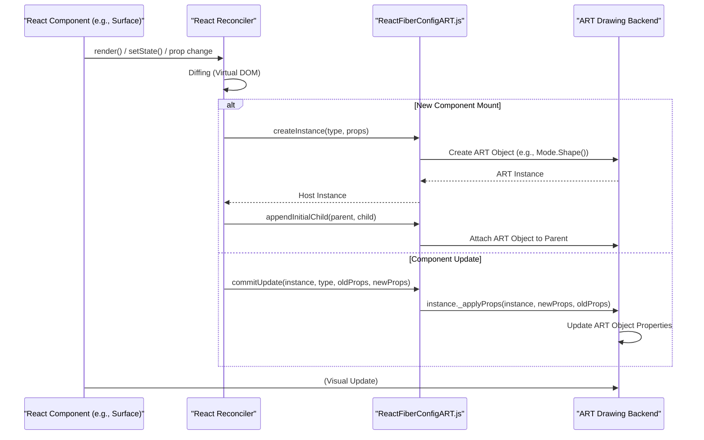

# Integration with React

React ART enables you to utilize React's declarative paradigm for creating and managing vector graphics. This section explains how `react-art` integrates with the React reconciliation process and the component lifecycle, which is fundamental to understanding its declarative nature. For a broader understanding of `react-art`'s architecture, refer to the [Core Concepts](./core-concepts.md) section.

## Declarative Graphics with React Components

`react-art` wraps the ART drawing library, allowing you to define your graphics using standard React components. Instead of directly manipulating drawing commands, you declare the desired state of your graphic, and React ART handles the underlying drawing operations. This aligns perfectly with React's core principle of declarative UI development.

Key components like `Surface` and `Text` are implemented as React classes, extending `React.Component`. This allows them to participate in React's component lifecycle and state management.

## The `Surface` Component: The Root of ART Integration

In `react-art`, the `Surface` component serves as the primary root container for all ART drawing elements. It is a standard React component that manages the lifecycle of the underlying ART drawing surface. This is where the crucial integration with React's reconciliation process happens.

During its lifecycle, the `Surface` component interacts directly with React's reconciler to create and update the ART scene:

*   **`componentDidMount()`**: When the `Surface` component is mounted, it initializes the ART drawing surface (`_surface`) based on the specified `width` and `height` props. It then calls `createContainer` from `react-reconciler/src/ReactFiberReconciler` to establish the connection between React's virtual tree and the ART host environment. An initial `updateContainerSync` is performed to render its children, followed by `flushSyncWork` to ensure synchronous updates.

    ```javascript
    componentDidMount() {
      const {height, width} = this.props;

      this._surface = Mode.Surface(+width, +height, this._tagRef);

      this._mountNode = createContainer(
        this._surface,
        disableLegacyMode ? ConcurrentRoot : LegacyRoot,
        null,
        false,
        false,
        '',
        defaultOnUncaughtError,
        defaultOnCaughtError,
        defaultOnRecoverableError,
        defaultOnDefaultTransitionIndicator,
        null,
      );
      // We synchronously flush updates coming from above so that they commit together
      // and so that refs resolve before the parent life cycles.
      updateContainerSync(this.props.children, this._mountNode, this);
      flushSyncWork();
    }
    ```

*   **`componentDidUpdate()`**: On subsequent updates, if the `width` or `height` props change, the `_surface` is resized. Regardless of size changes, `updateContainerSync` is invoked again with the new `children` props to re-reconcile and update the ART scene. `flushSyncWork` ensures these updates are applied synchronously. If the ART surface has a `render` method (e.g., for Canvas mode), it is called to redraw the scene.

    ```javascript
    componentDidUpdate(prevProps, prevState) {
      const props = this.props;

      if (props.height !== prevProps.height || props.width !== prevProps.width) {
        this._surface.resize(+props.width, +props.height);
      }

      // We synchronously flush updates coming from above so that they commit together
      // and so that refs resolve before the parent life cycles.
      updateContainerSync(this.props.children, this._mountNode, this);
      flushSyncWork();

      if (this._surface.render) {
        this._surface.render();
      }
    }
    ```

*   **`componentWillUnmount()`**: Before the `Surface` component is unmounted, `updateContainerSync` is called with `null` children to effectively unmount all ART elements from the `_mountNode`, ensuring proper cleanup of the ART scene.

    ```javascript
    componentWillUnmount() {
      // We synchronously flush updates coming from above so that they commit together
      // and so that refs resolve before the parent life cycles.
      updateContainerSync(null, this._mountNode, this);
      flushSyncWork();
    }
    ```

## Custom Renderer Configuration

`react-art` functions as a custom React renderer, meaning it implements a specific host configuration (`src/ReactFiberConfigART.js`) that dictates how React interacts with the ART drawing environment. This configuration exposes a set of functions that the React reconciler calls to perform operations on ART nodes.

Some key functions defined in `src/ReactFiberConfigART.js` that illustrate this integration include:

*   **`createInstance(type, props, internalInstanceHandle)`**: This function is responsible for creating a new ART drawing object (e.g., `Mode.ClippingRectangle()`, `Mode.Group()`, `Mode.Shape()`, `Mode.Text()`) based on the React component `type`. It also attaches an `_applyProps` method to the instance, which will be used later for applying updates.

    ```javascript
    export function createInstance(type, props, internalInstanceHandle) {
      let instance;

      switch (type) {
        case TYPES.CLIPPING_RECTANGLE:
          instance = Mode.ClippingRectangle();
          instance._applyProps = applyClippingRectangleProps;
          break;
        case TYPES.GROUP:
          instance = Mode.Group();
          instance._applyProps = applyGroupProps;
          break;
        case TYPES.SHAPE:
          instance = Mode.Shape();
          instance._applyProps = applyShapeProps;
          break;
        case TYPES.TEXT:
          instance = Mode.Text(
            props.children,
            props.font,
            props.alignment,
            props.path,
          );
          instance._applyProps = applyTextProps;
          break;
      }

      if (!instance) {
        throw new Error(`ReactART does not support the type "${type}"`);
      }

      instance._applyProps(instance, props);

      return instance;
    }
    ```

*   **`appendChild(parentInstance, child)` and `insertBefore(parentInstance, child, beforeChild)`**: These functions define how ART objects are added as children to their parents within the ART scene graph, including handling re-parenting by ejecting existing children first.

*   **`removeChild(parentInstance, child)`**: This function handles the removal of ART objects from their parent, including the cleanup of event listeners associated with the child.

*   **`commitUpdate(instance, type, oldProps, newProps)`**: This critical function is called by the reconciler when props on an existing ART instance change. It invokes the `_applyProps` method on the ART `instance` to apply the `newProps`, often comparing them with `oldProps` to optimize updates.

    ```javascript
    export function commitUpdate(instance, type, oldProps, newProps) {
      instance._applyProps(instance, newProps, oldProps);
    }
    ```

This architecture allows React to manage the virtual representation of your ART graphic, efficiently calculating minimal updates, and then `react-art` translates these updates into direct manipulations of the underlying ART drawing objects.

## Integration Flow

The following diagram illustrates the high-level integration flow between React components, the React Reconciler, `ReactFiberConfigART.js`, and the ART drawing backend:



## Developer Tools Integration

`react-art` includes a call to `injectIntoDevTools()`, ensuring that developers can inspect and debug their React ART component trees using standard React DevTools. This provides a familiar debugging experience for React developers working with ART graphics.

## Summary

React ART's integration with the React reconciliation process and component lifecycle enables a powerful declarative approach to vector graphics. By defining how ART objects are created, updated, and managed through the custom host configuration, `react-art` allows you to leverage React's efficient update mechanisms for complex graphical scenes.

To learn more about the different backends ART supports and how `react-art` utilizes them, proceed to the [Rendering Modes](./core-concepts-rendering-modes.md) section. For an in-depth look at the internal ART types and event handling, refer to [Internal Types and Events](./core-concepts-internal-types-events.md).
