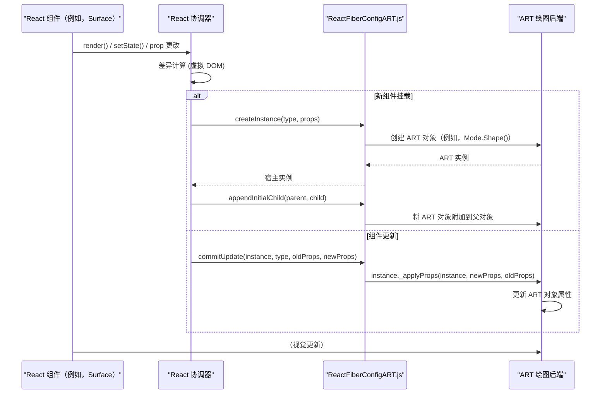

# 与 React 集成

React ART 使您能够利用 React 的声明式范例来创建和管理矢量图形。本节解释了 `react-art` 如何与 React 协调过程和组件生命周期集成，这对于理解其声明式特性至关重要。要更广泛地了解 `react-art` 的架构，请参阅[核心概念](./core-concepts.md)部分。

## 使用 React 组件进行声明式图形开发

`react-art` 封装了 ART 绘图库，使您能够使用标准 React 组件定义图形。您无需直接操作绘图命令，而是声明图形的所需状态，React ART 会处理底层的绘图操作。这与 React 声明式 UI 开发的核心原则完美契合。

像 `Surface` 和 `Text` 这样的关键组件被实现为 React 类，扩展了 `React.Component`。这使它们能够参与 React 的组件生命周期和状态管理。

## `Surface` 组件：ART 集成的根

在 `react-art` 中，`Surface` 组件是所有 ART 绘图元素的主要根容器。它是一个标准的 React 组件，管理底层 ART 绘图表面的生命周期。这是与 React 协调过程发生关键集成的地方。

在其生命周期中，`Surface` 组件直接与 React 的协调器交互，以创建和更新 ART 场景：

*   **`componentDidMount()`**：当 `Surface` 组件挂载时，它根据指定的 `width` 和 `height` prop 初始化 ART 绘图表面 (`_surface`)。然后它从 `react-reconciler/src/ReactFiberReconciler` 调用 `createContainer` 来建立 React 虚拟树与 ART 宿主环境之间的连接。执行初始的 `updateContainerSync` 以渲染其子组件，然后执行 `flushSyncWork` 以确保同步更新。

    ```javascript
    componentDidMount() {
      const {height, width} = this.props;

      this._surface = Mode.Surface(+width, +height, this._tagRef);

      this._mountNode = createContainer(
        this._surface,
        disableLegacyMode ? ConcurrentRoot : LegacyRoot,
        null,
        false,
        false,
        '',
        defaultOnUncaughtError,
        defaultOnCaughtError,
        defaultOnRecoverableError,
        defaultOnDefaultTransitionIndicator,
        null,
      );
      // We synchronously flush updates coming from above so that they commit together
      // and so that refs resolve before the parent life cycles.
      updateContainerSync(this.props.children, this._mountNode, this);
      flushSyncWork();
    }
    ```

*   **`componentDidUpdate()`**：在后续更新中，如果 `width` 或 `height` prop 发生变化，`_surface` 将被调整大小。无论大小是否变化，都会使用新的 `children` prop 再次调用 `updateContainerSync`，以重新协调和更新 ART 场景。`flushSyncWork` 确保这些更新同步应用。如果 ART 表面具有 `render` 方法（例如，用于 Canvas 模式），则会调用该方法以重新绘制场景。

    ```javascript
    componentDidUpdate(prevProps, prevState) {
      const props = this.props;

      if (props.height !== prevProps.height || props.width !== prevProps.width) {
        this._surface.resize(+props.width, +props.height);
      }

      // We synchronously flush updates coming from above so that they commit together
      // and so that refs resolve before the parent life cycles.
      updateContainerSync(this.props.children, this._mountNode, this);
      flushSyncWork();

      if (this._surface.render) {
        this._surface.render();
      }
    }
    ```

*   **`componentWillUnmount()`**：在 `Surface` 组件卸载之前，调用 `updateContainerSync` 并传入 `null` 子组件，以有效卸载 `_mountNode` 中的所有 ART 元素，确保 ART 场景的正确清理。

    ```javascript
    componentWillUnmount() {
      // We synchronously flush updates coming from above so that they commit together
      // and so that refs resolve before the parent life cycles.
      updateContainerSync(null, this._mountNode, this);
      flushSyncWork();
    }
    ```

## 自定义渲染器配置

`react-art` 作为一个自定义 React 渲染器运行，这意味着它实现了一个特定的宿主配置 (`src/ReactFiberConfigART.js`)，该配置决定了 React 如何与 ART 绘图环境交互。此配置公开了一组函数，React 协调器会调用这些函数来对 ART 节点执行操作。

`src/ReactFiberConfigART.js` 中定义的一些关键函数说明了这种集成，其中包括：

*   **`createInstance(type, props, internalInstanceHandle)`**：此函数负责根据 React 组件 `type` 创建新的 ART 绘图对象（例如 `Mode.ClippingRectangle()`、`Mode.Group()`、`Mode.Shape()`、`Mode.Text()`）。它还将 `_applyProps` 方法附加到实例，该方法稍后将用于应用更新。

    ```javascript
    export function createInstance(type, props, internalInstanceHandle) {
      let instance;

      switch (type) {
        case TYPES.CLIPPING_RECTANGLE:
          instance = Mode.ClippingRectangle();
          instance._applyProps = applyClippingRectangleProps;
          break;
        case TYPES.GROUP:
          instance = Mode.Group();
          instance._applyProps = applyGroupProps;
          break;
        case TYPES.SHAPE:
          instance = Mode.Shape();
          instance._applyProps = applyShapeProps;
          break;
        case TYPES.TEXT:
          instance = Mode.Text(
            props.children,
            props.font,
            props.alignment,
            props.path,
          );
          instance._applyProps = applyTextProps;
          break;
      }

      if (!instance) {
        throw new Error(`ReactART does not support the type "${type}"`);
      }

      instance._applyProps(instance, props);

      return instance;
    }
    ```

*   **`appendChild(parentInstance, child)` 和 `insertBefore(parentInstance, child, beforeChild)`**：这些函数定义了 ART 对象如何作为子对象添加到 ART 场景图中的父对象，包括通过首先弹出现有子对象来处理重新父子化。

*   **`removeChild(parentInstance, child)`**：此函数处理从父对象中移除 ART 对象，包括清理与子对象关联的事件监听器。

*   **`commitUpdate(instance, type, oldProps, newProps)`**：当现有 ART 实例上的 prop 更改时，协调器会调用此关键函数。它会在 ART `instance` 上调用 `_applyProps` 方法来应用 `newProps`，通常将其与 `oldProps` 进行比较以优化更新。

    ```javascript
    export function commitUpdate(instance, type, oldProps, newProps) {
      instance._applyProps(instance, newProps, oldProps);
    }
    ```

这种架构允许 React 管理 ART 图形的虚拟表示，高效地计算最小更新，然后 `react-art` 将这些更新转换为对底层 ART 绘图对象的直接操作。

## 集成流程

下图说明了 React 组件、React 协调器、`ReactFiberConfigART.js` 和 ART 绘图后端之间的高级集成流程：



## 开发工具集成

`react-art` 包含对 `injectIntoDevTools()` 的调用，确保开发人员可以使用标准 React DevTools 检查和调试其 React ART 组件树。这为使用 ART 图形的 React 开发人员提供了熟悉的调试体验。

## 总结

React ART 与 React 协调过程和组件生命周期的集成，为矢量图形实现了强大的声明式方法。通过定义如何通过自定义宿主配置创建、更新和管理 ART 对象，`react-art` 使您能够利用 React 高效的更新机制来处理复杂的图形场景。

要了解有关 ART 支持的不同后端以及 `react-art` 如何利用它们的更多信息，请继续阅读[渲染模式](./core-concepts-rendering-modes.md)部分。有关内部 ART 类型和事件处理的深入了解，请参阅[内部类型和事件](./core-concepts-internal-types-events.md)。