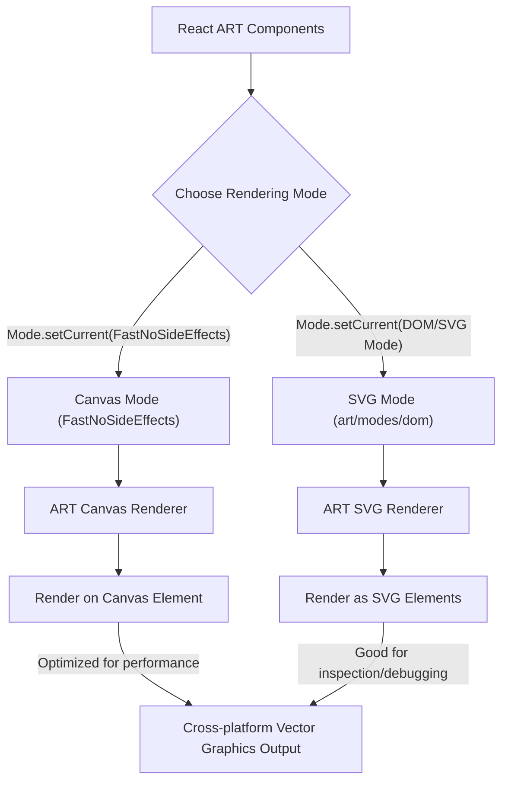

# Rendering Modes

React ART leverages the underlying ART library's capability to render vector graphics across different backends. This design allows you to create declarative React components for drawing that can function across various platforms without requiring significant code changes. This section explains the different rendering backends ART supports, such as Canvas and SVG, and how `react-art` utilizes them.

For a broader understanding of how `react-art` fits into the React ecosystem, refer to the [Core Concepts](./core-concepts.md) section.

## The ART Mode System

The ART library employs a `Mode` object to manage its active rendering backend. You set this mode using `Mode.setCurrent()`. By default, `react-art` is configured to use `FastNoSideEffects`, which is optimized for performance, typically mapping to Canvas rendering for direct pixel manipulation. This is visible in the source code:

```javascript
Mode.setCurrent(
  // Change to 'art/modes/dom' for easier debugging via SVG
  FastNoSideEffects,
);
```

The comment in the code snippet `Change to 'art/modes/dom' for easier debugging via SVG` indicates that `art/modes/dom` is another available mode. This mode is specifically useful for rendering vector graphics as SVG elements, which can be advantageous for inspection and debugging in a browser's developer tools, as SVG elements form part of the DOM.

The `Surface` component, which acts as the root container for all ART elements, determines its underlying DOM element (e.g., `<canvas>` or `<svg>`) based on the currently active `Mode.Surface.tagName` property.

## How React ART Adapts

`react-art` functions as a host renderer, translating your declarative React component tree into calls to the active ART mode's specific drawing primitives. This abstraction is key to its cross-platform capability. For instance, when `react-art` creates an instance of a component like `Shape` or `Group`, it relies on the `Mode` object:

```javascript
export function createInstance(type, props, internalInstanceHandle) {
  let instance;

  switch (type) {
    case TYPES.CLIPPING_RECTANGLE:
      instance = Mode.ClippingRectangle();
      instance._applyProps = applyClippingRectangleProps;
      break;
    case TYPES.GROUP:
      instance = Mode.Group();
      instance._applyProps = applyGroupProps;
      break;
    case TYPES.SHAPE:
      instance = Mode.Shape();
      instance._applyProps = applyShapeProps;
      break;
    case TYPES.TEXT:
      instance = Mode.Text(
        props.children,
        props.font,
        props.alignment,
        props.path,
      );
      instance._applyProps = applyTextProps;
      break;
  }

  if (!instance) {
    throw new Error(`ReactART does not support the type "${type}"`);
  }

  instance._applyProps(instance, props);

  return instance;
}
```

As you can see, `Mode.ClippingRectangle()`, `Mode.Group()`, `Mode.Shape()`, and `Mode.Text()` are invoked. These methods internally return drawing objects specifically tailored to the active rendering backend (e.g., a Canvas context object or an SVG element). This allows your `react-art` components to work seamlessly regardless of whether the output is Canvas-based or SVG-based.

Here is a visual representation of how React ART interacts with the ART rendering modes:



In summary, `react-art`'s architecture, by leveraging ART's flexible rendering modes, enables you to write React components for vector graphics that can run efficiently on various platforms. This approach provides both performance benefits (with Canvas) and debugging advantages (with SVG).

To understand the specific ART types used in these modes and how events are handled, proceed to the [Internal Types and Events](./core-concepts-internal-types-events.md) section.