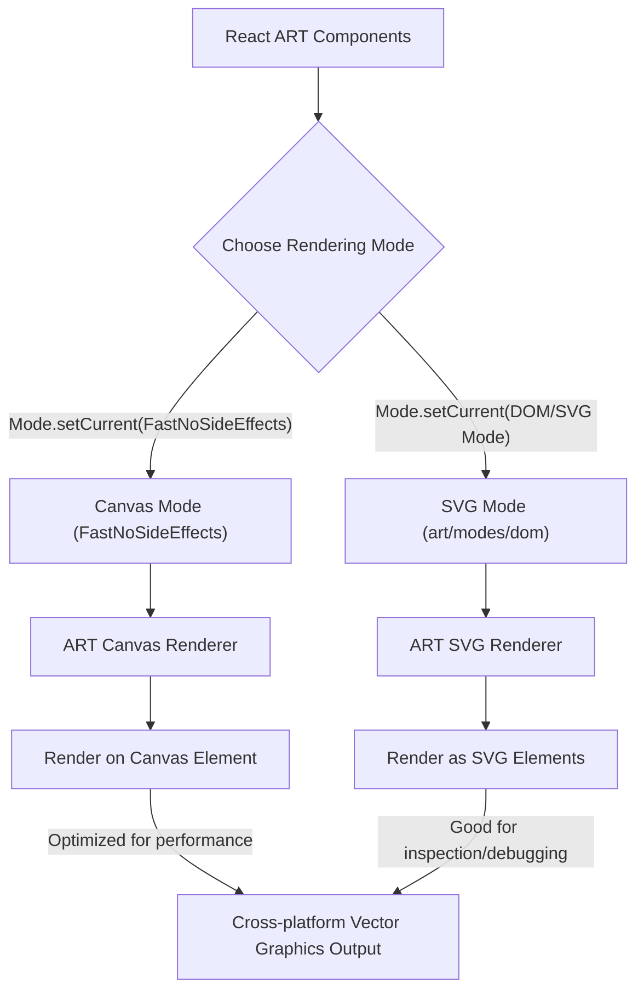

# 渲染模式

React ART 利用底层 ART 库在不同后端渲染矢量图形的能力。这种设计使您能够创建声明式 React 绘图组件，这些组件无需大量代码更改即可跨各种平台运行。本节将解释 ART 支持的不同渲染后端，例如 Canvas 和 SVG，以及 `react-art` 如何利用它们。

要更全面地了解 `react-art` 如何融入 React 生态系统，请参阅[核心概念](./core-concepts.md)部分。

## ART 模式系统

ART 库采用一个 `Mode` 对象来管理其活动的渲染后端。您可以使用 `Mode.setCurrent()` 设置此模式。默认情况下，`react-art` 配置为使用 `FastNoSideEffects`，它针对性能进行了优化，通常映射到 Canvas 渲染以进行直接像素操作。这在源代码中可见：

```javascript
Mode.setCurrent(
  // Change to 'art/modes/dom' for easier debugging via SVG
  FastNoSideEffects,
);
```

代码片段中“`Change to 'art/modes/dom' for easier debugging via SVG`”的注释表明 `art/modes/dom` 是另一种可用模式。此模式特别适用于将矢量图形渲染为 SVG 元素，这对于在浏览器开发人员工具中进行检查和调试可能很有利，因为 SVG 元素是 DOM 的一部分。

`Surface` 组件作为所有 ART 元素的根容器，根据当前活动的 `Mode.Surface.tagName` 属性确定其底层 DOM 元素（例如 `<canvas>` 或 `<svg>`）。

## React ART 如何适应

`react-art` 作为一个宿主渲染器，将您的声明式 React 组件树转换为对活动 ART 模式特定绘图原语的调用。这种抽象是其跨平台能力的关键。例如，当 `react-art` 创建 `Shape` 或 `Group` 等组件的实例时，它依赖于 `Mode` 对象：

```javascript
export function createInstance(type, props, internalInstanceHandle) {
  let instance;

  switch (type) {
    case TYPES.CLIPPING_RECTANGLE:
      instance = Mode.ClippingRectangle();
      instance._applyProps = applyClippingRectangleProps;
      break;
    case TYPES.GROUP:
      instance = Mode.Group();
      instance._applyProps = applyGroupProps;
      break;
    case TYPES.SHAPE:
      instance = Mode.Shape();
      instance._applyProps = applyShapeProps;
      break;
    case TYPES.TEXT:
      instance = Mode.Text(
        props.children,
        props.font,
        props.alignment,
        props.path,
      );
      instance._applyProps = applyTextProps;
      break;
  }

  if (!instance) {
    throw new Error(`ReactART does not support the type "${type}"`);
  }

  instance._applyProps(instance, props);

  return instance;
}
```

如您所见，`Mode.ClippingRectangle()`、`Mode.Group()`、`Mode.Shape()` 和 `Mode.Text()` 被调用。这些方法内部返回专门为活动渲染后端（例如 Canvas 上下文对象或 SVG 元素）量身定制的绘图对象。这使得您的 `react-art` 组件能够无缝工作，无论输出是基于 Canvas 还是基于 SVG。

以下是 React ART 如何与 ART 渲染模式交互的可视化表示：



总而言之，`react-art` 的架构通过利用 ART 灵活的渲染模式，使您能够编写可在各种平台上高效运行的 React 矢量图形组件。这种方法既提供了性能优势（通过 Canvas），也提供了调试便利（通过 SVG）。

要了解这些模式中使用的特定 ART 类型以及事件如何处理，请继续阅读[内部类型和事件](./core-concepts-internal-types-events.md)部分。
