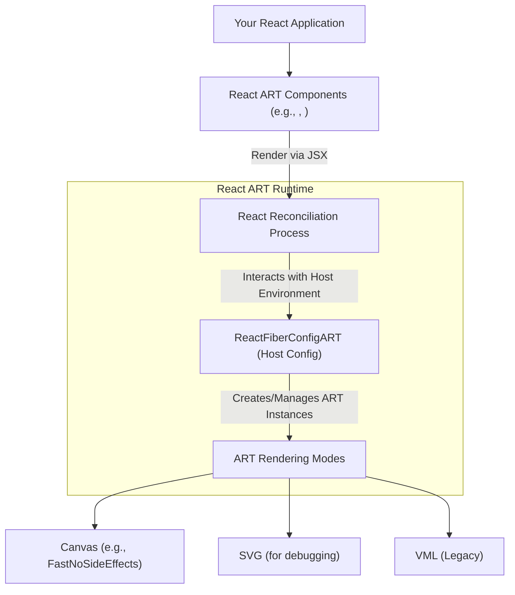

# Core Concepts

React ART enables you to render high-quality vector graphics using React's declarative syntax. Understanding its core concepts provides a foundation for building complex graphical applications. This section explores how React ART integrates with the React ecosystem, its various rendering modes, and the internal architecture that powers it.

For deeper dives into specific aspects, refer to:

*   [Integration with React](./core-concepts-integration-with-react.md)
*   [Rendering Modes](./core-concepts-rendering-modes.md)
*   [Internal Types and Events](./core-concepts-internal-types-events.md)

### Architectural Overview

React ART bridges the gap between React's component model and ART's drawing capabilities. Your React components declaratively describe the desired graphic, and React ART, via the React reconciler, translates these descriptions into commands for the underlying ART rendering engine. This engine can then draw on different backends, such as Canvas or SVG, depending on the configured mode.

## Integration with React

React ART operates as a custom renderer for React, leveraging the same declarative component model and lifecycle methods you are familiar with from React DOM. The `Surface` component acts as the root container, where the React reconciler manages updates by calling functions like `createContainer` and `updateContainerSync`. This integration ensures that your ART graphics benefit from React's efficient reconciliation process and component-based structure.

Learn more about how React ART integrates with the React reconciliation process and the component lifecycle in the [Integration with React](./core-concepts-integration-with-react.md) section.

## Rendering Modes

ART, the underlying drawing library, is designed to be backend-agnostic, supporting rendering to different environments like Canvas, SVG, and VML. React ART utilizes this capability by setting a current rendering `Mode`. For instance, it can be configured to use `FastNoSideEffects` for Canvas rendering, which is optimized for performance. This flexibility allows `react-art` to deliver cross-platform vector graphics without requiring you to manage the specifics of each drawing API.

Explore the different rendering backends supported by ART and how `react-art` utilizes them for cross-platform vector graphics in the [Rendering Modes](./core-concepts-rendering-modes.md) section.

## Internal Types and Events

Internally, React ART maps your React components to specific ART instance types. These core types include `ClippingRectangle`, `Group`, `Shape`, and `Text`. Each type corresponds to a fundamental graphical primitive or container within the ART system. React ART also manages event handling by providing a mechanism to attach listeners for various user interactions, such as `onClick`, `onMouseMove`, `onMouseOver`, `onMouseOut`, `onMouseUp`, and `onMouseDown`, directly on ART elements.

Discover the internal ART types and event handling mechanisms within `react-art` for custom implementations in the [Internal Types and Events](./core-concepts-internal-types-events.md) section.

---

Understanding these core concepts is crucial for effectively utilizing React ART. With this foundational knowledge, you are ready to begin creating and manipulating graphics. Proceed to the [Drawing Components](./drawing-components.md) section to learn about the pre-built components available in React ART.