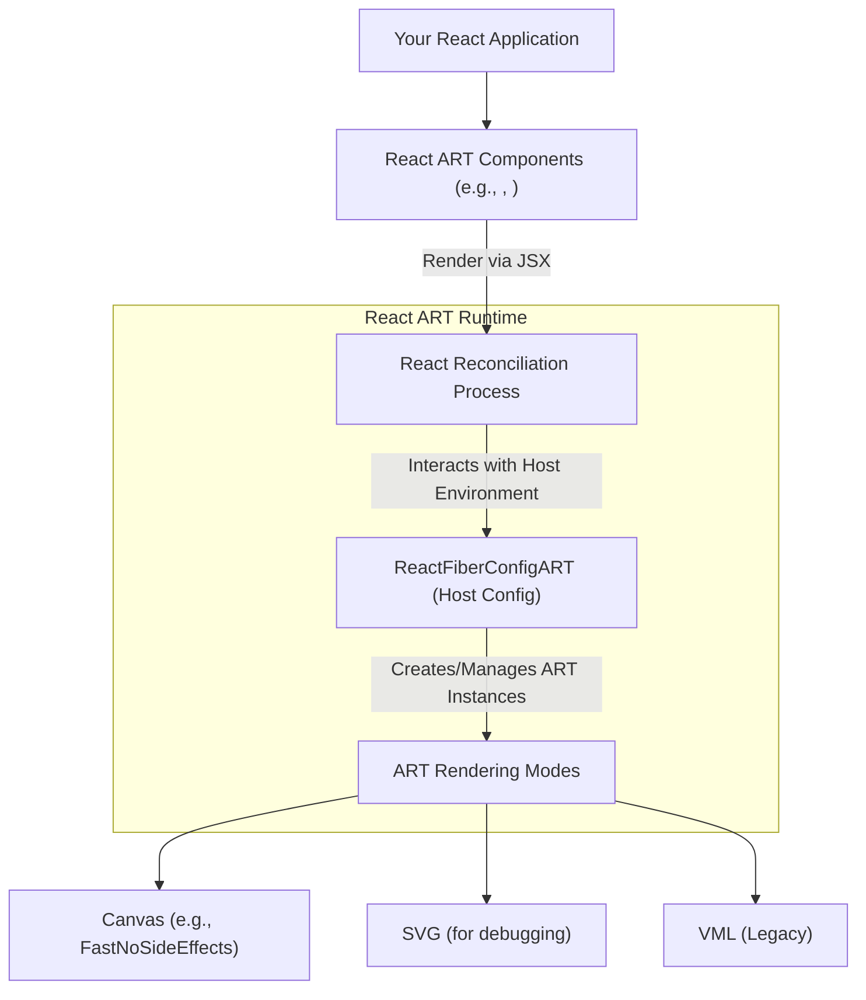

# 核心概念

React ART 允许你使用 React 的声明式语法渲染高质量的矢量图形。理解其核心概念为构建复杂的图形应用程序奠定了基础。本节探讨 React ART 如何与 React 生态系统集成、其各种渲染模式以及支撑其运行的内部架构。

如需深入了解特定方面，请参阅：

*   [与 React 集成](./core-concepts-integration-with-react.md)
*   [渲染模式](./core-concepts-rendering-modes.md)
*   [内部类型与事件](./core-concepts-internal-types-events.md)

### 架构概览

React ART 弥合了 React 组件模型与 ART 绘图能力之间的差距。你的 React 组件以声明方式描述所需的图形，React ART 通过 React 协调器将这些描述转换为底层 ART 渲染引擎的命令。然后，该引擎可以根据配置的模式，在不同的后端（例如 Canvas 或 SVG）上进行绘图。

## 与 React 集成

React ART 作为 React 的自定义渲染器运行，利用你从 React DOM 熟悉的相同声明式组件模型和生命周期方法。`Surface` 组件充当根容器，React 协调器通过调用 `createContainer` 和 `updateContainerSync` 等函数来管理更新。这种集成确保你的 ART 图形受益于 React 高效的协调过程和基于组件的结构。

在[与 React 集成](./core-concepts-integration-with-react.md)部分了解更多关于 React ART 如何与 React 协调过程和组件生命周期集成的信息。

## 渲染模式

ART 作为底层绘图库，被设计为与后端无关，支持渲染到不同的环境，例如 Canvas、SVG 和 VML。React ART 通过设置当前的渲染 `模式` 来利用此功能。例如，它可以配置为使用 `FastNoSideEffects` 进行 Canvas 渲染，这针对性能进行了优化。这种灵活性使得 `react-art` 能够提供跨平台矢量图形，而无需你管理每个绘图 API 的具体细节。

在[渲染模式](./core-concepts-rendering-modes.md)部分探索 ART 支持的不同渲染后端以及 `react-art` 如何利用它们实现跨平台矢量图形。

## 内部类型与事件

在内部，React ART 将你的 React 组件映射到特定的 ART 实例类型。这些核心类型包括 `ClippingRectangle`、`Group`、`Shape` 和 `Text`。每种类型都对应于 ART 系统中的一个基本图形图元或容器。React ART 还通过提供一种机制来管理事件处理，可以直接在 ART 元素上附加各种用户交互的侦听器，例如 `onClick`、`onMouseMove`、`onMouseOver`、`onMouseOut`、`onMouseUp` 和 `onMouseDown`。

在[内部类型与事件](./core-concepts-internal-types-events.md)部分探索 `react-art` 中的内部 ART 类型和事件处理机制，以实现自定义实现。

---

理解这些核心概念对于有效利用 React ART 至关重要。有了这些基础知识，你就可以开始创建和操作图形了。请继续阅读[绘图组件](./drawing-components.md)部分，了解 React ART 中可用的预构建组件。