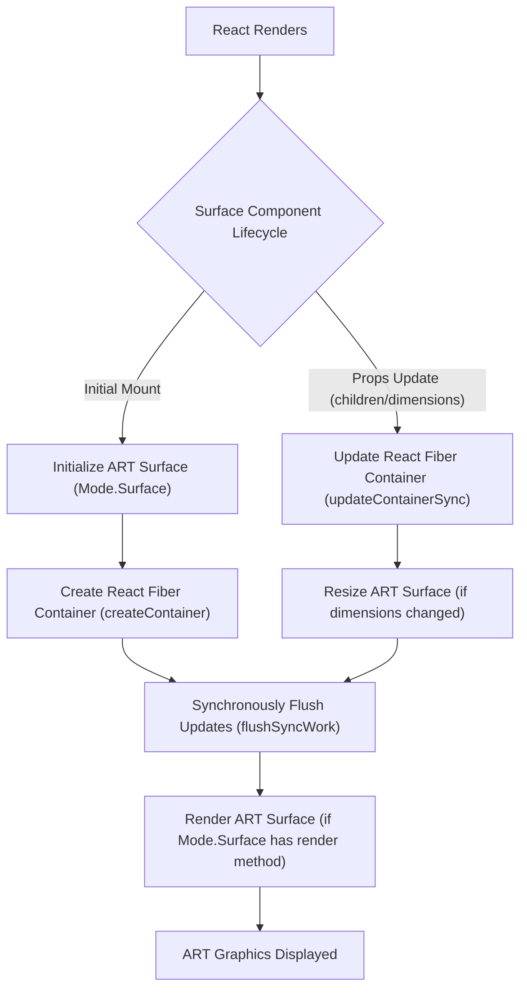

# Surface

The `Surface` component is the essential root container for all ART elements within a React application. It serves as the canvas where all your vector graphics will be rendered, providing the foundational drawing area for shapes, groups, and text.

To understand how `Surface` integrates with React's rendering pipeline and ART's backends, refer to the [Core Concepts](./core-concepts.md) section.

## Purpose and Usage

The `Surface` component is responsible for initializing the underlying ART rendering surface, which can be a Canvas, SVG, or VML element depending on the `art/modes/current` configuration. You define the dimensions of your drawing area by passing `width` and `height` props to the `Surface` component.

### Props

`Surface` accepts `width` and `height` as mandatory props to define its dimensions. It also passes through standard HTML attributes to the underlying DOM element it renders.

| Name | Type | Description |
|---|---|---|
| `height` | `number` | The height of the ART drawing surface in pixels. |
| `width` | `number` | The width of the ART drawing surface in pixels. |
| `accessKey` | `string` | Standard HTML `accesskey` attribute. |
| `className` | `string` | Standard HTML `class` attribute. |
| `draggable` | `boolean` | Standard HTML `draggable` attribute. |
| `role` | `string` | Standard HTML `role` attribute. |
| `style` | `object` | Standard HTML `style` object for inline styles. |
| `tabIndex` | `number` | Standard HTML `tabindex` attribute. |
| `title` | `string` | Standard HTML `title` attribute. |

## How Surface Works

`Surface` manages the lifecycle of the ART drawing context and bridges it with React's reconciliation process. When the `Surface` component mounts, it creates an ART surface and a React Fiber container. Subsequent updates to its `children` or `width`/`height` props trigger a re-render cycle on the ART surface.

The underlying DOM element used by `Surface` (e.g., `<canvas>`, `<svg>`, or a VML equivalent) is determined by the active ART mode, specifically `Mode.Surface.tagName`.



This flowchart illustrates the flow of control from React's component lifecycle methods to the ART rendering backend, ensuring that changes to your React components are efficiently translated into visual updates on the ART surface.

## Example

Here’s an example demonstrating a basic `Surface` component hosting a simple `Group`:

```javascript
import * as React from 'react';
import { Surface, Group, Shape } from 'react-art';

function MyArtCanvas() {
  return (
    <Surface width={300} height={200} style={{ border: '1px solid black' }}>
      <Group x={50} y={50}>
        <Shape
          d="M0 0 L100 0 L100 50 L0 50 Z"
          fill="#FF0000"
          stroke="#000000"
          strokeWidth={2}
        />
      </Group>
    </Surface>
  );
}

// Assuming MyArtCanvas is rendered in a React root somewhere, e.g.:
// ReactDOM.render(<MyArtCanvas />, document.getElementById('root'));
```

This example renders a 300x200 pixel `Surface` with a black border. Inside, a `Group` element is positioned at (50, 50), containing a red rectangular `Shape`. This demonstrates how `Surface` acts as the primary container for your ART compositions.

---

With `Surface` set up, you are ready to start drawing elements. Proceed to the [Shape](./drawing-components-shape.md) section to learn about creating custom paths and defining their appearance.