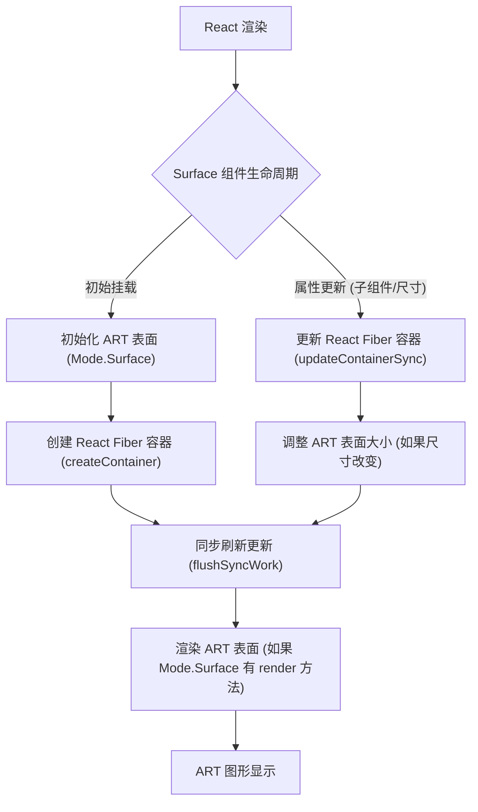

# Surface

`Surface` 组件是 React 应用程序中所有 ART 元素的必要根容器。它充当渲染所有矢量图形的画布，为形状、组和文本提供基础绘图区域。

要了解 `Surface` 如何与 React 的渲染管道和 ART 的后端集成，请参阅[核心概念](./core-concepts.md)部分。

## 目的和用法

`Surface` 组件负责初始化底层 ART 渲染表面，该表面可以是 Canvas、SVG 或 VML 元素，具体取决于 `art/modes/current` 配置。您可以通过将 `width` 和 `height` 属性传递给 `Surface` 组件来定义绘图区域的尺寸。

### 属性

`Surface` 接受 `width` 和 `height` 作为强制属性来定义其尺寸。它还将标准 HTML 属性传递给其渲染的底层 DOM 元素。

| 名称 | 类型 | 描述 |
|---|---|---|
| `height` | `number` | ART 绘图表面的高度（以像素为单位）。 |
| `width` | `number` | ART 绘图表面的宽度（以像素为单位）。 |
| `accessKey` | `string` | 标准 HTML `accesskey` 属性。 |
| `className` | `string` | 标准 HTML `class` 属性。 |
| `draggable` | `boolean` | 标准 HTML `draggable` 属性。 |
| `role` | `string` | 标准 HTML `role` 属性。 |
| `style` | `object` | 用于内联样式的标准 HTML `style` 对象。 |
| `tabIndex` | `number` | 标准 HTML `tabindex` 属性。 |
| `title` | `string` | 标准 HTML `title` 属性。 |

## Surface 工作原理

`Surface` 管理 ART 绘图上下文的生命周期，并将其与 React 的协调过程连接起来。当 `Surface` 组件挂载时，它会创建一个 ART 表面和一个 React Fiber 容器。随后对其 `children` 或 `width`/`height` 属性的更新会触发 ART 表面上的重新渲染周期。

`Surface` 使用的底层 DOM 元素（例如 `<canvas>`、`<svg>` 或 VML 等效元素）由活动的 ART 模式决定，特别是 `Mode.Surface.tagName`。



此流程图说明了从 React 组件生命周期方法到 ART 渲染后端的控制流，确保对 React 组件的更改能够有效地转换为 ART 表面上的视觉更新。

## 示例

这是一个演示 `Surface` 组件托管简单 `Group` 的示例：

```javascript
import * as React from 'react';
import { Surface, Group, Shape } from 'react-art';

function MyArtCanvas() {
  return (
    <Surface width={300} height={200} style={{ border: '1px solid black' }}>
      <Group x={50} y={50}>
        <Shape
          d="M0 0 L100 0 L100 50 L0 50 Z"
          fill="#FF0000"
          stroke="#000000"
          strokeWidth={2}
        />
      </Group>
    </Surface>
  );
}

// 假设 MyArtCanvas 渲染在某个 React 根中，例如：
// ReactDOM.render(<MyArtCanvas />, document.getElementById('root'));
```

此示例渲染了一个 300x200 像素、带有黑色边框的 `Surface`。在其中，一个 `Group` 元素定位在 (50, 50) 处，包含一个红色的矩形 `Shape`。这演示了 `Surface` 如何作为 ART 组合的主容器。

---

设置好 `Surface` 后，您就可以开始绘制元素了。请继续阅读[形状](./drawing-components-shape.md)部分，了解如何创建自定义路径并定义其外观。
