# Overview

React ART is a JavaScript library for drawing vector graphics using [React](https://github.com/facebook/react/). It provides declarative and reactive bindings to the underlying [ART library](https://github.com/sebmarkbage/art/). This enables developers to create sophisticated graphical interfaces and dynamic visualizations directly within their React applications.

For practical setup instructions, proceed to the [Getting Started](./getting-started.md) section. To understand the foundational concepts, refer to [Core Concepts](./core-concepts.md).

## Core Purpose

React ART's primary purpose is to simplify vector graphic creation by leveraging React's declarative component model. Instead of directly manipulating the underlying drawing APIs (like Canvas 2D contexts or SVG DOM elements), you define what you want to draw using React components. React ART then efficiently translates these declarations into actual graphics, handling updates and state changes reactively.

## Key Capabilities

One of the significant advantages of React ART is its ability to render output to various backends using a single, consistent declarative API. This includes:

*   **Canvas**: For high-performance, pixel-based rendering, ideal for complex animations or large numbers of drawing operations.
*   **SVG**: For scalable vector graphics that can be manipulated via CSS and are well-suited for interactive, resolution-independent displays.
*   **VML (Vector Markup Language)**: For compatibility with older Internet Explorer browsers (specifically IE8), ensuring broader reach for certain applications.

This cross-platform capability allows you to write your graphics code once and deploy it across different rendering environments without significant modifications.

## Architecture Overview

React ART integrates deeply with React's reconciliation process. When you define ART components in your React tree, React ART acts as a custom renderer (a host config) that translates your component hierarchy into ART's native drawing primitives. The `Surface` component acts as the root container, encapsulating the ART drawing context.

```mermaid
flowchart TD
    A["React Components (e.g., <Surface>, <Shape>)"] --> B["React Reconciliation"];
    B --> C["ReactART Host Config"];
    C --> D["ART Instances (ClippingRectangle, Group, Shape, Text)"];
    D --> E{"ART Rendering Modes"};
    E -- "Canvas" --> F["Canvas Output"];
    E -- "SVG" --> G["SVG Output"];
    E -- "VML" --> H["VML Output (IE8)"];
```

In this architecture:

*   **React Components**: These are your familiar JSX elements like `<Surface>`, `<Shape>`, `<Group>`, and `<Text>` that you define in your React application.
*   **React Reconciliation**: React's core algorithm efficiently calculates the differences between the previous and current component trees.
*   **ReactART Host Config**: This is React ART's custom renderer, which intercepts the changes identified by React's reconciler and translates them into specific instructions for the ART library.
*   **ART Instances**: These are the actual drawing objects managed by the ART library, such as `ClippingRectangle`, `Group`, `Shape`, and `Text`. They represent the visual elements on the drawing surface.
*   **ART Rendering Modes**: The ART library can then render these instances to different low-level graphical outputs, including Canvas, SVG, or VML.

## Core Components

React ART provides a set of fundamental components that correspond to the drawing primitives in the ART library:

*   **`Surface`**: The root component where all ART graphics are rendered.
*   **`Shape`**: A versatile component for drawing custom paths.
*   **`Group`**: Used to group multiple ART elements, allowing for common transformations and properties.
*   **`ClippingRectangle`**: Defines a rectangular region to clip other drawing elements.
*   **`Text`**: For rendering textual content.

More detailed documentation for each component can be found in the [Drawing Components](./drawing-components.md) section.

--- 

This overview has introduced you to React ART, its core purpose, and its architectural foundation. You are now ready to begin building your first graphics. Proceed to the [Getting Started](./getting-started.md) section to set up your environment and create a basic example.