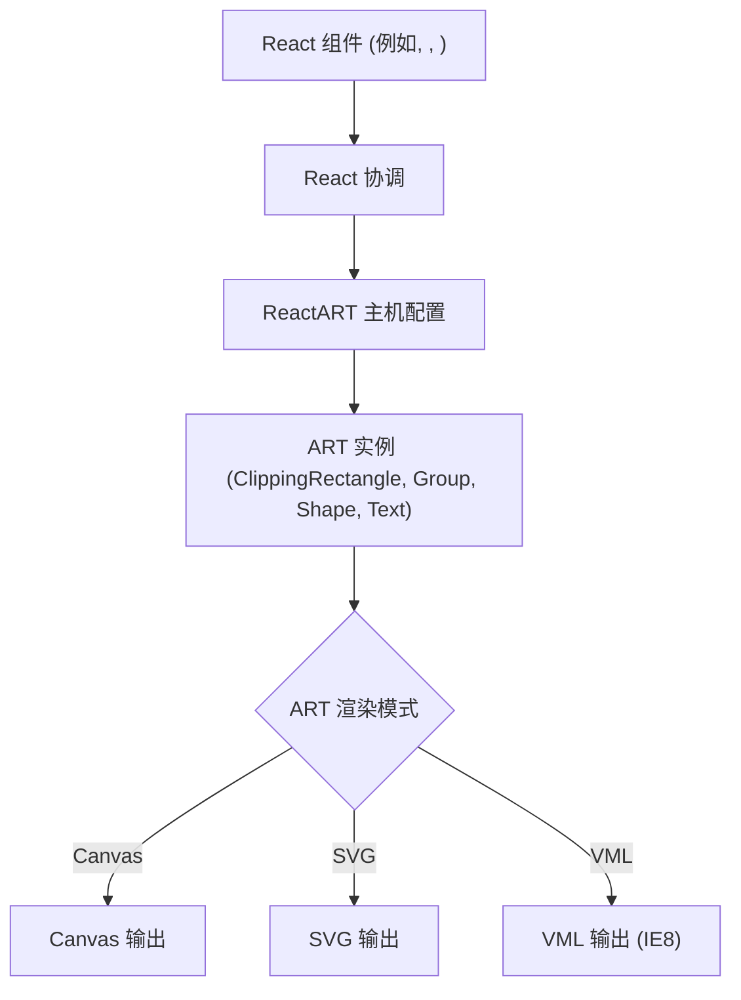

# 概述

React ART 是一个 JavaScript 库，它使用 [React](https://github.com/facebook/react/) 绘制矢量图形。它提供了对底层 [ART 库](https://github.com/sebmarkbage/art/) 的声明式和响应式绑定。这使得开发人员可以直接在他们的 React 应用程序中创建复杂的图形界面和动态可视化效果。

有关实际设置说明，请前往[入门](./getting-started.md)部分。要了解基本概念，请参阅[核心概念](./core-concepts.md)。

## 核心目的

React ART 的主要目的是通过利用 React 的声明式组件模型来简化矢量图形的创建。您无需直接操作底层绘图 API（如 Canvas 2D 上下文或 SVG DOM 元素），而是使用 React 组件定义您想要绘制的内容。然后，React ART 会高效地将这些声明转换为实际图形，并响应式地处理更新和状态变化。

## 主要功能

React ART 的一个显著优势是它能够使用单一、一致的声明式 API 将输出渲染到各种后端。这包括：

*   **Canvas**：用于高性能、基于像素的渲染，非常适合复杂的动画或大量的绘图操作。
*   **SVG**：用于可伸缩矢量图形，可通过 CSS 进行操作，非常适合交互式、分辨率无关的显示。
*   **VML (矢量标记语言)**：用于兼容旧版 Internet Explorer 浏览器（特别是 IE8），确保某些应用程序的更广泛覆盖。

这种跨平台能力使您能够一次编写图形代码，并将其部署到不同的渲染环境中，而无需进行重大修改。

## 架构概述

React ART 与 React 的协调（reconciliation）过程深度集成。当您在 React 树中定义 ART 组件时，React ART 作为自定义渲染器（主机配置）将您的组件层次结构转换为 ART 的原生绘图原语。`Surface` 组件充当根容器，封装了 ART 绘图上下文。

在这种架构中：

*   **React 组件**：这些是您在 React 应用程序中定义的熟悉 JSX 元素，如 `<Surface>`、`<Shape>`、`<Group>` 和 `<Text>`。
*   **React 协调**：React 的核心算法高效地计算上一个和当前组件树之间的差异。
*   **ReactART 主机配置**：这是 React ART 的自定义渲染器，它拦截由 React 协调器识别的变化，并将其转换为 ART 库的特定指令。
*   **ART 实例**：这些是由 ART 库管理的实际绘图对象，例如 `ClippingRectangle`、`Group`、`Shape` 和 `Text`。它们代表绘图表面上的视觉元素。
*   **ART 渲染模式**：ART 库随后可以将这些实例渲染到不同的低级图形输出，包括 Canvas、SVG 或 VML。

## 核心组件

React ART 提供了一组与 ART 库中绘图原语相对应的基本组件：

*   **`Surface`**：所有 ART 图形渲染的根组件。
*   **`Shape`**：一个多功能组件，用于绘制自定义路径。
*   **`Group`**：用于分组多个 ART 元素，允许进行共同的变换和属性设置。
*   **`ClippingRectangle`**：定义一个矩形区域，用于裁剪其他绘图元素。
*   **`Text`**：用于渲染文本内容。

每个组件的更详细文档可以在[绘图组件](./drawing-components.md)部分找到。

---

本概述向您介绍了 React ART、其核心目的和架构基础。您现在已准备好开始构建您的第一个图形。请前往[入门](./getting-started.md)部分以设置您的环境并创建一个基本示例。