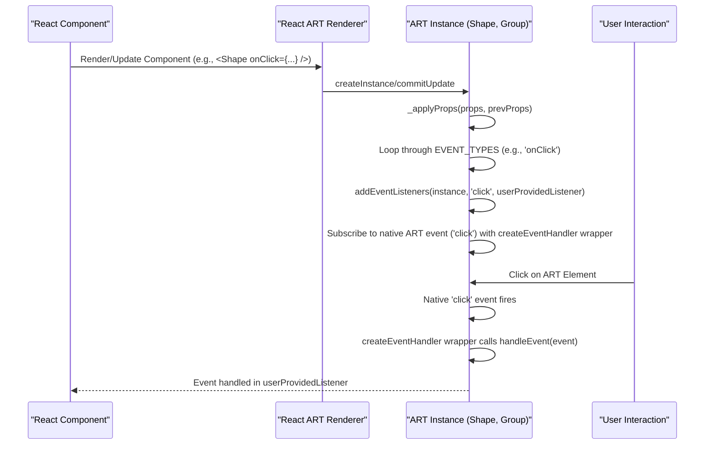

# Event Handling

React ART enables you to make your vector graphics interactive by allowing you to attach user interaction events directly to your ART elements. This section explains how to handle events like clicks, mouse movements, and more on your `Shape`, `Group`, `Text`, and `ClippingRectangle` components.

For information on styling your graphics, refer to the [Fills and Strokes](./styling-interactivity-fills-strokes.md) and [Transformations](./styling-interactivity-transformations.md) sections.

## How Event Handling Works

When you define an event handler on a React ART component (e.g., `onClick`, `onMouseMove`), React ART's renderer manages the underlying ART instance's event subscriptions. It internally uses helper methods like `addEventListeners` and `createEventHandler` to attach and wrap your provided listener functions to the native ART event system. This ensures that when a user interacts with your graphic element, your specified handler is called.

When a component is unmounted or removed from the hierarchy, React ART automatically cleans up these event listeners using `destroyEventListeners`, preventing memory leaks and ensuring efficient resource management.



## Supported Event Types

React ART supports common mouse-related events, which you can attach as props to any renderable ART component. The following table lists the supported event props and their corresponding internal ART event types:

| Event Prop   | ART Event Type |
|--------------|----------------|
| `onClick`    | `click`        |
| `onMouseMove`| `mousemove`    |
| `onMouseOver`| `mouseover`    |
| `onMouseOut` | `mouseout`     |
| `onMouseUp`  | `mouseup`      |
| `onMouseDown`| `mousedown`    |

## Example: Handling a Click Event

This example demonstrates how to attach an `onClick` event handler to an `ART.Shape` component. When the shape is clicked, a message will be logged to the console.

```javascript
import React from 'react';
import ART from 'react-art';

const { Surface, Shape, Group } = ART;

function MyInteractiveShape() {
  const handleClick = (event) => {
    console.log('Shape clicked!', event.type, event.x, event.y); // event object contains type, x, y coordinates
  };

  return (
    <Surface width={200} height={200}>
      <Group x={50} y={50}>
        <Shape
          d="M0 0 L100 0 L100 100 L0 100 Z"
          fill="#FFC107"
          stroke="#FFA000"
          strokeWidth={2}
          onClick={handleClick}
        />
      </Group>
    </Surface>
  );
}

// Render your component
// ReactDOM.render(<MyInteractiveShape />, document.getElementById('root'));

```

In this example:
*   The `handleClick` function is defined to process the click event. It receives an `event` object containing details such as `type`, `x`, and `y` coordinates of the interaction.
*   The `onClick` prop is passed to the `Shape` component, linking the `handleClick` function to the shape's click event.

You can apply similar patterns for `onMouseMove`, `onMouseOver`, and other supported events to create dynamic and responsive ART graphics.

---

This section provided a guide on how to attach and handle user interaction events in React ART. You can now create interactive graphic elements in your applications. To explore further aspects of React ART's architecture, you might want to look into [API Reference](./api-reference.md).