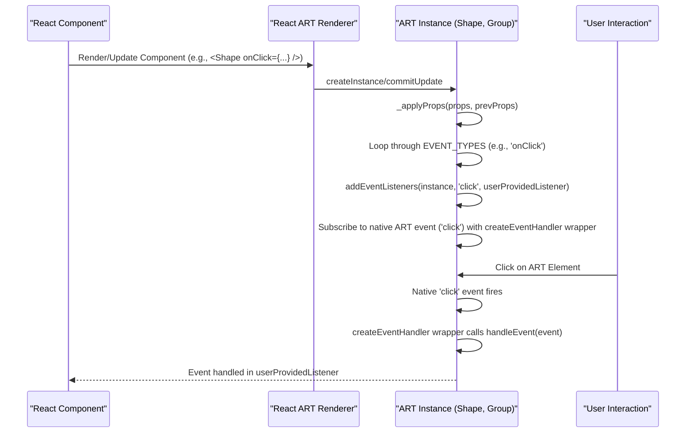

# 事件处理

React ART 允许你通过将用户交互事件直接附加到 ART 元素上，使你的矢量图形具有交互性。本节解释了如何在你的 `Shape`、`Group`、`Text` 和 `ClippingRectangle` 组件上处理点击、鼠标移动等事件。

有关图形样式的更多信息，请参阅[填充和描边](./styling-interactivity-fills-strokes.md)和[变换](./styling-interactivity-transformations.md)部分。

## 事件处理的工作原理

当你在 React ART 组件上定义事件处理程序（例如 `onClick`、`onMouseMove`）时，React ART 的渲染器会管理底层 ART 实例的事件订阅。它内部使用 `addEventListeners` 和 `createEventHandler` 等辅助方法将你提供的监听器函数附加并封装到原生 ART 事件系统。这确保当用户与你的图形元素交互时，你的指定处理程序会被调用。

当组件被卸载或从层级结构中移除时，React ART 会自动使用 `destroyEventListeners` 清理这些事件监听器，从而防止内存泄漏并确保高效的资源管理。



## 支持的事件类型

React ART 支持常见的鼠标相关事件，你可以将它们作为 props 附加到任何可渲染的 ART 组件。下表列出了支持的事件 prop 及其对应的内部 ART 事件类型：

| Event Prop   | ART Event Type |
|--------------|----------------|
| `onClick`    | `click`        |
| `onMouseMove`| `mousemove`    |
| `onMouseOver`| `mouseover`    |
| `onMouseOut` | `mouseout`     |
| `onMouseUp`  | `mouseup`      |
| `onMouseDown`| `mousedown`    |

## 示例：处理点击事件

本示例演示如何将 `onClick` 事件处理程序附加到 `ART.Shape` 组件。当点击该形状时，控制台将记录一条消息。

```javascript
import React from 'react';
import ART from 'react-art';

const { Surface, Shape, Group } = ART;

function MyInteractiveShape() {
  const handleClick = (event) => {
    console.log('Shape clicked!', event.type, event.x, event.y); // event object contains type, x, y coordinates
  };

  return (
    <Surface width={200} height={200}>
      <Group x={50} y={50}>
        <Shape
          d="M0 0 L100 0 L100 100 L0 100 Z"
          fill="#FFC107"
          stroke="#FFA000"
          strokeWidth={2}
          onClick={handleClick}
        />
      </Group>
    </Surface>
  );
}

// Render your component
// ReactDOM.render(<MyInteractiveShape />, document.getElementById('root'));

```

在此示例中：
*   `handleClick` 函数被定义来处理点击事件。它接收一个 `event` 对象，其中包含交互的 `type`、`x` 和 `y` 坐标等详细信息。
*   `onClick` prop 被传递给 `Shape` 组件，将 `handleClick` 函数与形状的点击事件关联起来。

你可以对 `onMouseMove`、`onMouseOver` 和其他支持的事件应用类似的模式，以创建动态和响应式的 ART 图形。

---

本节提供了关于如何在 React ART 中附加和处理用户交互事件的指南。你现在可以在你的应用程序中创建交互式图形元素。要进一步探索 React ART 架构的其他方面，你可能需要查看 [API 参考](./api-reference.md)。