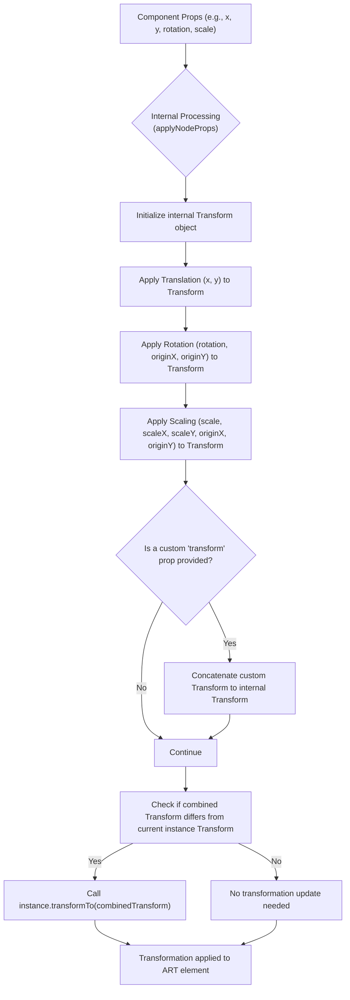

# Transformations

Transformations allow you to precisely control the position, orientation, and size of your ART elements, enabling dynamic and interactive graphics. You can apply transformations such as translation (moving), rotation, and scaling directly through component properties or by providing a custom `Transform` object.

For information on styling your elements with colors and patterns, refer to the [Fills and Strokes](./styling-interactivity-fills-strokes.md) section. To learn about making your graphics interactive, see [Event Handling](./styling-interactivity-event-handling.md).

## Understanding Transformations in ART

React ART leverages the underlying ART library's `Transform` object to handle complex geometric manipulations. When you specify transformation-related properties on an ART component (like `Shape`, `Group`, `ClippingRectangle`, or `Text`), React ART internally processes these properties and applies them as a single, combined transformation to the element.

### How Transformations are Applied

The internal process combines all individual transformation properties (`x`, `y`, `rotation`, `scale`, `scaleX`, `scaleY`, `originX`, `originY`, and a custom `transform` object) into a single transformation matrix. This unified matrix is then applied to the ART instance.



## Component Properties for Transformations

Most ART drawing components, such as `Shape`, `Group`, `ClippingRectangle`, and `Text`, accept the following properties for transformations:

| Property | Type | Description | Default | Applicable to | 
|---|---|---|---|---| 
| `x` | `number` | The X-coordinate for translation. | `0` | All transformable components | 
| `y` | `number` | The Y-coordinate for translation. | `0` | All transformable components | 
| `rotation` | `number` | Rotation angle in degrees. | `0` | All transformable components | 
| `originX` | `number` | X-coordinate of the rotation/scale origin. If not specified, the origin is the top-left corner of the element's bounding box. | `undefined` | All transformable components | 
| `originY` | `number` | Y-coordinate of the rotation/scale origin. If not specified, the origin is the top-left corner of the element's bounding box. | `undefined` | All transformable components | 
| `scale` | `number` | Uniform scaling factor for both X and Y axes. | `1` | All transformable components | 
| `scaleX` | `number` | Scaling factor for the X-axis. | `1` | All transformable components | 
| `scaleY` | `number` | Scaling factor for the Y-axis. | `1` | All transformable components | 
| `transform` | `Transform` | An instance of the `art/core/transform` object for custom, complex transformations. This is applied *after* individual `x`, `y`, `rotation`, and `scale` properties. | `null` | All transformable components | 

### Using `Transform` Object Directly

The `Transform` object from `art/core/transform` allows for more direct and programmatic control over transformations. You can create a `Transform` instance and pass it to the `transform` prop of any ART component.

```javascript
import { Transform, Shape, Surface } from 'react-art';

// Create a transform that moves 50,50 and then rotates 45 degrees
const myTransform = new Transform().move(50, 50).rotate(45);

function TransformedShape() {
  return (
    <Surface width={200} height={200}>
      <Shape 
        d="M0 0 L100 0 L100 100 L0 100 Z" 
        fill="blue" 
        stroke="black" 
        strokeWidth={2}
        transform={myTransform} // Apply the custom Transform object
      />
      <Shape 
        d="M0 0 L100 0 L100 100 L0 100 Z" 
        x={10} y={10} // Apply translation via props
        fill="red" 
        opacity={0.5} 
        stroke="black" 
        strokeWidth={2}
      />
    </Surface>
  );
}

// Example of more complex chained transformations
const complexTransform = new Transform()
  .scale(2) // Scale by 2
  .rotate(30, 50, 50) // Rotate 30 degrees around origin (50,50)
  .move(20, 20); // Then move 20, 20

function ComplexTransformedGroup() {
  return (
    <Surface width={300} height={300}>
      <Group transform={complexTransform}>
        <Shape 
          d="M0 0 L50 0 L50 50 L0 50 Z" 
          fill="green" 
          stroke="black" 
          strokeWidth={1}
        />
      </Group>
    </Surface>
  );
}
```

In this example, `myTransform` is created and applied to the first `Shape`. The second `Shape` uses simple `x` and `y` props for translation. The `ComplexTransformedGroup` demonstrates applying a chained `Transform` object to a `Group` component, which then affects all its children.

## Example: Combining Transformations

This example demonstrates a `Shape` that is translated, rotated, and scaled using a combination of properties.

```javascript
import React from 'react';
import { Surface, Shape } from 'react-art';

function TransformedSquare() {
  return (
    <Surface width={200} height={200}>
      <Shape
        d="M0 0 L50 0 L50 50 L0 50 Z" // A 50x50 square path
        x={75} // Translate 75 units right
        y={75} // Translate 75 units down
        rotation={45} // Rotate 45 degrees around its origin (which defaults to top-left of the original path, 0,0 relative to the element)
        originX={25} // Set rotation origin to center of 50x50 square (x)
        originY={25} // Set rotation origin to center of 50x50 square (y)
        scale={1.5} // Scale uniformly by 1.5
        fill="purple"
        stroke="darkgrey"
        strokeWidth={2}
      />
    </Surface>
  );
}

// Render this component in your React application
// ReactDOM.render(<TransformedSquare />, document.getElementById('art-container'));
```

This code renders a square that is centered, rotated by 45 degrees, and scaled up by 1.5 times. The `originX` and `originY` props are crucial here to ensure the rotation and scaling occur around the square's center, not its top-left corner.

---

Understanding transformations allows you to create complex and dynamic visual effects with React ART. You now have the tools to position, rotate, and scale your drawing components effectively. Next, explore how to make these graphics interactive by handling user input in the [Event Handling](./styling-interactivity-event-handling.md) section.