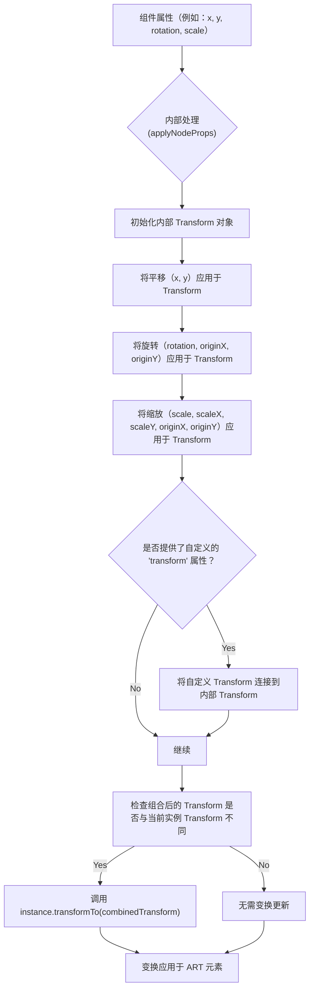

# 变换

变换使您能够精确控制 ART 元素的位置、方向和大小，从而实现动态和交互式图形。您可以通过组件属性或提供自定义的 `Transform` 对象直接应用平移（移动）、旋转和缩放等变换。

有关使用颜色和图案为元素设置样式的信息，请参阅[填充和描边](./styling-interactivity-fills-strokes.md)部分。要了解如何使您的图形具有交互性，请参阅[事件处理](./styling-interactivity-event-handling.md)。

## 理解 ART 中的变换

React ART 利用底层 ART 库的 `Transform` 对象来处理复杂的几何操作。当您在 ART 组件（如 `Shape`、`Group`、`ClippingRectangle` 或 `Text`）上指定与变换相关的属性时，React ART 会在内部处理这些属性，并将其作为单个组合变换应用于元素。

### 变换如何应用

内部过程将所有单独的变换属性（`x`、`y`、`rotation`、`scale`、`scaleX`、`scaleY`、`originX`、`originY` 和自定义的 `transform` 对象）组合成一个单一的变换矩阵。然后将此统一矩阵应用于 ART 实例。



## 用于变换的组件属性

大多数 ART 绘图组件，例如 `Shape`、`Group`、`ClippingRectangle` 和 `Text`，都接受以下变换属性：

| Property | Type | Description | Default | Applicable to |
|---|---|---|---|---|
| `x` | `number` | 平移的 X 坐标。 | `0` | 所有可变换组件 |
| `y` | `number` | 平移的 Y 坐标。 | `0` | 所有可变换组件 |
| `rotation` | `number` | 旋转角度，单位为度。 | `0` | 所有可变换组件 |
| `originX` | `number` | 旋转/缩放原点的 X 坐标。如果未指定，则原点为元素边界框的左上角。 | `undefined` | 所有可变换组件 |
| `originY` | `number` | 旋转/缩放原点的 Y 坐标。如果未指定，则原点为元素边界框的左上角。 | `undefined` | 所有可变换组件 |
| `scale` | `number` | X 轴和 Y 轴的统一缩放因子。 | `1` | 所有可变换组件 |
| `scaleX` | `number` | X 轴的缩放因子。 | `1` | 所有可变换组件 |
| `scaleY` | `number` | Y 轴的缩放因子。 | `1` | 所有可变换组件 |
| `transform` | `Transform` | `art/core/transform` 对象的一个实例，用于自定义的复杂变换。此变换在单独的 `x`、`y`、`rotation` 和 `scale` 属性*之后*应用。 | `null` | 所有可变换组件 |

### 直接使用 `Transform` 对象

`art/core/transform` 中的 `Transform` 对象允许对变换进行更直接和程序化的控制。您可以创建一个 `Transform` 实例并将其传递给任何 ART 组件的 `transform` 属性。

```javascript
import { Transform, Shape, Surface } from 'react-art';

// Create a transform that moves 50,50 and then rotates 45 degrees
const myTransform = new Transform().move(50, 50).rotate(45);

function TransformedShape() {
  return (
    <Surface width={200} height={200}>
      <Shape 
        d="M0 0 L100 0 L100 100 L0 100 Z" 
        fill="blue" 
        stroke="black" 
        strokeWidth={2}
        transform={myTransform} // Apply the custom Transform object
      />
      <Shape 
        d="M0 0 L100 0 L100 100 L0 100 Z" 
        x={10} y={10} // Apply translation via props
        fill="red" 
        opacity={0.5} 
        stroke="black" 
        strokeWidth={2}
      />
    </Surface>
  );
}

// Example of more complex chained transformations
const complexTransform = new Transform()
  .scale(2) // Scale by 2
  .rotate(30, 50, 50) // Rotate 30 degrees around origin (50,50)
  .move(20, 20); // Then move 20, 20

function ComplexTransformedGroup() {
  return (
    <Surface width={300} height={300}>
      <Group transform={complexTransform}>
        <Shape 
          d="M0 0 L50 0 L50 50 L0 50 Z" 
          fill="green" 
          stroke="black" 
          strokeWidth={1}
        />
      </Group>
    </Surface>
  );
}
```

在此示例中，`myTransform` 被创建并应用于第一个 `Shape`。第二个 `Shape` 使用简单的 `x` 和 `y` 属性进行平移。`ComplexTransformedGroup` 演示了将链式 `Transform` 对象应用于 `Group` 组件，这会影响其所有子元素。

## 示例：组合变换

此示例演示了一个 `Shape`，它使用属性组合进行平移、旋转和缩放。

```javascript
import React from 'react';
import { Surface, Shape } from 'react-art';

function TransformedSquare() {
  return (
    <Surface width={200} height={200}>
      <Shape
        d="M0 0 L50 0 L50 50 L0 50 Z" // 一个 50x50 的正方形路径
        x={75} // 向右平移 75 个单位
        y={75} // 向下平移 75 个单位
        rotation={45} // 围绕其原点（默认为原始路径的左上角，相对于元素的 0,0）旋转 45 度
        originX={25} // 将旋转原点设置为 50x50 正方形的中心 (x)
        originY={25} // 将旋转原点设置为 50x50 正方形的中心 (y)
        scale={1.5} // 均匀缩放 1.5 倍
        fill="purple"
        stroke="darkgrey"
        strokeWidth={2}
      />
    </Surface>
  );
}

// 在您的 React 应用程序中渲染此组件
// ReactDOM.render(<TransformedSquare />, document.getElementById('art-container'));
```

此代码渲染了一个居中、旋转 45 度并放大 1.5 倍的正方形。此处的 `originX` 和 `originY` 属性至关重要，它们确保旋转和缩放发生在正方形的中心，而不是其左上角。

---

理解变换使您能够使用 React ART 创建复杂而动态的视觉效果。您现在拥有有效定位、旋转和缩放绘图组件的工具。接下来，请在[事件处理](./styling-interactivity-event-handling.md)部分探索如何通过处理用户输入使这些图形具有交互性。