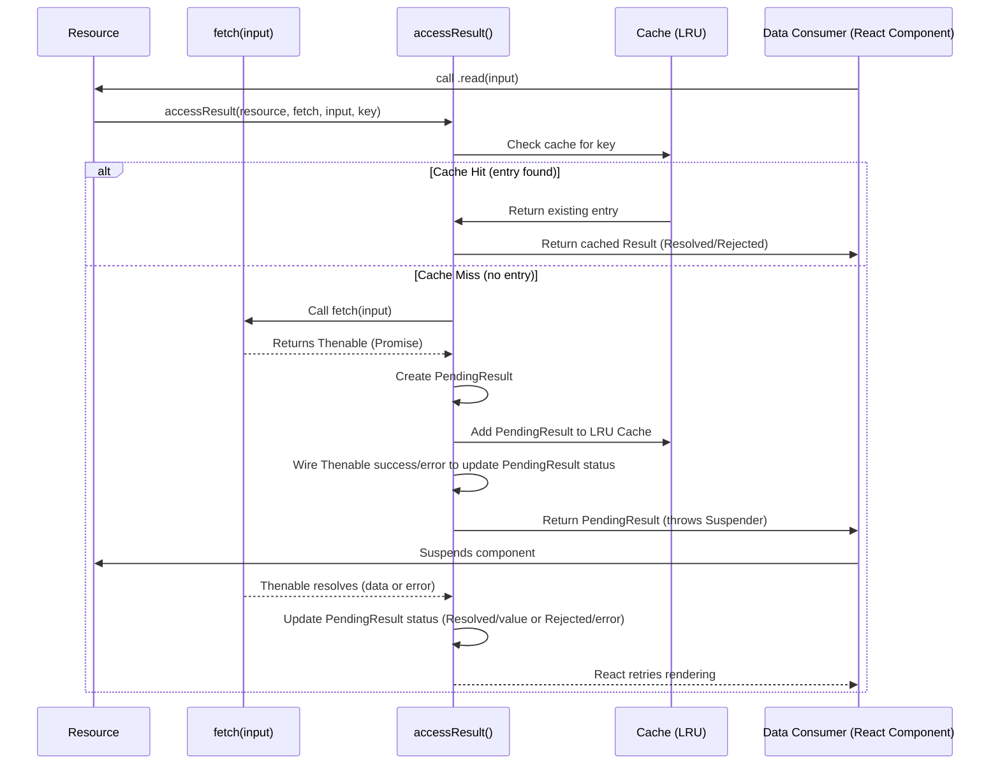

# unstable_createResource

The `unstable_createResource` function is a core utility within `react-cache` that allows you to define a cacheable resource. This resource abstracts the process of data fetching and caching, integrating directly with React's Suspense mechanism. It manages data lifecycle, including the states of data (Pending, Resolved, Rejected) and automatically leverages an LRU cache.

For a deeper understanding of how resources are managed internally, refer to the [Resource Management](./Core-Concepts-Resource-Management.md) section. Details on the caching algorithm can be found in [LRU Cache Implementation](./Core-Concepts-LRU-Cache-Implementation.md).

## Function Signature

```javascript
function unstable_createResource<I, K: string | number, V>(
  fetch: I => Thenable<V>,
  maybeHashInput?: I => K,
): Resource<I, V>
```

## Parameters

| Name | Type | Description |
|---|---|---|
| `fetch` | `I => Thenable<V>` | A required asynchronous function that takes an `input` of type `I` and returns a `Thenable<V>`. This `Thenable` should resolve with the data of type `V` or reject with an error. This function is responsible for the actual data fetching logic. |
| `maybeHashInput` | `(I => K)` | An optional function that takes an `input` of type `I` and returns a `key` of type `K` (`string` or `number`). This key is used to uniquely identify the cached data. If not provided, `unstable_createResource` uses a default `identityHashFn` that expects primitive inputs (`string`, `number`, `boolean`, `undefined`, `null`). If you need to use non-primitive values (like objects) as keys, you must provide your own hashing function. |

## Return Value

`unstable_createResource` returns a `Resource` object with two methods:

| Method | Description |
|---|---|
| `read(input: I): V` | Attempts to read the resource's value based on the given `input`. If the data is not yet available, it throws a `Suspender` (a `Thenable`) to trigger React's Suspense. If an error occurred during fetching, it throws the error. If the data is resolved, it returns the value. |
| `preload(input: I): void` | Initiates a fetch for the resource's value based on the given `input`, but does not wait for it or throw if pending. This is useful for pre-fetching data that might be needed soon. |

## Resource Lifecycle and Caching with `accessResult`

The `read` and `preload` methods internally rely on the `accessResult` function to manage the caching and state of the data. This function ensures that for a given resource and input key, data is fetched only once and then cached. If a request comes in for data that is already pending, `accessResult` returns the existing `PendingResult` rather than initiating a new fetch.

Here's a simplified view of the `accessResult` flow:



When `read` is called, if the data is `Pending`, it throws the `Suspender` (the `Thenable` itself). React's Suspense mechanism catches this and waits for the `Thenable` to resolve or reject before retrying the component's render. If the data is `Resolved`, `read` returns the value. If it's `Rejected`, `read` throws the error.

The `preload` method follows a similar path but does not throw the `Suspender` or return the value. Its sole purpose is to initiate the data fetch and populate the cache in the background.

## Key Hashing with `identityHashFn`

The `maybeHashInput` parameter is crucial when your input `I` is not a primitive type that can directly serve as a Map key. `react-cache` provides a default `identityHashFn` for basic cases:

```javascript
function identityHashFn(input) {
  if (
    typeof input !== 'string' &&
    typeof input !== 'number' &&
    typeof input !== 'boolean' &&
    input !== undefined &&
    input !== null
  ) {
    console.error(
      'Invalid key type. Expected a string, number, symbol, or boolean, ' +
        'but instead received: %s' +
        '\n\nTo use non-primitive values as keys, you must pass a hash ' +
        'function as the second argument to createResource().',
      input,
    );
  }
  return input;
}
```

As the warning suggests, if your `input` to the resource is an object or array, you must provide a `maybeHashInput` function that deterministically converts your complex input into a simple string or number key. Without a proper hashing function, different object instances with the same content would be treated as distinct keys, leading to cache misses and redundant fetches.

## Example Usage

Consider fetching user data by ID. You can define a resource like this:

```javascript
import { unstable_createResource } from 'react-cache';

// Simulate an async data fetch
const fetchUserById = (id) => {
  return new Promise(resolve => {
    setTimeout(() => {
      console.log(`Fetching user ${id}...`);
      resolve({ id, name: `User ${id}`, email: `user${id}@example.com` });
    }, 1000);
  });
};

// Create the user resource
const UserResource = unstable_createResource(fetchUserById);

// A React component that uses the resource
function UserProfile({ userId }) {
  // This will suspend if data is not in cache and fetching
  const user = UserResource.read(userId);
  return (
    <div>
      <h3>User Profile</h3>
      <p>ID: {user.id}</p>
      <p>Name: {user.name}</p>
      <p>Email: {user.email}</p>
    </div>
  );
}

// Example of preloading data
// You might call this in a parent component or route handler
UserResource.preload(1);
UserResource.preload(2);

// In your actual React app, you would render UserProfile within a <Suspense> boundary.
// Example:
// function App() {
//   const [showUser, setShowUser] = React.useState(false);
//   return (
//     <>
//       <button onClick={() => setShowUser(!showUser)}>Toggle User</button>
//       <React.Suspense fallback={<div>Loading user...</div>}>
//         {showUser && <UserProfile userId={1} />}
//       </React.Suspense>
//     </>
//   );
// }
```

In this example, `UserResource.read(userId)` attempts to read the user data. If the data for `userId` is not cached or is currently being fetched, it will cause the component to suspend. The `UserResource.preload(userId)` calls initiate the data fetching in the background, making it available in the cache for when `read` is eventually called, potentially reducing or eliminating the suspension time.

This section provided a comprehensive overview of `unstable_createResource`, its parameters, and how its `read` and `preload` methods function. You can now define and manage cacheable data within your React applications using this experimental utility. For details on controlling the cache size, proceed to the [unstable_setGlobalCacheLimit](./API-Reference-unstable_setGlobalCacheLimit.md) section.