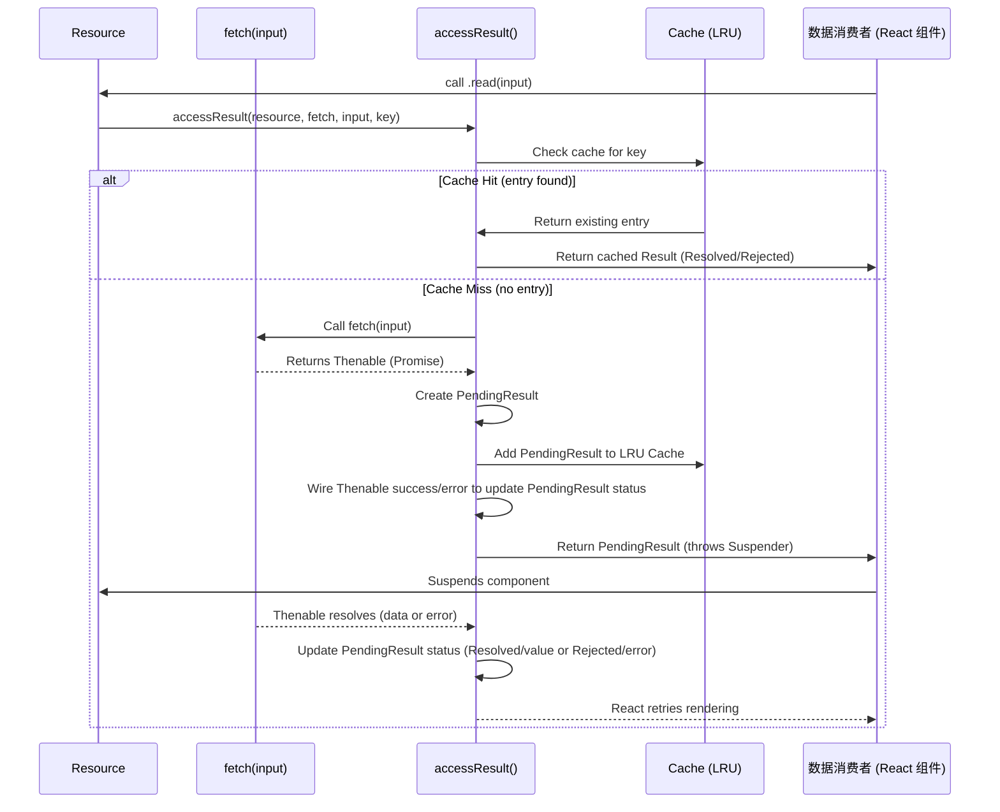

# unstable_createResource

`unstable_createResource` 函数是 `react-cache` 中的一个核心工具，它允许你定义一个可缓存的资源。这个资源抽象了数据获取和缓存的过程，并直接与 React 的 Suspense 机制集成。它管理数据生命周期，包括数据状态（挂起、已解决、已拒绝），并自动利用 LRU 缓存。

有关资源内部如何管理的更深入理解，请参阅[资源管理](./Core-Concepts-Resource-Management.md)部分。有关缓存算法的详细信息，请参见[LRU 缓存实现](./Core-Concepts-LRU-Cache-Implementation.md)。

## 函数签名

```javascript
function unstable_createResource<I, K: string | number, V>(
  fetch: I => Thenable<V>,
  maybeHashInput?: I => K,
): Resource<I, V>
```

## 参数

| Name |
|---|
| `fetch` |
| `maybeHashInput` |

## 返回值

`unstable_createResource` 返回一个包含两个方法的 `Resource` 对象：

| Method | Description |
|---|---|
| `read(input: I): V` | 尝试根据给定的 `input` 读取资源的值。如果数据尚未可用，它会抛出一个 `Suspender`（一个 `Thenable`）以触发 React 的 Suspense。如果在获取过程中发生错误，它会抛出错误。如果数据已解决，它会返回值。 |
| `preload(input: I): void` | 根据给定的 `input` 启动资源值的获取，但不会等待或在挂起时抛出。这对于预取可能很快需要的数据非常有用。 |

## Resource 生命周期和 `accessResult` 缓存

`read` 和 `preload` 方法内部依赖于 `accessResult` 函数来管理数据的缓存和状态。此函数确保对于给定的资源和输入 `key`，数据只获取一次然后进行缓存。如果对已挂起数据的请求进入，`accessResult` 返回现有的 `PendingResult` 而不是启动新的获取。

以下是 `accessResult` 流程的简化视图：



当调用 `read` 时，如果数据处于 `Pending` 状态，它会抛出 `Suspender`（即 `Thenable` 本身）。React 的 Suspense 机制会捕获它，并等待 `Thenable` 解析或拒绝，然后才重试组件的渲染。如果数据已 `Resolved`，`read` 返回该值。如果是 `Rejected`，`read` 会抛出错误。

`preload` 方法遵循类似路径，但不会抛出 `Suspender` 或返回值。其唯一目的是在后台启动数据获取并填充缓存。

## 使用 `identityHashFn` 进行键哈希

当你的 `input I` 不是可以直接用作 Map 键的基本类型时，`maybeHashInput` 参数至关重要。`react-cache` 为基本情况提供了一个默认的 `identityHashFn`：

```javascript
function identityHashFn(input) {
  if (
    typeof input !== 'string' &&
    typeof input !== 'number' &&
    typeof input !== 'boolean' &&
    input !== undefined &&
    input !== null
  ) {
    console.error(
      '无效的键类型。预期为字符串、数字、符号或布尔值，' +
        '但实际接收到：%s' +
        '\n\n要使用非基本类型值作为键，你必须将一个哈希' +
        '函数作为第二个参数传递给 createResource()。',
      input,
    );
  }
  return input;
}
```

正如警告所示，如果你传递给资源的 `input` 是一个对象或数组，你必须提供一个 `maybeHashInput` 函数，它能确定性地将复杂的 `input` 转换为简单的字符串或数字键。如果没有正确的哈希函数，具有相同内容的不同对象实例将被视为不同的键，从而导致缓存未命中和冗余获取。

## 示例用法

考虑按 ID 获取用户数据。你可以这样定义一个资源：

```javascript
import { unstable_createResource } from 'react-cache';

// 模拟异步数据获取
const fetchUserById = (id) => {
  return new Promise(resolve => {
    setTimeout(() => {
      console.log(`获取用户 ${id}...`);
      resolve({ id, name: `User ${id}`, email: `user${id}@example.com` });
    }, 1000);
  });
};

// 创建用户资源
const UserResource = unstable_createResource(fetchUserById);

// 一个使用该资源的 React 组件
function UserProfile({ userId }) {
  // 如果数据不在缓存中且正在获取，这将导致组件挂起
  const user = UserResource.read(userId);
  return (
    <div>
      <h3>User Profile</h3>
      <p>ID: {user.id}</p>
      <p>Name: {user.name}</p>
      <p>Email: {user.email}</p>
    </div>
  );
}

// 预加载数据的示例
// 你可以在父组件或路由处理程序中调用此函数
UserResource.preload(1);
UserResource.preload(2);

// 在你的实际 React 应用中，你将在 <Suspense> 边界内渲染 UserProfile。
// 示例:
// function App() {
//   const [showUser, setShowUser] = React.useState(false);
//   return (
//     <>
//       <button onClick={() => setShowUser(!showUser)}>切换用户</button>
//       <React.Suspense fallback={<div>正在加载用户...</div>}>
//         {showUser && <UserProfile userId={1} />}
//       </React.Suspense>
//     </>
//   );
// }
```

在此示例中，`UserResource.read(userId)` 尝试读取用户数据。如果 `userId` 的数据未被缓存或正在获取中，它将导致组件挂起。`UserResource.preload(userId)` 调用会在后台启动数据获取，使其在最终调用 `read` 时可在缓存中获取，从而可能减少或消除挂起时间。

本节全面概述了 `unstable_createResource`、它的参数，以及 `read` 和 `preload` 方法如何工作。你现在可以使用这个实验性工具在 React 应用程序中定义和管理可缓存的数据。有关控制缓存大小的详细信息，请参阅`[unstable_setGlobalCacheLimit](./API-Reference-unstable_setGlobalCacheLimit.md)` 部分。