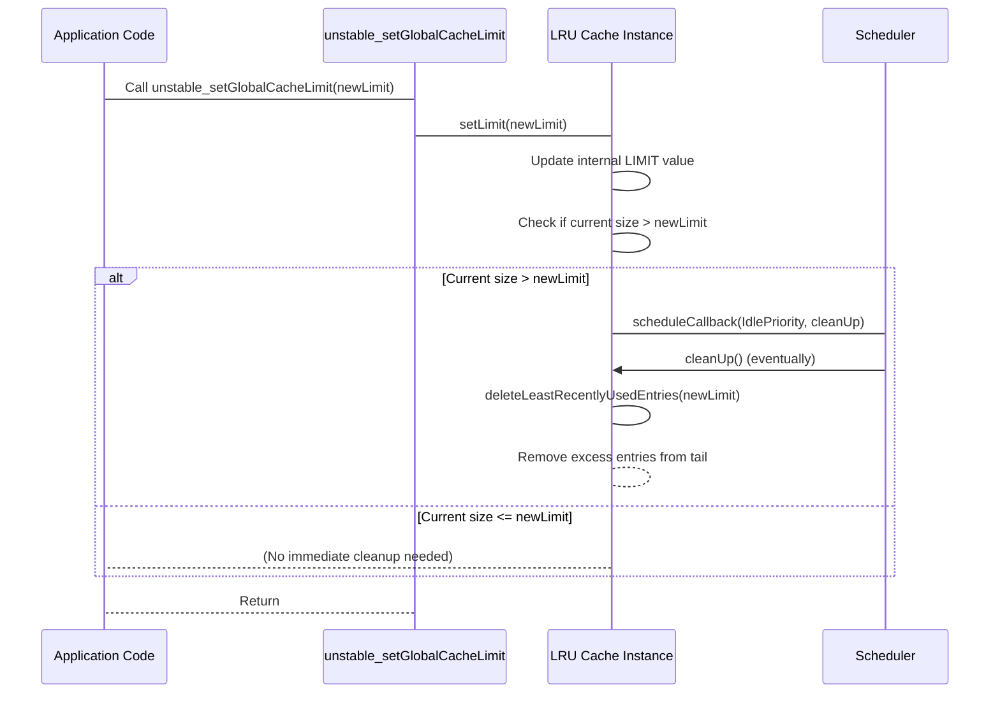

# unstable_setGlobalCacheLimit

This section details the `unstable_setGlobalCacheLimit` API, which allows you to adjust the maximum number of entries the internal Least Recently Used (LRU) cache can hold. This function directly influences how `react-cache` manages cached resources.

For a deeper understanding of the caching mechanism, refer to the [LRU Cache Implementation](./Core-Concepts-LRU-Cache-Implementation.md) section.

## Function Overview

The `unstable_setGlobalCacheLimit` function enables you to dynamically change the global cache size limit. When a new limit is set, the LRU cache immediately checks if its current size exceeds this new limit and schedules a cleanup if necessary. The default cache limit is 500 entries.

### Parameters

| Name | Type | Description |
|---|---|---|
| `limit` | `number` | The new maximum number of entries the global cache should store. If the current cache size is greater than this new limit, a cleanup process will be triggered to remove the least recently used entries until the cache size is within the new limit. |

### Returns

This function does not return any value (`void`).

### Example

```javascript
import { unstable_setGlobalCacheLimit } from 'react-cache';

function adjustCacheLimit() {
  // Set the global cache limit to 1000 entries
  unstable_setGlobalCacheLimit(1000);
  console.log('Global cache limit adjusted to 1000.');
}

// Call the function to set a new limit
adjustCacheLimit();

function reduceCacheLimit() {
  // Reduce the global cache limit to 200 entries
  // This will trigger an immediate cleanup if the cache currently holds more than 200 entries.
  unstable_setGlobalCacheLimit(200);
  console.log('Global cache limit reduced to 200. Cleanup may be scheduled.');
}

// Call the function to set a lower limit
reduceCacheLimit();
```

This example demonstrates how to increase and then decrease the global cache limit using `unstable_setGlobalCacheLimit`. When the limit is set to 200, if the cache currently contains more than 200 items, the LRU mechanism will begin removing the least recently used items to comply with the new, smaller limit.


### Cache Limit Adjustment Process

The following diagram illustrates how the LRU cache reacts when `unstable_setGlobalCacheLimit` is invoked:




--- 

This function offers control over `react-cache`'s memory footprint by managing its internal LRU cache. Remember that `react-cache` is an experimental utility. For important caveats and warnings, proceed to the [Experimental Status and Warnings](./Experimental-Status-and-Warnings.md) section.