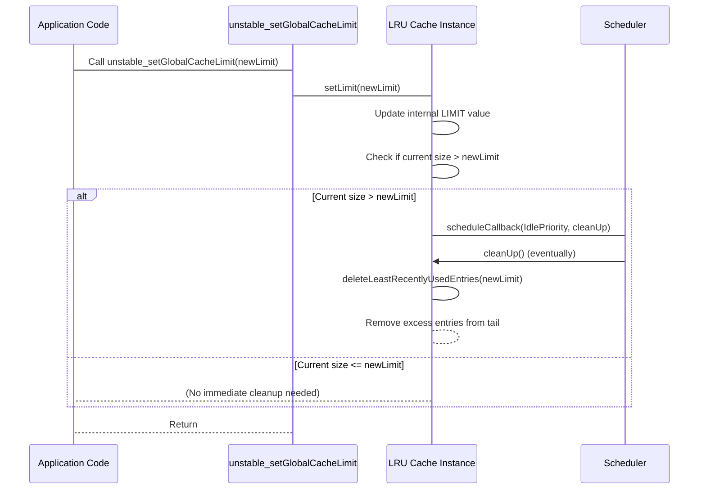

# unstable_setGlobalCacheLimit

本节详细介绍了 `unstable_setGlobalCacheLimit` API，该 API 允许您调整内部最近最少使用 (LRU) 缓存可容纳的最大条目数。此函数直接影响 `react-cache` 管理缓存资源的方式。

要更深入地了解缓存机制，请参阅 [LRU 缓存实现](./Core-Concepts-LRU-Cache-Implementation.md) 部分。

## 函数概述

`unstable_setGlobalCacheLimit` 函数使您能够动态更改全局缓存大小限制。当设置新限制时，LRU 缓存会立即检查其当前大小是否超出此新限制，并在必要时安排清理。默认缓存限制为 500 个条目。

### 参数

| Name | Type | Description |
|---|---|---|
| `limit` | `number` | 全局缓存应存储的新最大条目数。如果当前缓存大小大于此新限制，将触发清理过程以移除最近最少使用的条目，直到缓存大小在新限制之内。 |

### 返回值

此函数不返回任何值 (`void`)。

### 示例

```javascript
import { unstable_setGlobalCacheLimit } from 'react-cache';

function adjustCacheLimit() {
  // 将全局缓存限制设置为 1000 个条目
  unstable_setGlobalCacheLimit(1000);
  console.log('全局缓存限制已调整为 1000。');
}

// 调用函数设置新限制
adjustCacheLimit();

function reduceCacheLimit() {
  // 将全局缓存限制减少到 200 个条目
  // 如果缓存当前包含超过 200 个条目，这将触发立即清理。
  unstable_setGlobalCacheLimit(200);
  console.log('全局缓存限制已减少到 200。可能已安排清理。');
}

// 调用函数设置较低的限制
reduceCacheLimit();
```

此示例演示了如何使用 `unstable_setGlobalCacheLimit` 增加然后减少全局缓存限制。当限制设置为 200 时，如果缓存当前包含超过 200 个项目，LRU 机制将开始移除最近最少使用的项目，以符合新的、更小的限制。


### 缓存限制调整过程

下图说明了当调用 `unstable_setGlobalCacheLimit` 时 LRU 缓存的反应方式：




---

此函数通过管理其内部 LRU 缓存，提供了对 `react-cache` 内存占用量的控制。请记住，`react-cache` 是一个实验性工具。有关重要的注意事项和警告，请参阅 [实验状态和警告](./Experimental-Status-and-Warnings.md) 部分。