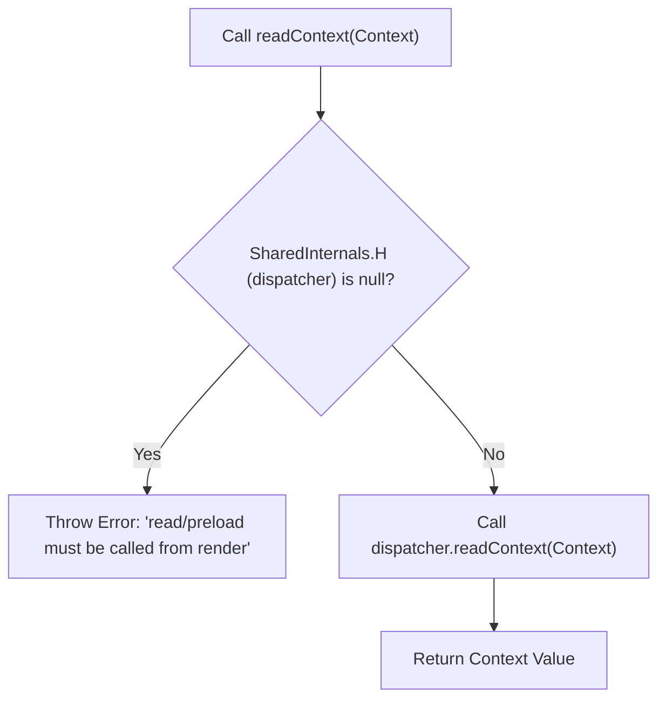

# Context and Internal Dispatcher

This section explains how `react-cache` integrates with React's internal mechanisms to enforce its usage rules. It specifically details the role of React's internal dispatcher and the `CacheContext` in ensuring that `react-cache`'s operations, such as `read` and `preload`, are only executed within a component's render phase. This design prevents common pitfalls and ensures predictable behavior within the React reconciliation cycle.

## The Internal Dispatcher (`SharedInternals.H`)

`react-cache` interacts with an internal React dispatcher, exposed via `React.__CLIENT_INTERNALS_DO_NOT_USE_OR_WARN_USERS_THEY_CANNOT_UPGRADE`. This `SharedInternals` object provides access to low-level React functionalities, including the current dispatcher (`SharedInternals.H`). The dispatcher is a crucial internal mechanism that React uses to manage operations like context reading, hooks, and updates during the rendering process. It is only available when React is actively rendering a component.

## Enforcing Render Phase Usage (`readContext` and `CacheContext`)

To ensure `react-cache` functions correctly within React's lifecycle, the library utilizes an internal `readContext` function. This function serves as a gatekeeper, checking for the presence of the internal dispatcher. It leverages `CacheContext`, which is a standard React Context created via `React.createContext(null)`.

Here is how the enforcement works:

1.  **Accessing the Dispatcher**: The `readContext` function attempts to retrieve the internal dispatcher from `SharedInternals.H`.
2.  **Validation Check**: It then checks if this dispatcher is `null`. If `SharedInternals.H` is `null`, it signifies that the `readContext` call (and by extension, the `react-cache` operation) is happening outside of React's render phase (e.g., in an event handler or a lifecycle method like `componentDidMount`).
3.  **Error Handling**: If the dispatcher is `null`, `readContext` throws an error. This error explicitly warns that `read` and `preload` operations are only supported from within a component's render function, thereby preventing misuse and potential inconsistencies.
4.  **Context Consumption**: If the dispatcher is present, `readContext` proceeds to call `dispatcher.readContext(Context)`, which is how React internally reads context values during render.

Both the `read` and `preload` methods within `unstable_createResource` explicitly call `readContext(CacheContext)` to trigger this check, thereby enforcing that these operations strictly adhere to being called within React's render phase. This ensures that data fetching and caching align with React's concurrent rendering capabilities and suspense mechanisms.



Here is the relevant code illustrating this mechanism:

```javascript
const SharedInternals =
  React.__CLIENT_INTERNALS_DO_NOT_USE_OR_WARN_USERS_THEY_CANNOT_UPGRADE;

function readContext(Context: ReactContext<mixed>) {
  const dispatcher = SharedInternals.H;
  if (dispatcher === null) {
    throw new Error(
      'react-cache: read and preload may only be called from within a ' +
        "component's render. They are not supported in event handlers or " +
        'lifecycle methods.',
    );
  }
  return dispatcher.readContext(Context);
}

const CacheContext = React.createContext<mixed>(null);

export function unstable_createResource<I, K: string | number, V>(
  fetch: I => Thenable<V>,
  maybeHashInput?: I => K,
): Resource<I, V> {
  const resource = {
    read(input: I): V {
      // This call ensures operations happen within render.
      readContext(CacheContext);
      // ... rest of read logic
    },
    preload(input: I): void {
      // This call ensures operations happen within render.
      readContext(CacheContext);
      // ... rest of preload logic
    },
  };
  return resource;
}
```

This robust check prevents `react-cache` from being used in unsupported contexts, which could lead to unpredictable behavior or reconciliation issues. It is a fundamental aspect of `react-cache`'s design, ensuring its compatibility and stability within the React ecosystem.

To understand how to define and use cacheable resources with these mechanisms, proceed to the [unstable_createResource](./API-Reference-unstable_createResource.md) section.