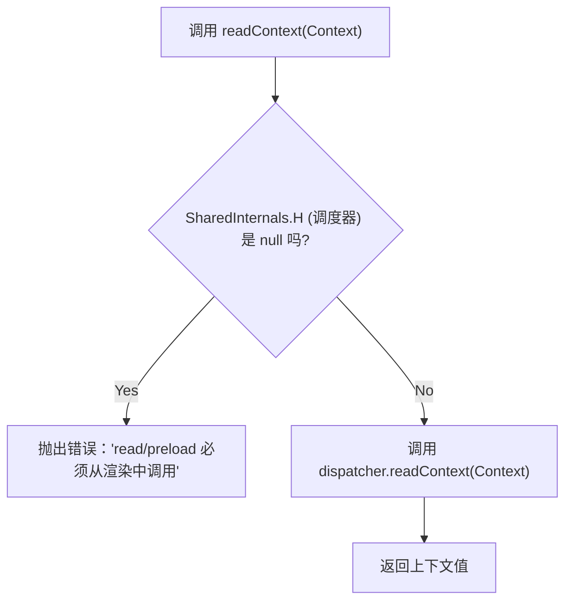

# 上下文和内部调度器

本节解释了 `react-cache` 如何与 React 的内部机制集成以强制执行其使用规则。它特别详细说明了 React 内部调度器和 `CacheContext` 在确保 `react-cache` 的操作（例如 `read` 和 `preload`）仅在组件的渲染阶段执行方面的作用。这种设计避免了常见的陷阱，并确保了 React 协调周期内的可预测行为。

## 内部调度器 (SharedInternals.H)

`react-cache` 与一个内部 React 调度器交互，该调度器通过 `React.__CLIENT_INTERNALS_DO_NOT_USE_OR_WARN_USERS_THEY_CANNOT_UPGRADE` 暴露。这个 `SharedInternals` 对象提供了对低级 React 功能的访问，包括当前的调度器 (`SharedInternals.H`)。调度器是 React 用于在渲染过程中管理上下文读取、Hooks 和更新等操作的关键内部机制。它只在 React 积极渲染组件时可用。

## 强制渲染阶段使用 (readContext 和 CacheContext)

为确保 `react-cache` 在 React 生命周期内正常运行，该库使用了一个内部 `readContext` 函数。此函数充当守门员，检查内部调度器是否存在。它利用 `CacheContext`，这是一个通过 `React.createContext(null)` 创建的标准 React 上下文。

强制执行的工作原理如下：

1.  **访问调度器**：`readContext` 函数尝试从 `SharedInternals.H` 中检索内部调度器。
2.  **验证检查**：然后它检查此调度器是否为 `null`。如果 `SharedInternals.H` 为 `null`，则表示 `readContext` 调用（以及 `react-cache` 操作）发生在 React 渲染阶段之外（例如，在事件处理程序或 `componentDidMount` 等生命周期方法中）。
3.  **错误处理**：如果调度器为 `null`，`readContext` 将抛出错误。此错误明确警告 `read` 和 `preload` 操作仅在组件的渲染函数内部受支持，从而防止误用和潜在的不一致性。
4.  **上下文消费**：如果调度器存在，`readContext` 将继续调用 `dispatcher.readContext(Context)`，这是 React 在渲染期间内部读取上下文值的方式。

`unstable_createResource` 中的 `read` 和 `preload` 方法都显式调用 `readContext(CacheContext)` 来触发此检查，从而强制这些操作严格遵守在 React 的渲染阶段内被调用。这确保了数据获取和缓存与 React 的并发渲染能力和 `Suspense` 机制保持一致。



以下是说明此机制的相关代码：

```javascript
const SharedInternals =
  React.__CLIENT_INTERNALS_DO_NOT_USE_OR_WARN_USERS_THEY_CANNOT_UPGRADE;

function readContext(Context: ReactContext<mixed>) {
  const dispatcher = SharedInternals.H;
  if (dispatcher === null) {
    throw new Error(
      'react-cache: read 和 preload 只能从组件的渲染中调用。它们在事件处理程序或生命周期方法中不受支持。',
    );
  }
  return dispatcher.readContext(Context);
}

const CacheContext = React.createContext<mixed>(null);

export function unstable_createResource<I, K: string | number, V>(
  fetch: I => Thenable<V>,
  maybeHashInput?: I => K,
): Resource<I, V> {
  const resource = {
    read(input: I): V {
      // 此调用确保操作在渲染中发生。
      readContext(CacheContext);
      // ... read 的其余逻辑
    },
    preload(input: I): void {
      // 此调用确保操作在渲染中发生。
      readContext(CacheContext);
      // ... preload 的其余逻辑
    },
  };
  return resource;
}
```

这种健壮的检查防止 `react-cache` 在不支持的上下文中被使用，这可能导致不可预测的行为或协调问题。它是 `react-cache` 设计的一个基本方面，确保了它在 React 生态系统中的兼容性和稳定性。

要了解如何使用这些机制定义和使用可缓存资源，请转到 [unstable_createResource](./API-Reference-unstable_createResource.md) 部分。
