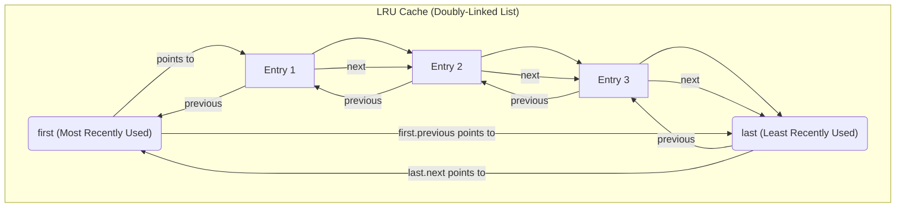
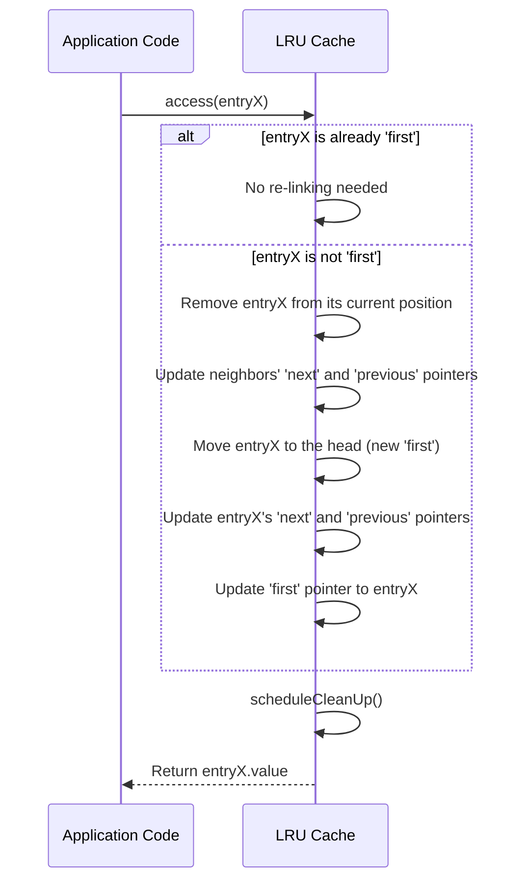
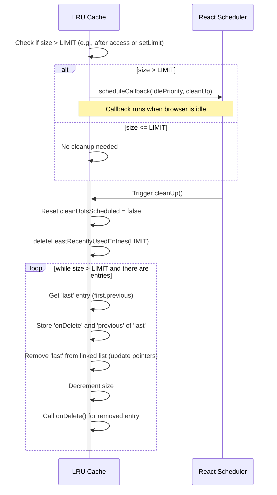

# LRU Cache Implementation

`react-cache` utilizes a Least Recently Used (LRU) cache algorithm to efficiently manage cached data. This ensures that the most frequently accessed data remains readily available, while older, less-used entries are eventually removed to free up memory. This section details how entries are added, updated, accessed, and cleaned up within this LRU mechanism. For an overview of `react-cache`'s foundational principles, refer to the [Core Concepts](./Core-Concepts.md) section.

## Understanding the LRU Structure

The LRU cache is implemented as a circular, doubly-linked list. Each item in the cache is represented by an `Entry` object, which contains:

*   `value`: The actual data being cached.
*   `onDelete`: A callback function executed when the entry is removed from the cache, allowing for resource cleanup.
*   `previous`: A reference to the previous entry in the list.
*   `next`: A reference to the next entry in the list.

The `first` pointer always refers to the most recently used entry, which is the head of the list. The `previous` pointer of the `first` entry points to the least recently used entry (the tail), creating a circular structure.



## Adding Entries

When you add a new entry to the cache, it is placed at the head of the list, becoming the new `first` (most recently used). If the cache is empty, the new entry becomes the sole element, pointing to itself in a circular fashion. Otherwise, it is inserted between the current `first` and its `previous` (the last entry), effectively shifting the previous `first` to the second position.

```javascript
function add(value: Object, onDelete: () => mixed): Entry<Object> {
  const entry = {
    value,
    onDelete,
    next: (null: any),
    previous: (null: any),
  };
  if (first === null) {
    // Cache is empty, make it the sole entry
    entry.previous = entry.next = entry;
    first = entry;
  } else {
    // Append to head (new first)
    const last = first.previous;
    last.next = entry;
    entry.previous = last;

    first.previous = entry;
    entry.next = first;

    first = entry;
  }
  size += 1;
  return entry;
}
```

## Accessing Entries

When an entry is accessed, the LRU algorithm dictates that it becomes the most recently used. If the accessed entry is not already the `first` entry in the list, it is moved to the head. This involves updating the `next` and `previous` pointers of its neighbors, then re-linking it to the `first` position. After an access, a cleanup operation is scheduled to potentially trim the cache size if it exceeds the configured limit.



```javascript
function access(entry: Entry<T>): T {
  const next = entry.next;
  if (next !== null) { // Check if entry is still in cache
    if (first !== entry) {
      // Remove from current position
      const previous = entry.previous;
      previous.next = next;
      next.previous = previous;

      // Append to head (making it the new first)
      const last = (first: any).previous;
      last.next = entry;
      entry.previous = last;

      (first: any).previous = entry;
      entry.next = (first: any);

      first = entry;
    }
  }
  scheduleCleanUp();
  return entry.value;
}
```

## Updating Entries

Updating an entry is a straightforward operation. The `update` method simply modifies the `value` property of the existing cache entry without changing its position in the linked list. Its position for LRU purposes is only affected by `access` calls.

```javascript
function update(entry: Entry<T>, newValue: T): void {
  entry.value = newValue;
}
```

## Cleaning Up Entries

The cache maintains a `LIMIT`. If the cache `size` exceeds this `LIMIT` after an `access` or `setLimit` operation, a cleanup is scheduled. This cleanup occurs with `IdlePriority` using the Scheduler, meaning it runs when the main thread is idle, minimizing impact on user interactions.

During cleanup, the `deleteLeastRecentlyUsedEntries` function is invoked. It iteratively removes entries starting from the `last` entry (the least recently used) until the cache size falls within the `LIMIT`. For each removed entry, its `onDelete` callback is executed to allow for external resource release.



```javascript
function scheduleCleanUp() {
  if (cleanUpIsScheduled === false && size > LIMIT) {
    cleanUpIsScheduled = true;
    scheduleCallback(IdlePriority, cleanUp);
  }
}

function cleanUp() {
  cleanUpIsScheduled = false;
  deleteLeastRecentlyUsedEntries(LIMIT);
}

function deleteLeastRecentlyUsedEntries(targetSize: number) {
  if (first !== null) {
    let last: null | Entry<T> = (first: any).previous;
    while (size > targetSize && last !== null) {
      const onDelete = last.onDelete;
      const previous = last.previous;

      // Remove from the list
      // (Pointer manipulation to remove 'last')
      if (last === first) {
        first = last = null;
      } else {
        (first: any).previous = previous;
        previous.next = (first: any);
        last = previous;
      }

      size -= 1;
      onDelete(); // Execute cleanup callback
    }
  }
}
```

## Setting Cache Limit

The `setLimit` function allows you to dynamically adjust the maximum number of entries the cache should hold. After updating the `LIMIT`, a `scheduleCleanUp` call is immediately triggered to ensure the cache adheres to the new size constraint.

```javascript
function setLimit(newLimit: number): void {
  LIMIT = newLimit;
  scheduleCleanUp();
}
```

--- 

This section provided a deep dive into `react-cache`'s LRU cache implementation, covering the mechanisms for managing cached data. Understanding these internal workings is crucial for comprehending how `react-cache` handles data lifecycle. Next, explore how `react-cache` integrates with React's concurrency model and manages different states of resources in the [Resource Management](./Core-Concepts-Resource-Management.md) section.