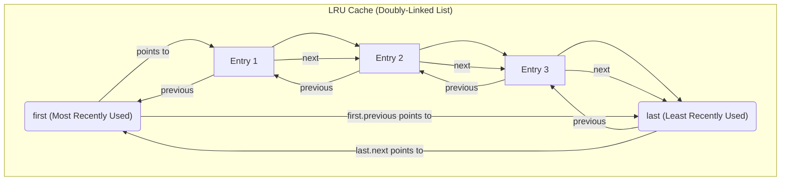
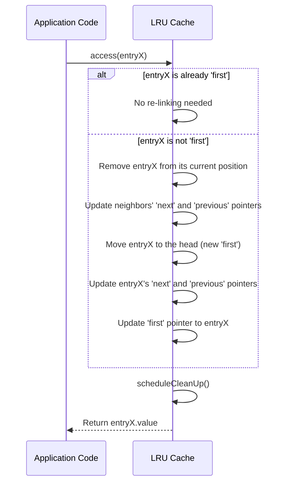
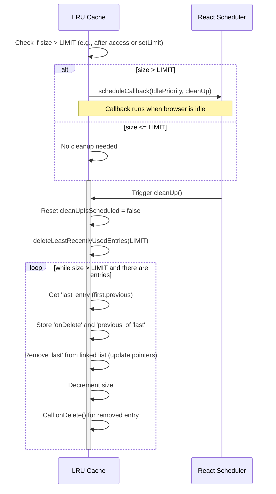

# LRU 缓存实现

`react-cache` 利用最近最少使用（LRU）缓存算法来高效管理缓存数据。这确保了最常访问的数据保持随时可用，而较旧、使用较少的条目最终会被移除以释放内存。本节详细介绍了在此 LRU 机制中如何添加、更新、访问和清理条目。有关 `react-cache` 基本原则的概述，请参阅 [核心概念](./Core-Concepts.md) 部分。

## 理解 LRU 结构

LRU 缓存实现为一个循环双向链表。缓存中的每个项目都由一个 `Entry` 对象表示，其中包含：

*   `value`：实际缓存的数据。
*   `onDelete`：当条目从缓存中移除时执行的回调函数，用于资源清理。
*   `previous`：指向列表中上一个条目的引用。
*   `next`：指向列表中下一个条目的引用。

`first` 指针始终指向最近使用的条目，即列表的头部。`first` 条目的 `previous` 指针指向最近最少使用的条目（尾部），从而创建了一个循环结构。



## 添加条目

当您向缓存添加新条目时，它被放置在列表的头部，成为新的 `first`（最近使用的）。如果缓存为空，新条目将成为唯一的元素，以循环方式指向自身。否则，它被插入到当前的 `first` 和其 `previous`（最后一个条目）之间，有效地将之前的 `first` 移到第二个位置。

```javascript
function add(value: Object, onDelete: () => mixed): Entry<Object> {
  const entry = {
    value,
    onDelete,
    next: (null: any),
    previous: (null: any),
  };
  if (first === null) {
    // Cache is empty, make it the sole entry
    entry.previous = entry.next = entry;
    first = entry;
  } else {
    // Append to head (new first)
    const last = first.previous;
    last.next = entry;
    entry.previous = last;

    first.previous = entry;
    entry.next = first;

    first = entry;
  }
  size += 1;
  return entry;
}
```

## 访问条目

当访问一个条目时，LRU 算法规定它成为最近使用的。如果被访问的条目不是列表中已经存在的 `first` 条目，则将其移动到头部。这涉及到更新其相邻条目的 `next` 和 `previous` 指针，然后将其重新链接到 `first` 位置。访问后，会安排一个清理操作，以在缓存大小超过配置限制时可能裁剪缓存。



```javascript
function access(entry: Entry<T>): T {
  const next = entry.next;
  if (next !== null) { // Check if entry is still in cache
    if (first !== entry) {
      // Remove from current position
      const previous = entry.previous;
      previous.next = next;
      next.previous = previous;

      // Append to head (making it the new first)
      const last = (first: any).previous;
      last.next = entry;
      entry.previous = last;

      (first: any).previous = entry;
      entry.next = (first: any);

      first = entry;
    }
  }
  scheduleCleanUp();
  return entry.value;
}
```

## 更新条目

更新条目是一个直接的操作。`update` 方法只是修改现有缓存条目的 `value` 属性，而不改变其在链表中的位置。其在 LRU 目的上的位置仅受 `access` 调用的影响。

```javascript
function update(entry: Entry<T>, newValue: T): void {
  entry.value = newValue;
}
```

## 清理条目

缓存维护一个 `LIMIT`。如果在 `access` 或 `setLimit` 操作后，缓存 `size` 超过此 `LIMIT`，则会安排清理。此清理使用调度器（Scheduler）的 `IdlePriority` 进行，这意味着它在主线程空闲时运行，最大限度地减少对用户交互的影响。

在清理过程中，会调用 `deleteLeastRecentlyUsedEntries` 函数。它从 `last` 条目（最近最少使用的）开始迭代移除条目，直到缓存大小落入 `LIMIT` 范围内。对于每个被移除的条目，其 `onDelete` 回调都会被执行，以允许外部资源释放。



```javascript
function scheduleCleanUp() {
  if (cleanUpIsScheduled === false && size > LIMIT) {
    cleanUpIsScheduled = true;
    scheduleCallback(IdlePriority, cleanUp);
  }
}

function cleanUp() {
  cleanUpIsScheduled = false;
  deleteLeastRecentlyUsedEntries(LIMIT);
}

function deleteLeastRecentlyUsedEntries(targetSize: number) {
  if (first !== null) {
    let last: null | Entry<T> = (first: any).previous;
    while (size > targetSize && last !== null) {
      const onDelete = last.onDelete;
      const previous = last.previous;

      // Remove from the list
      // (Pointer manipulation to remove 'last')
      if (last === first) {
        first = last = null;
      } else {
        (first: any).previous = previous;
        previous.next = (first: any);
        last = previous;
      }

      size -= 1;
      onDelete(); // Execute cleanup callback
    }
  }
}
```

## 设置缓存限制

`setLimit` 函数允许您动态调整缓存应持有的最大条目数量。更新 `LIMIT` 后，会立即触发 `scheduleCleanUp` 调用，以确保缓存遵守新的大小限制。

```javascript
function setLimit(newLimit: number): void {
  LIMIT = newLimit;
  scheduleCleanUp();
}
```

---

本节深入探讨了 `react-cache` 的 LRU 缓存实现，涵盖了管理缓存数据的机制。理解这些内部工作原理对于理解 `react-cache` 如何处理数据生命周期至关重要。接下来，请在 [资源管理](./Core-Concepts-Resource-Management.md) 部分探索 `react-cache` 如何与 React 的并发模型集成并管理资源的不同状态。
