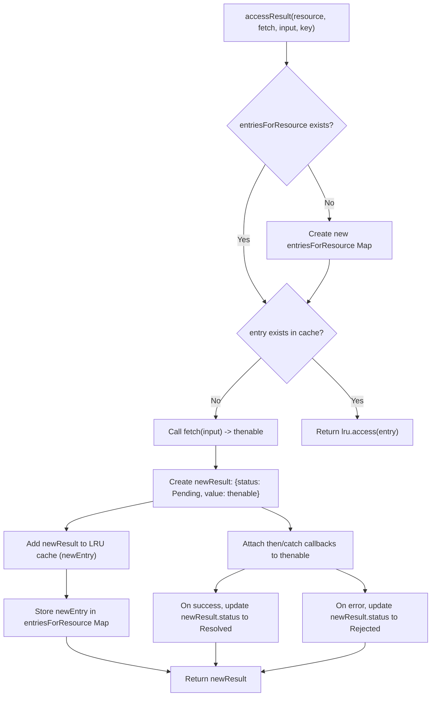

# Resource Management

`react-cache` effectively handles asynchronous data fetching and caching by managing the lifecycle and states of data resources. This section delves into how `react-cache` tracks the status of data, from initial fetching to final resolution or rejection, utilizing specific internal types to integrate with React's Suspense mechanism.

For a deeper understanding of the underlying caching mechanism, refer to the [LRU Cache Implementation](./Core-Concepts-LRU-Cache-Implementation.md) section.

## Data States

`react-cache` defines distinct states to represent the current status of a data resource as it is being fetched and processed. These states are critical for determining how React should respond, especially in the context of Suspense.

| State Name | Numeric Value | Description |
|---|---|---|
| `Pending` | `0` | The data fetch is in progress, and the result is not yet available. When a resource is in this state during a render, `react-cache` will throw a `Suspender` to trigger React Suspense. |
| `Resolved` | `1` | The data fetch has successfully completed, and the desired value is available. |
| `Rejected` | `2` | The data fetch failed, and an error occurred. `react-cache` will throw the error when the resource is accessed in this state. |

These states are internally managed by `react-cache` to provide a consistent mechanism for handling asynchronous operations.

## Suspender and Thenable Types

When data is in the `Pending` state, `react-cache` interacts with React's Suspense feature by throwing a specific type of object:

*   **`Thenable`**: This is a general term for any object that has a `then` method, similar to a JavaScript Promise. It represents an object that can be asynchronously "thenable" — meaning it has a `then` method, similar to a standard JavaScript Promise, allowing for callbacks to be registered for when the operation completes successfully or fails.
*   **`Suspender`**: Within `react-cache`, when a resource is in the `Pending` state, the `value` property of the `PendingResult` is a `Thenable` that also acts as a `Suspender`. When `unstable_createResource`'s `read` method is called and the data is not yet available (i.e., its status is `Pending`), `react-cache` throws this `Suspender` object. This throw is caught by React's Suspense mechanism, which then pauses the rendering of the component until the `Suspender` resolves, displaying a fallback UI in the meantime.

The `accessResult` function is central to this management. The flow of `accessResult` demonstrates how `react-cache` determines if a resource is cached or needs to be fetched, and how its state is managed throughout the asynchronous operation.

When a new resource is accessed and not found in the cache, `accessResult` initiates the `fetch(input)` operation, which returns a `Thenable`. This `Thenable` is immediately wrapped into a `PendingResult` object, setting its `status` to `0` (Pending). Callbacks are then attached to this `Thenable` to update the `PendingResult`'s status to `1` (Resolved) upon success or `2` (Rejected) upon failure, along with storing the actual value or error.

By carefully managing these data states and leveraging the `Suspender` mechanism, `react-cache` provides a robust, Suspense-integrated way to handle asynchronous data, allowing components to declaratively express their data dependencies. This approach abstracts away the complexities of data loading, error handling, and caching, enabling a more streamlined development experience.

--- 

Continue to the [API Reference](./API-Reference.md) to explore the public functions for interacting with `react-cache`.