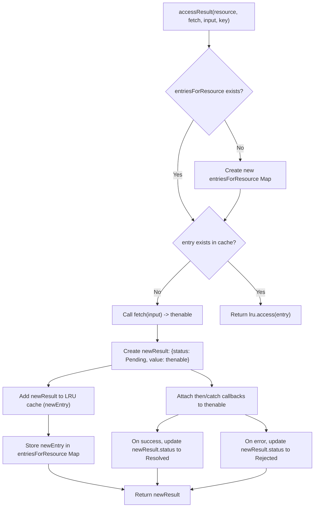

# 资源管理

`react-cache` 通过管理数据资源的生命周期和状态，有效地处理异步数据获取和缓存。本节深入探讨了 `react-cache` 如何跟踪数据状态，从初始获取到最终解决或拒绝，并利用特定的内部类型与 React 的 Suspense 机制集成。

如需深入了解底层缓存机制，请参阅[LRU 缓存实现](./Core-Concepts-LRU-Cache-Implementation.md)部分。

## 数据状态

`react-cache` 定义了不同的状态来表示数据资源在获取和处理过程中的当前状态。这些状态对于确定 React 应如何响应至关重要，尤其是在 Suspense 的上下文中。

| State Name | Numeric Value | Description |
|---|---|---|
| `Pending` | `0` | 数据获取正在进行中，结果尚未可用。当资源在渲染过程中处于此状态时，`react-cache` 将抛出一个 `Suspender` 来触发 React Suspense。 |
| `Resolved` | `1` | 数据获取已成功完成，所需值可用。 |
| `Rejected` | `2` | 数据获取失败，并且发生了错误。当在此状态下访问资源时，`react-cache` 将抛出该错误。 |

这些状态由 `react-cache` 内部管理，为处理异步操作提供了持续一致的机制。

## Suspender 和 Thenable 类型

当数据处于 `Pending` 状态时，`react-cache` 通过抛出特定类型的对象与 React 的 Suspense 功能进行交互：

*   **`Thenable`**：这是一个通用术语，指任何具有 `then` 方法的对象，类似于 JavaScript Promise。它表示一个可以异步“thenable”的对象——意味着它有一个 `then` 方法，类似于标准的 JavaScript Promise，允许注册回调以便在操作成功完成或失败时执行。
*   **`Suspender`**：在 `react-cache` 中，当资源处于 `Pending` 状态时，`PendingResult` 的 `value` 属性是一个 `Thenable`，它也充当 `Suspender`。当调用 `unstable_createResource` 的 `read` 方法且数据尚未可用（即其状态为 `Pending`）时，`react-cache` 会抛出此 `Suspender` 对象。此抛出会被 React 的 Suspense 机制捕获，然后暂停组件的渲染，直到 `Suspender` 解决，在此期间显示备用 UI。

`accessResult` 函数是这种管理的核心。`accessResult` 的流程演示了 `react-cache` 如何确定资源是已缓存还是需要获取，以及其状态如何在整个异步操作中进行管理。

当访问新资源且在缓存中未找到时，`accessResult` 会启动 `fetch(input)` 操作，该操作返回一个 `Thenable`。此 `Thenable` 会立即被包装成一个 `PendingResult` 对象，并将其 `status` 设置为 `0` (Pending)。随后，回调函数会附加到此 `Thenable`，以便在成功时将 `PendingResult` 的状态更新为 `1` (Resolved)，或在失败时更新为 `2` (Rejected)，同时存储实际值或错误。

通过精心管理这些数据状态并利用 `Suspender` 机制，`react-cache` 提供了一种健壮的、与 Suspense 集成的处理异步数据的方式，允许组件声明性地表达其数据依赖。这种方法抽象了数据加载、错误处理和缓存的复杂性，从而实现了更流畅的开发体验。

---

继续查阅 [API 参考](./API-Reference.md)以探索与 `react-cache` 交互的公共函数。