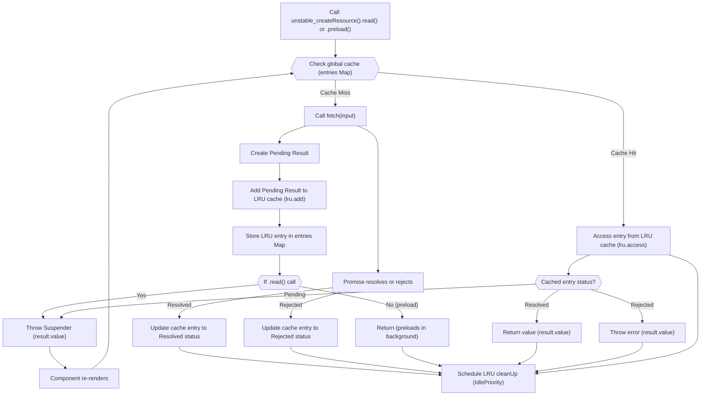

# Core Concepts

`react-cache` introduces an experimental approach to managing and caching data within React applications, deeply integrating with React's concurrent rendering capabilities. Its foundation relies on a Least Recently Used (LRU) caching strategy to efficiently store and retrieve data, along with a robust resource management system to handle asynchronous operations and their various states.

This section provides an overview of the core principles behind `react-cache`. For detailed explanations of each mechanism, refer to the dedicated sub-sections:

*   [LRU Cache Implementation](./Core-Concepts-LRU-Cache-Implementation.md)
*   [Resource Management](./Core-Concepts-Resource-Management.md)
*   [Context and Internal Dispatcher](./Core-Concepts-Context-and-Internal-Dispatcher.md)

## Caching Strategy Overview

The fundamental operation of `react-cache` revolves around `unstable_createResource`, which defines how a resource is fetched and cached. When a component attempts to `read` or `preload` data through a created resource, `react-cache` follows a specific flow to determine if the data is already available or needs to be fetched.

If the data is in the cache, it's immediately returned (if resolved) or the component is suspended (if pending). If not in the cache, a fetch operation is initiated, and the result is stored. The LRU cache ensures that older, less-accessed data is eventually removed to maintain a defined memory limit.

## LRU Cache Implementation

At the heart of `react-cache`'s memory management is its custom-built Least Recently Used (LRU) cache. This algorithm ensures that the cache stays within a predefined memory limit by automatically evicting the least recently accessed items when new items are added and the limit is exceeded. The cache operates as a circular, doubly-linked list, optimizing for fast access and updates. 

Learn more about how the LRU cache is implemented, including the `add`, `update`, `access`, and `setLimit` operations, in the [LRU Cache Implementation](./Core-Concepts-LRU-Cache-Implementation.md) section.

## Resource Management

`react-cache` manages the lifecycle of asynchronous data by tracking its state through distinct `Result` types: `Pending`, `Resolved`, and `Rejected`. This system allows `react-cache` to seamlessly integrate with React's Suspense feature, suspending rendering when data is `Pending` and re-rendering with the `Resolved` value or throwing a `Rejected` error.

Explore the different states of cached data, the role of `Suspender` and `Thenable` types, and how `accessResult` manages these states in the [Resource Management](./Core-Concepts-Resource-Management.md) section.

## Context and Internal Dispatcher

To ensure proper usage within React's render phase and to leverage React's internal mechanisms, `react-cache` utilizes `CacheContext` and interacts with React's internal dispatcher. This integration is crucial for features like `readContext`, which prevents `read` and `preload` calls from occurring outside of a component's render function, ensuring predictable behavior and enabling React to manage data fetching appropriately within its concurrent model.

Understand the integration with React's internals and the importance of calling `react-cache` APIs within the render phase in the [Context and Internal Dispatcher](./Core-Concepts-Context-and-Internal-Dispatcher.md) section.

---

This section provided a high-level overview of the core concepts underpinning `react-cache`. To delve deeper into the specific implementation details, proceed to the [LRU Cache Implementation](./Core-Concepts-LRU-Cache-Implementation.md) section.