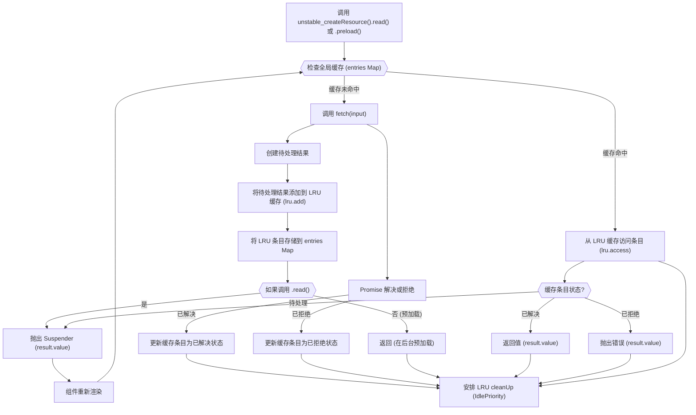

# 核心概念

`react-cache` 引入了一种实验性方法，用于在 React 应用程序中管理和缓存数据，并与 React 的并发渲染能力深度集成。其基础依赖于最近最少使用（LRU）缓存策略，以高效存储和检索数据，以及一个健壮的资源管理系统，用于处理异步操作及其各种状态。

本节提供了 `react-cache` 背后核心原理的概述。有关每种机制的详细解释，请参阅专门的小节：

*   [LRU 缓存实现](./Core-Concepts-LRU-Cache-Implementation.md)
*   [资源管理](./Core-Concepts-Resource-Management.md)
*   [上下文和内部调度器](./Core-Concepts-Context-and-Internal-Dispatcher.md)

## 缓存策略概述

`react-cache` 的基本操作围绕着 `unstable_createResource` 展开，它定义了资源如何被获取和缓存。当组件尝试通过已创建的资源 `read` 或 `preload` 数据时，`react-cache` 遵循特定的流程来确定数据是否已可用或需要获取。

如果数据在缓存中，它会立即返回（如果已解决）或者组件被挂起（如果处于待处理状态）。如果不在缓存中，则会启动一个获取操作，并将结果存储起来。LRU 缓存确保较旧、访问较少的数据最终被移除，以维持定义的内存限制。

## LRU 缓存实现

`react-cache` 内存管理的核心是其定制构建的最近最少使用（LRU）缓存。该算法确保缓存保持在预定义的内存限制内，通过在添加新项目且超出限制时自动逐出最近最少访问的项目。缓存作为循环双向链表运行，优化了快速访问和更新。

了解有关 LRU 缓存如何实现（包括 `add`、`update`、`access` 和 `setLimit` 操作）的更多信息，请参阅 [LRU 缓存实现](./Core-Concepts-LRU-Cache-Implementation.md) 部分。

## 资源管理

`react-cache` 通过跟踪异步数据的状态，即不同的 `Result` 类型：`Pending`、`Resolved` 和 `Rejected`，来管理其生命周期。该系统允许 `react-cache` 与 React 的 Suspense 功能无缝集成，在数据处于 `Pending` 状态时暂停渲染，并在获取到 `Resolved` 值时重新渲染，或在遇到 `Rejected` 错误时抛出错误。

探索缓存数据的不同状态，`Suspender` 和 `Thenable` 类型的角色，以及 `accessResult` 如何在 [资源管理](./Core-Concepts-Resource-Management.md) 部分管理这些状态。

## 上下文和内部调度器

为了确保在 React 的渲染阶段正确使用并利用 React 的内部机制，`react-cache` 利用 `CacheContext` 并与 React 的内部调度器交互。这种集成对于诸如 `readContext` 等功能至关重要，它防止 `read` 和 `preload` 调用发生在组件渲染函数之外，从而确保可预测的行为，并使 React 能够在其并发模型中适当地管理数据获取。

了解与 React 内部的集成以及在渲染阶段调用 `react-cache` API 的重要性，请参阅 [上下文和内部调度器](./Core-Concepts-Context-and-Internal-Dispatcher.md) 部分。

---

本节提供了 `react-cache` 核心概念的高级概述。要深入了解具体的实现细节，请继续阅读 [LRU 缓存实现](./Core-Concepts-LRU-Cache-Implementation.md) 部分。