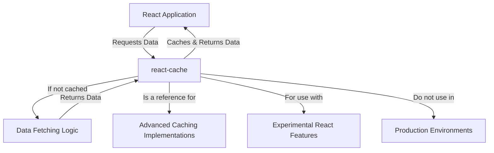

# Overview

`react-cache` is an experimental package designed to provide a basic caching mechanism for React applications. Its primary purpose is to serve as a reference implementation for more advanced caching solutions that will integrate with yet-to-be-released experimental React features. It is important to understand that this package is not intended for use in real-world applications and is published early solely for demonstration purposes.

## Purpose and Design

The core idea behind `react-cache` is to enable applications to cache data that can be consumed by future experimental React APIs. It is built to offer a foundational understanding of how a caching layer might interact with React's rendering model, particularly concerning concurrent features. As such, it's a tool for exploration and learning, rather than a production-ready library.

### Architectural Concept

At a high level, `react-cache` sits between your React application and your data fetching logic, providing a simple in-memory store. Its design reflects a basic pattern for resource management within a React context.

## Experimental Status

This package is published under an alpha version (`2.0.0-alpha.0`), indicating its highly experimental and unstable nature. The API is subject to frequent and significant changes. We strongly advise against using `react-cache` in any production environment due to its volatility and lack of stability guarantees.

For more detailed information regarding its experimental status and important warnings, please refer to the [Experimental Status and Warnings](./Experimental-Status-and-Warnings.md) section.

To begin exploring `react-cache` for demonstration and experimentation, proceed to the [Getting Started](./Getting-Started.md) section.