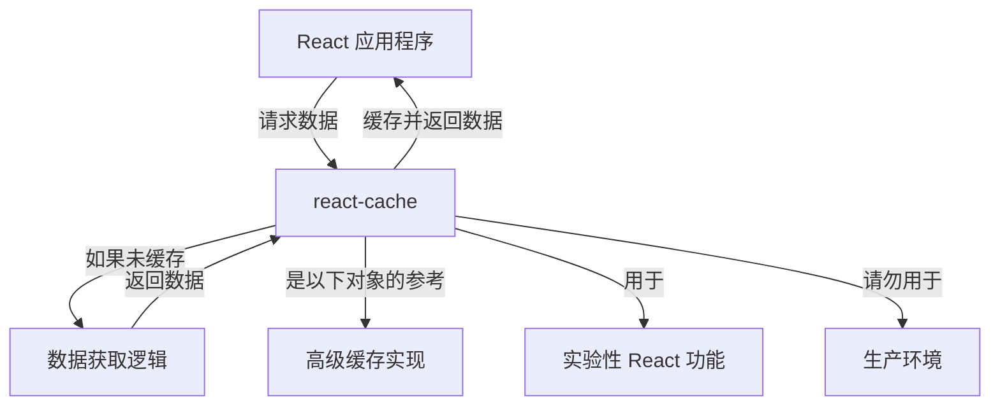

# 概述

`react-cache` 是一个实验性包，旨在为 React 应用程序提供基本的缓存机制。它的主要目的是作为更高级缓存解决方案的参考实现，这些解决方案将与尚未发布的实验性 React 功能集成。重要的是要理解，此包不适用于实际应用程序，并且仅出于演示目的而提前发布。

## 目的与设计

`react-cache` 的核心思想是使应用程序能够缓存可供未来实验性 React API 使用的数据。它的构建旨在提供对缓存层如何与 React 的渲染模型（特别是与并发功能相关）进行交互的基础理解。因此，它是一个用于探索和学习的工具，而不是一个生产就绪的库。

### 架构概念

从高层次看，`react-cache` 位于你的 React 应用程序和数据获取逻辑之间，提供一个简单的内存存储。它的设计反映了 React 上下文中资源管理的基本模式。

## 实验性状态

此包以 alpha 版本 (`2.0.0-alpha.0`) 发布，表明其高度实验性和不稳定性。API 可能会频繁发生重大更改。我们强烈建议不要在任何生产环境中使用 `react-cache`，因为其波动性和缺乏稳定性保证。

有关其实验性状态和重要警告的更多详细信息，请参阅[实验性状态和警告](./Experimental-Status-and-Warnings.md)部分。

要开始探索 `react-cache` 以进行演示和实验，请转到[入门](./Getting-Started.md)部分。