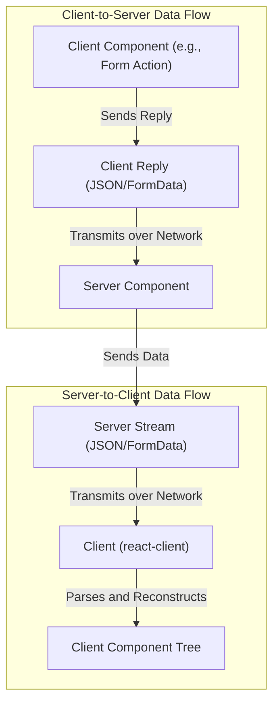

# Serialization Protocol

`react-client` employs a sophisticated serialization protocol to bridge the communication gap between the server and the client. This protocol is essential for transforming complex JavaScript types and React elements into a format that can be efficiently transmitted over the network and then re-hydrated on the receiving end. Understanding this internal logic is crucial for architects and developers aiming for a deeper insight into its design and operation.

For a detailed look into how these serialized chunks are transmitted and managed, refer to the [Streaming Data Flow](./core-concepts-streaming-data-flow.md) section. For insights into how server functions are invoked from the client, see [Server-Client Interaction](./core-concepts-server-client-interaction.md).

## Overview of the Serialization Process

The protocol defines specific formats and rules for various data types, ensuring accurate reconstruction. Both client-to-server replies and server-to-client responses adhere to this structure, albeit with distinct entry points and handling mechanisms.

## Client-to-Server Serialization (Reply)

When a client needs to send data back to the server, for instance, through a form action, the `processReply` function orchestrates the serialization. It leverages a `resolveToJSON` callback to custom-serialize various JavaScript types and React constructs into a `string` or `FormData` object suitable for network transmission.

### `processReply` and `resolveToJSON`

The `processReply` function initiates the serialization of a root `ReactServerValue`. It manages part IDs for outlined objects and handles pending promises or lazy components by adding them as separate parts, typically within a `FormData` object if complex types are present. The core of its logic resides in `resolveToJSON`.

The `resolveToJSON` function acts as a custom `replacer` for `JSON.stringify`, intercepting values before they are stringified. It detects specific types and transforms them into a prefixed string format or outlines them into separate `FormData` entries.

**Serialization Formats for Client Replies**

| Type                   | Prefix/Format                | Description                                                                                                                                                                | Example           |
| :--------------------- | :--------------------------- | :------------------------------------------------------------------------------------------------------------------------------------------------------------------------- | :---------------- |
| React Element          | `$T` or throws error         | Replaced with a temporary reference marker if a `TemporaryReferenceSet` is provided; otherwise, throws an error.                                                              | `$T`              |
| React Lazy Component   | `$L{id}`                     | Outlined as a separate part, referenced by an ID.                                                                                                                          | `$L123`           |
| Promise/Thenable       | `$@{id}`                     | Outlined as a separate part, referenced by an ID.                                                                                                                          | `$@456`           |
| Server Reference       | `$F{id}`                     | References an already known server function.                                                                                                                               | `$F789`           |
| Temporary Reference    | `$T`                         | If a parent has a reference, a new temporary reference can be created, marked by `$T`.                                                                                     | `$T`              |
| FormData               | `$K{id}`                     | Outlined as separate parts, referenced by an ID.                                                                                                                           | `$Kabc`           |
| Map                    | `$Q{id}`                     | Converted to an array of entries, outlined as a separate part, referenced by an ID.                                                                                        | `$Qdef`           |
| Set                    | `$W{id}`                     | Converted to an array of values, outlined as a separate part, referenced by an ID.                                                                                         | `$Wghi`           |
| ArrayBuffer            | `$A{id}`                     | Converted to a Blob, outlined as a separate part, referenced by an ID.                                                                                                     | `$A123`           |
| TypedArray (various)   | `$O{id}` (Int8Array), etc.   | Converted to a Blob, outlined as a separate part, referenced by an ID.                                                                                                     | `$O456`           |
| Blob                   | `$B{id}`                     | Outlined as a separate part, referenced by an ID.                                                                                                                          | `$B789`           |
| ReadableStream         | `$R{id}` or `$r{id}`         | Outlined as a stream part (`$R` for text, `$r` for bytes), referenced by an ID.                                                                                          | `$Rabc`           |
| AsyncIterable/Iterator | `$X{id}` or `$x{id}`         | Outlined as a stream part (`$X` for iterable, `$x` for iterator), referenced by an ID.                                                                                   | `$Xdef`           |
| Undefined              | `$undefined`                 | Special string representation.                                                                                                                                             | `$undefined`      |
| Date                   | `$D{ISOString}`              | Prefixed with `$D`, followed by ISO string.                                                                                                                                | `$D2023-01-01T...` |
| BigInt                 | `$n{value}`                  | Prefixed with `$n`, followed by string representation.                                                                                                                     | `$n1234567890`    |
| Infinity               | `$Infinity`                  | Special string representation.                                                                                                                                             | `$Infinity`       |
| -Infinity              | `$-Infinity`                 | Special string representation.                                                                                                                                             | `$-Infinity`      |
| -0                     | `$-0`                        | Special string representation.                                                                                                                                             | `$-0`             |
| NaN                    | `$NaN`                       | Special string representation.                                                                                                                                             | `$NaN`            |
| Dollar-prefixed String | `$$string`                   | Escaped string value to avoid collision with special prefixes.                                                                                                             | `$$Hello`         |

Other primitive types (string, boolean, number, null) are serialized directly as their JSON equivalents. Objects are serialized as plain JSON objects, with checks to ensure they are simple objects without classes or symbol properties, unless a `TemporaryReferenceSet` is available.

## Server-to-Client Deserialization

Upon receiving a response from the server, `react-client` deserializes the incoming data stream to reconstruct the React model. This process involves `parseModel` and a custom `_fromJSON` callback that intelligently re-hydrates the original JavaScript types and React elements.

### `parseModel` and `createFromJSONCallback`

The `parseModel` function is the entry point for deserializing a JSON string into a React model. It uses `response._fromJSON`, a custom `reviver` function created by `createFromJSONCallback`.

This `reviver` function (`response._fromJSON` or `parseModelString`) is called for each key-value pair in the JSON. It identifies special prefixes (`$`) and patterns to reconstruct objects that were outlined or specially encoded during serialization.

**Deserialization Logic**

```mermaid
flowchart TD
    A["JSON.parse() with _fromJSON reviver"] --> B{Is value a string?}
    B -- "No" --> C{Is value an object/tuple?}
    C -- "Yes" --> D["Handle React Element tuple (createElement)"]
    D --> Z["Return reconstructed value"]
    C -- "No" --> Z

    B -- "Yes" --> E{Is string prefixed with '$'?}
    E -- "No" --> F["Return raw string"]
    F --> Z

    E -- "Yes" --> G{Check prefix type}
    G -- "$$ (escaped string)" --> H["Return string without prefix"]
    H --> Z
    G -- "$L (Lazy Component)" --> I["Create LazyComponent wrapper"]
    I --> Z
    G -- "$@ (Promise)" --> J["Return Promise Chunk"]
    J --> Z
    G -- "$F (Server Reference)" --> K["Load Server Function"]
    K --> Z
    G -- "$T (Temporary Reference)" --> L["Read from TemporaryReferenceSet"]
    L --> Z
    G -- "$Q (Map)" --> M["Get outlined model as Map"]
    M --> Z
    G -- "$W (Set)" --> N["Get outlined model as Set"]
    N --> Z
    G -- "$B (Blob)" --> O["Get outlined model as Blob"]
    O --> Z
    G -- "$K (FormData)" --> P["Get outlined model as FormData"]
    P --> Z
    G -- "$S (Symbol)" --> Q["Return Symbol.for(value)"]
    Q --> Z
    G -- "$i (Iterator)" --> R["Extract Iterator"]
    R --> Z
    G -- "$I ($Infinity)" --> S["Return Infinity"]
    S --> Z
    G -- "$- ($-0, $-Infinity)" --> T["Return -0 or -Infinity"]
    T --> Z
    G -- "$N ($NaN)" --> U["Return NaN"]
    U --> Z
    G -- "$u ($undefined)" --> V["Return undefined"]
    V --> Z
    G -- "$D (Date)" --> W["Return Date object"]
    W --> Z
    G -- "$n (BigInt)" --> X["Return BigInt"]
    X --> Z
    G -- "$P (Constructor, DEV-only)" --> Y["Apply constructor/prototype"]
    Y --> Z
    G -- "$E (Function, DEV-only)" --> Z1["Return evaluated/inferred function"]
    Z1 --> Z
    G -- "$Y (Debug info, DEV-only)" --> Z2["Handle debug-only lazy/omitted props"]
    Z2 --> Z
    G -- "Any other '$' prefix" --> AB["Get outlined model as generic value"]
    AB --> Z

    subgraph "Special Handlers"
        D
        I
        J
        K
        L
        M
        N
        O
        P
        Q
        R
        S
        T
        U
        V
        W
        X
        Y
        Z1
        Z2
        AB
    end
```

### Outlined Objects and Chunks

For values that are too large, streamed, or need to be resolved asynchronously (like Promises, Modules, Maps, Sets, or complex objects), the server outlines them by assigning an ID. On the client, `getChunk` retrieves or creates a placeholder `Chunk` object. These `Chunk` objects track the status (`PENDING`, `BLOCKED`, `INITIALIZED`, `ERRORED`, `HALTED`) and allow for asynchronous resolution.

Once a chunk's content is received (via `resolveModel`, `resolveModule`, etc.), its status is updated, and any pending listeners (callbacks or references) are awakened. This allows for progressive loading and handling of dependencies.

### Special Type Deserialization

*   **React Elements**: Identified by `REACT_ELEMENT_TYPE` (`$`) and an array tuple `[$$typeof, type, key, props, owner, stack, validated]`, they are reconstructed into React element objects using `createElement`.
*   **Client References (Modules)**: Represented by an ID, these refer to modules that need to be loaded on the client. `resolveClientReference`, `preloadModule`, and `requireModule` are used to asynchronously load and initialize these modules.
*   **Server References**: When a server function is passed back to the server from the client, `react-client` resolves it using `resolveServerReference` and `createBoundServerReference`. This creates a client-side proxy that can invoke the original server function.
*   **Streams (`ReadableStream`, `AsyncIterable`)**: Special `FlightStreamController` objects are created to manage the enqueueing and closing of stream data. These allow for continuous data flow between server and client.
*   **Errors & Postponements**: Server-side errors and postponed responses are serialized with specific tags (`E` for Error, `P` for Postpone) and re-thrown on the client, maintaining their original message, stack, and digest (for errors) or reason (for postponements) in development mode. In production, error messages are omitted to avoid leaking sensitive details.
*   **Debug Information**: In development mode (`__DEV__`), `react-client` can replay console logs and performance tracking (`N`, `D`, `J`, `W` tags) associated with server-side rendering, complete with reconstructed call stacks and component owners, aiding debugging (`initializeDebugInfo`, `replayConsoleWithCallStackInDEV`). This functionality leverages `console.createTask` for a clearer performance profile.

## Conclusion

The serialization protocol is fundamental to `react-client`'s ability to facilitate seamless data and component transfer across network boundaries. It handles a wide range of JavaScript types and React constructs, enabling advanced features like progressive rendering, server actions, and comprehensive debugging. By intelligently outlining and re-hydrating values, `react-client` optimizes the runtime performance and developer experience for server-driven applications.

Next, explore how `react-client` integrates with developer tools and aids in debugging: [Developer Tools & Debugging](./developer-tools.md).