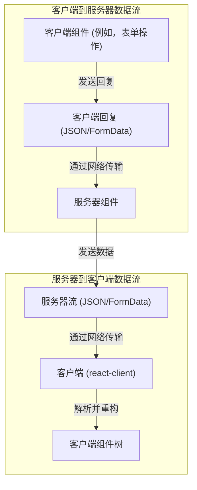
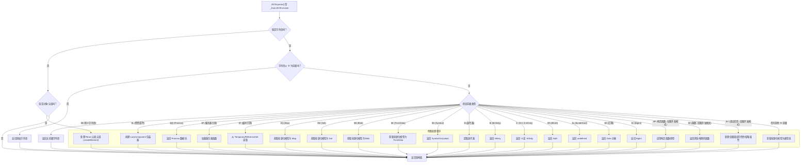

# 序列化协议

`react-client` 采用一套复杂的序列化协议，以弥合服务器与客户端之间的通信鸿沟。该协议对于将复杂的 JavaScript 类型和 React 元素转换为能够高效地通过网络传输并在接收端重新构造的格式至关重要。对于希望深入了解其设计与运作的架构师和开发人员而言，理解这一内部逻辑至关重要。

有关这些序列化数据块如何传输和管理的详细信息，请参阅“[流式数据流](./core-concepts-streaming-data-flow.md)”部分。有关客户端如何调用服务器函数的见解，请参阅“[服务器-客户端交互](./core-concepts-server-client-interaction.md)”部分。

## 序列化过程概述

该协议为各种数据类型定义了特定的格式和规则，确保准确重构。客户端到服务器的回复和服务器到客户端的响应都遵循此结构，尽管它们的入口点和处理机制有所不同。

## 客户端到服务器序列化（回复）

当客户端需要将数据发送回服务器时（例如通过表单操作），`processReply` 函数会协调序列化过程。它利用 `resolveToJSON` 回调，将各种 JavaScript 类型和 React 结构自定义序列化为适合网络传输的 `string` 或 `FormData` 对象。

### `processReply` 和 `resolveToJSON`

`processReply` 函数负责启动根 `ReactServerValue` 的序列化。它管理轮廓化对象的部件 ID，并通过将待处理的 Promise 或惰性组件作为单独的部件添加来处理它们，通常在存在复杂类型时将其添加到 `FormData` 对象中。其核心逻辑体现在 `resolveToJSON` 中。

`resolveToJSON` 函数充当 `JSON.stringify` 的自定义 `replacer`（替换器），在值被转换为字符串之前进行拦截。它检测特定类型，并将其转换为带前缀的字符串格式，或将其轮廓化为独立的 `FormData` 条目。

**客户端回复的序列化格式**

| 类型                   | 前缀/格式                | 描述                                                                                                                                                                | 示例           |
| :--------------------- | :--------------------------- | :------------------------------------------------------------------------------------------------------------------------------------------------------------------------- | :---------------- |
| React 元素          | `$T` 或抛出错误         | 如果提供了 `TemporaryReferenceSet`，则替换为临时引用标记；否则抛出错误。                                                              | `$T`              |
| React 惰性组件   | `$L{id}`                     | 轮廓化为单独的部分，通过 ID 引用。                                                                                                                          | `$L123`           |
| Promise/Thenable       | `$@{id}`                     | 轮廓化为单独的部分，通过 ID 引用。                                                                                                                          | `$@456`           |
| 服务器引用       | `$F{id}`                     | 引用一个已知的服务器函数。                                                                                                                               | `$F789`           |
| 临时引用    | `$T`                         | 如果父级存在引用，可以创建一个新的临时引用，标记为 `$T`。                                                                                     | `$T`              |
| FormData               | `$K{id}`                     | 轮廓化为单独的部分，通过 ID 引用。                                                                                                                           | `$Kabc`           |
| Map                    | `$Q{id}`                     | 转换为条目数组，轮廓化为单独的部分，通过 ID 引用。                                                                                        | `$Qdef`           |
| Set                    | `$W{id}`                     | 转换为值数组，轮廓化为单独的部分，通过 ID 引用。                                                                                         | `$Wghi`           |
| ArrayBuffer            | `$A{id}`                     | 转换为 Blob，轮廓化为单独的部分，通过 ID 引用。                                                                                                     | `$A123`           |
| TypedArray（各种）   | `$O{id}` (Int8Array), etc.   | 转换为 Blob，轮廓化为单独的部分，通过 ID 引用。                                                                                                     | `$O456`           |
| Blob                   | `$B{id}`                     | 轮廓化为单独的部分，通过 ID 引用。                                                                                                                          | `$B789`           |
| ReadableStream         | `$R{id}` 或 `$r{id}`         | 轮廓化为流部分（`$R` 用于文本，`$r` 用于字节），通过 ID 引用。                                                                                          | `$Rabc`           |
| AsyncIterable/Iterator | `$X{id}` 或 `$x{id}`         | 轮廓化为流部分（`$X` 用于可迭代对象，`$x` 用于迭代器），通过 ID 引用。                                                                                   | `$Xdef`           |
| Undefined              | `$undefined`                 | 特殊字符串表示。                                                                                                                                             | `$undefined`      |
| Date                   | `$D{ISOString}`              | 以 `$D` 为前缀，后跟 ISO 字符串。                                                                                                                                | `$D2023-01-01T...` |
| BigInt                 | `$n{value}`                  | 以 `$n` 为前缀，后跟字符串表示。                                                                                                                     | `$n1234567890`    |
| Infinity               | `$Infinity`                  | 特殊字符串表示。                                                                                                                                             | `$Infinity`       |
| -Infinity              | `$-Infinity`                 | 特殊字符串表示。                                                                                                                                             | `$-Infinity`      |
| -0                     | `$-0`                        | 特殊字符串表示。                                                                                                                                             | `$-0`             |
| NaN                    | `$NaN`                       | 特殊字符串表示。                                                                                                                                             | `$NaN`            |
| 美元符号前缀字符串 | `$$string`                   | 转义的字符串值，以避免与特殊前缀冲突。                                                                                                             | `$$Hello`         |

其他原始类型（字符串、布尔值、数字、null）直接序列化为它们对应的 JSON 形式。对象则序列化为普通 JSON 对象，同时会检查以确保它们是简单的对象，不包含类或 Symbol 属性，除非存在 `TemporaryReferenceSet`。

## 服务器到客户端反序列化

接收到服务器响应后，`react-client` 会反序列化传入的数据流以重构 React 模型。此过程涉及 `parseModel` 和一个自定义的 `_fromJSON` 回调函数，该回调智能地重新构建原始 JavaScript 类型和 React 元素。

### `parseModel` 和 `createFromJSONCallback`

`parseModel` 函数是将 JSON 字符串反序列化为 React 模型的入口点。它使用 `response._fromJSON`，这是一个由 `createFromJSONCallback` 创建的自定义 `reviver`（恢复器）函数。

这个 `reviver` 函数（`response._fromJSON` 或 `parseModelString`）会针对 JSON 中的每个键值对进行调用。它识别特殊的 `$` 前缀和模式，以重构在序列化过程中被轮廓化或特殊编码的对象。

**反序列化逻辑**

### 轮廓化对象和数据块

对于过大、流式传输或需要异步解析的值（如 Promise、模块、Map、Set 或复杂对象），服务器会通过分配 ID 来对其进行轮廓化。在客户端，`getChunk` 函数会检索或创建一个占位符 `Chunk` 对象。这些 `Chunk` 对象用于跟踪状态（`PENDING`、`BLOCKED`、`INITIALIZED`、`ERRORED`、`HALTED`），并支持异步解析。

一旦接收到数据块的内容（通过 `resolveModel`、`resolveModule` 等），其状态就会更新，并且任何待处理的监听器（回调或引用）都会被唤醒。这使得渐进式加载和依赖处理成为可能。

### 特殊类型反序列化

*   **React 元素**：通过 `REACT_ELEMENT_TYPE` (`$`) 和数组元组 `[$$typeof, type, key, props, owner, stack, validated]` 识别，它们会使用 `createElement` 函数被重构为 React 元素对象。
*   **客户端引用（模块）**：由 ID 表示，这些引用指向需要在客户端加载的模块。`resolveClientReference`、`preloadModule` 和 `requireModule` 用于异步加载和初始化这些模块。
*   **服务器引用**：当服务器函数从客户端传递回服务器时，`react-client` 会使用 `resolveServerReference` 和 `createBoundServerReference` 对其进行解析。这会创建一个客户端代理，能够调用原始的服务器函数。
*   **流 (`ReadableStream`、`AsyncIterable`)**：会创建特殊的 `FlightStreamController` 对象来管理流数据的入队和关闭。这使得服务器和客户端之间能够进行持续的数据流传输。
*   **错误与推迟**：服务器端错误和被推迟的响应会以特定标签（错误为 `E`，推迟为 `P`）进行序列化，并在客户端重新抛出，同时在开发模式下保留其原始消息、堆栈和摘要（针对错误）或原因（针对推迟）。在生产环境中，错误消息会被省略以避免泄露敏感细节。
*   **调试信息**：在开发模式 (`__DEV__`) 下，`react-client` 能够重放与服务器端渲染相关的控制台日志和性能跟踪（`N`、`D`、`J`、`W` 标签），同时提供重构的调用堆栈和组件所有者信息，从而辅助调试（`initializeDebugInfo`、`replayConsoleWithCallStackInDEV`）。此功能利用 `console.createTask` 来提供更清晰的性能分析。

## 结论

序列化协议是 `react-client` 实现跨网络边界无缝数据和组件传输能力的基础。它处理多种 JavaScript 类型和 React 结构，支持渐进式渲染、服务器操作和全面的调试等高级功能。通过智能地轮廓化和重新构建值，`react-client` 优化了服务器驱动应用程序的运行时性能和开发者体验。

接下来，了解 `react-client` 如何与开发者工具集成并辅助调试：[开发者工具与调试](./developer-tools.md)。