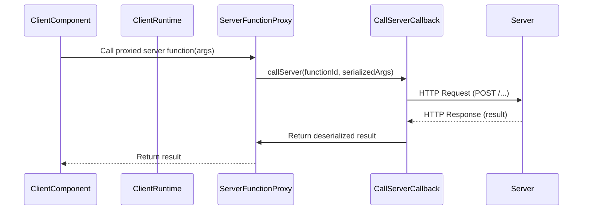
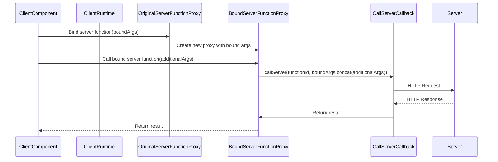
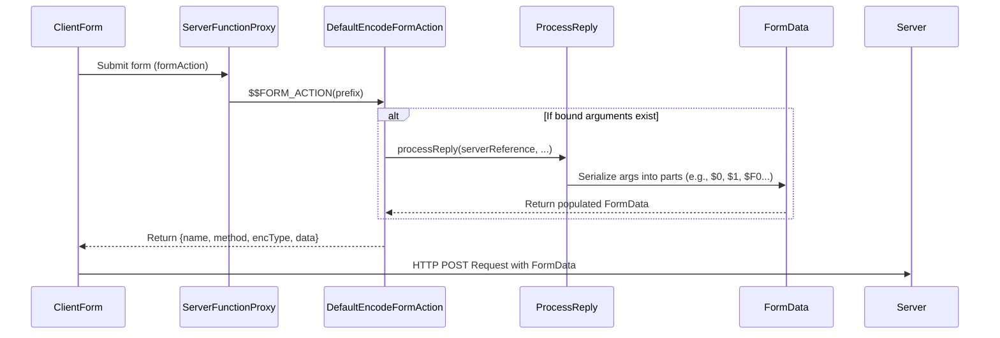

# Server-Client Interaction

Seamless communication between the client and server is fundamental for React Server Components (RSC) to operate. This section explores how client-side code interacts with server functions, manages references, and handles data submission via form actions. Understanding these mechanisms is essential for building robust and interactive RSC applications. For details on how data is structured and transformed during this process, refer to the [Serialization Protocol](./core-concepts-serialization-protocol.md) documentation. The [Streaming Data Flow](./core-concepts-streaming-data-flow.md) also provides context on the underlying data transmission.

## Server Function Invocation

React enables client components to directly invoke functions defined on the server. This is achieved through client-side proxies that represent the server functions. When you call a server function from the client, the React runtime handles the serialization of arguments, the network request, and the deserialization of the response.

The primary entry points for client-side server function proxies are `createServerReference` and `createBoundServerReference`.

### `createServerReference`

`createServerReference` creates a basic proxy for a server function. It takes a server function ID and a `callServer` callback, which is the actual network invocation mechanism. When the proxied function is called, its arguments are passed to the `callServer` callback.

**Mechanism**



**Example**

```javascript
// On the server (simplified)
export async function myServerFunction(arg1, arg2) {
  return `Server received: ${arg1}, ${arg2}`;
}

// On the client
import { createServerReference } from 'react-client'; // Conceptual import

// This function would be provided by your framework's client runtime
const myCallServerCallback = async (id, args) => {
  const response = await fetch(`/api/server-action?id=${id}`, {
    method: 'POST',
    headers: { 'Content-Type': 'application/json' },
    body: JSON.stringify(args),
  });
  return response.json();
};

const proxiedServerFunction = createServerReference(
  'server-function-id-123', 
  myCallServerCallback
);

async function invokeServerFunction() {
  const result = await proxiedServerFunction('hello', 42);
  console.log(result); // Output: Server received: hello, 42
}

invokeServerFunction();
```

### `createBoundServerReference`

`createBoundServerReference` extends the basic proxy by allowing server functions to be partially applied with arguments. This creates a new proxy that includes the pre-bound arguments, which are then combined with any additional arguments passed during the client-side invocation.

**Mechanism**



**Example**

```javascript
// On the server (simplified)
export async function processData(prefix, data) {
  return `Processed data: ${prefix}-${data}`;
}

// On the client
import { createBoundServerReference } from 'react-client'; // Conceptual import

// Assuming 'processData' is proxied by 'originalProcessDataProxy'
const originalProcessDataProxy = createServerReference('process-data-id', myCallServerCallback);

async function bindAndInvoke() {
  // Create a new bound server function
  const prefixedProcessData = createBoundServerReference(
    { id: 'process-data-id', bound: Promise.resolve(['LOG']) }, // Bound arguments 'LOG'
    myCallServerCallback
  );

  const result = await prefixedProcessData('entry');
  console.log(result); // Output: Processed data: LOG-entry
}

bindAndInvoke();
```

## Managing Server References

The `react-client` runtime uses a `WeakMap` named `knownServerReferences` to keep track of server function proxies. This map stores a `ServerReferenceClosure` for each function, containing its `id`, `originalBind` method, and any `bound` arguments (as a `Thenable`).

When a server function proxy is `bind`-ed on the client, the original `Function.prototype.bind` is wrapped. The new `bind` method creates a new function and updates `knownServerReferences` with its own `ServerReferenceClosure`, including the new set of bound arguments. This ensures that the server capabilities (like being able to invoke them on the server) are preserved across client-side `bind` operations.

These functions also expose special properties, `$$FORM_ACTION` and `$$IS_SIGNATURE_EQUAL` (when `usedWithSSR` is enabled), which are used by Server-Side Rendering (SSR) environments and React's form action handling.

## Form Action Encoding

When a server function is used as a `formAction` attribute for a `<form>` element, React needs to encode the function and its bound arguments in a way that can be transmitted as `FormData`. This involves two primary functions: `defaultEncodeFormAction` and `customEncodeFormAction`.

**`defaultEncodeFormAction`**

This function is used by default to generate the `ReactCustomFormAction` object, which includes the `name`, `method`, `encType`, and `data` (a `FormData` instance if bound arguments exist) for the HTML form. It leverages `processReply` to serialize the server function's ID and its bound arguments into `FormData` parts.

If the server function has bound arguments, `encodeFormData` is called, which internally uses `processReply`. `processReply` iterates through the arguments, serializing them into a JSON string and appending complex types (like Promises, Maps, Sets, Blobs, etc.) as separate parts within the `FormData`. This allows streaming and handling of rich data types in form submissions.



**`customEncodeFormAction`**

This function allows developers to provide their own logic for encoding form actions, giving more control over how server functions are represented in form submissions.

**Data Serialization in `processReply` (for Form Actions)**

When `processReply` is called (e.g., by `encodeFormData`), it meticulously converts various JavaScript values into a format suitable for transmission. This includes:

*   **Primitives**: Strings, numbers, booleans, null are sent directly, with special encoding for `$`, `Infinity`, `-Infinity`, `NaN`, `undefined`, `Date`, and `BigInt`.
*   **React Elements & Lazy Components**: These can be serialized if a `TemporaryReferenceSet` is provided, replacing them with a marker `$$T` and storing the actual object in the temporary reference set on the client to be potentially read later on the server or in logs.
*   **Promises (`Thenables`)**: Outlined as separate parts (`$@id`), and their eventual values are streamed as they resolve.
*   **Complex Objects (Maps, Sets, FormData, Typed Arrays, Blobs, Iterators, ReadableStreams, AsyncIterables)**: These are assigned unique IDs (`$Qid`, `$Wid`, `$Kid`, `$Aid`, etc.) and their contents are serialized into separate `FormData` parts, allowing for efficient and asynchronous transfer of large or structured data.
*   **Server References (Functions from Server)**: If a function passed back to the server is itself a server function that was originally received from the server, it's recognized via `knownServerReferences` and serialized by its ID (`$Fid`) along with any newly bound arguments. This allows server functions to be passed back and forth without losing their identity or context.

Temporary references play a critical role here. `TemporaryReferenceSet` allows objects (like React Elements, functions, or symbols) to be temporarily stored and referenced by an ID during the `processReply` phase. This avoids re-serializing complex objects that might already exist in a known context or are part of a circular structure, replacing them with a compact marker (`$$T`) that can be resolved later if needed.

## Conclusion

The `react-client` runtime provides a robust and flexible architecture for server-client interaction. By carefully managing server function proxies, handling argument serialization, and enabling rich data transmission via form actions, it facilitates a powerful development model where client and server logic can seamlessly interoperate. Further details on how the client consumes and initializes this streamed data can be found in the [Internal Mechanisms](./internal-mechanisms.md) section.
