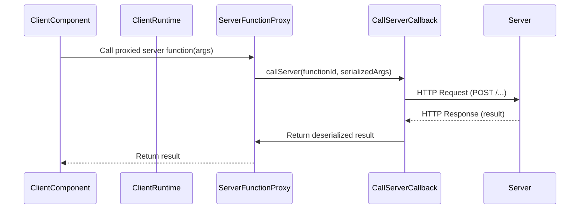
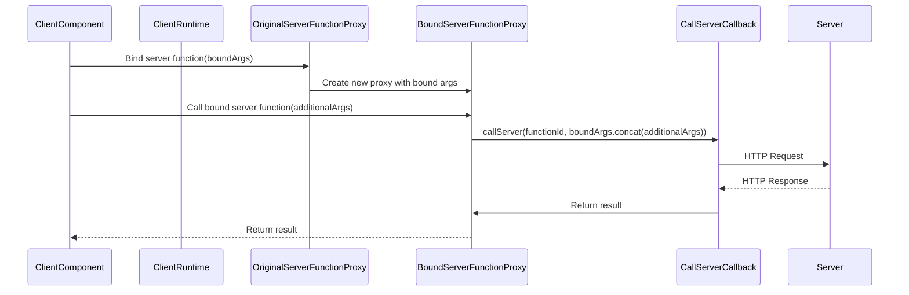
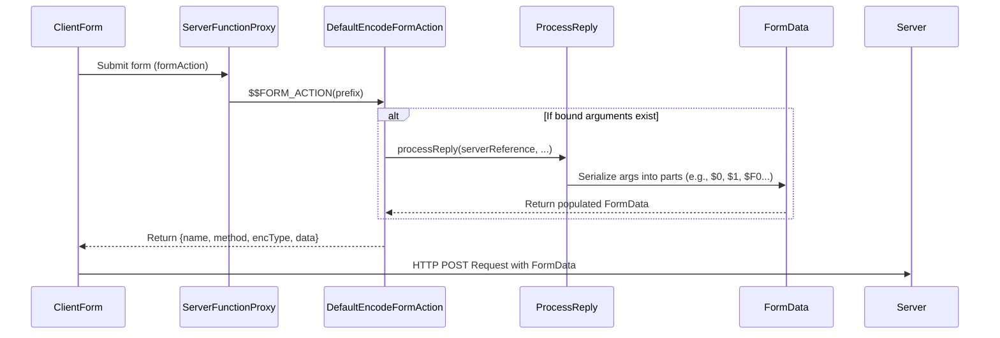

# 服务器-客户端交互

客户端和服务器之间的无缝通信对于 React 服务器组件 (RSC) 的运行至关重要。本节探讨了客户端代码如何与服务器函数交互、管理引用以及通过表单操作提交数据。理解这些机制对于构建健壮的交互式 RSC 应用程序至关重要。有关此过程中数据如何结构化和转换的详细信息，请参阅[序列化协议](./core-concepts-serialization-protocol.md)文档。[流式数据流](./core-concepts-streaming-data-flow.md)也提供了底层数据传输的背景信息。

## 服务器函数调用

React 允许客户端组件直接调用在服务器上定义的函数。这是通过表示服务器函数的客户端代理实现的。当您从客户端调用服务器函数时，React 运行时会处理参数的序列化、网络请求和响应的反序列化。

客户端服务器函数代理的主要入口点是 `createServerReference` 和 `createBoundServerReference`。

### `createServerReference`

`createServerReference` 为服务器函数创建了一个基本代理。它接受一个服务器函数 ID 和一个 `callServer` 回调，该回调是实际的网络调用机制。当代理函数被调用时，其参数会被传递给 `callServer` 回调。

**机制**



**示例**

```javascript
// On the server (simplified)
export async function myServerFunction(arg1, arg2) {
  return `Server received: ${arg1}, ${arg2}`;
}

// On the client
import { createServerReference } from 'react-client'; // Conceptual import

// This function would be provided by your framework's client runtime
const myCallServerCallback = async (id, args) => {
  const response = await fetch(`/api/server-action?id=${id}`, {
    method: 'POST',
    headers: { 'Content-Type': 'application/json' },
    body: JSON.stringify(args),
  });
  return response.json();
};

const proxiedServerFunction = createServerReference(
  'server-function-id-123', 
  myCallServerCallback
);

async function invokeServerFunction() {
  const result = await proxiedServerFunction('hello', 42);
  console.log(result); // Output: Server received: hello, 42
}

invokeServerFunction();
```

### `createBoundServerReference`

`createBoundServerReference` 通过允许服务器函数部分应用参数来扩展基本代理。这会创建一个新的代理，其中包含预绑定参数，这些参数随后与客户端调用期间传递的任何额外参数组合。

**机制**



**示例**

```javascript
// On the server (simplified)
export async function processData(prefix, data) {
  return `Processed data: ${prefix}-${data}`;
}

// On the client
import { createBoundServerReference } from 'react-client'; // Conceptual import

// Assuming 'processData' is proxied by 'originalProcessDataProxy'
const originalProcessDataProxy = createServerReference('process-data-id', myCallServerCallback);

async function bindAndInvoke() {
  // Create a new bound server function
  const prefixedProcessData = createBoundServerReference(
    { id: 'process-data-id', bound: Promise.resolve(['LOG']) }, // Bound arguments 'LOG'
    myCallServerCallback
  );

  const result = await prefixedProcessData('entry');
  console.log(result); // Output: Processed data: LOG-entry
}

bindAndInvoke();
```

## 管理服务器引用

`react-client` 运行时使用名为 `knownServerReferences` 的 `WeakMap` 来跟踪服务器函数代理。此映射为每个函数存储一个 `ServerReferenceClosure`，其中包含其 `id`、`originalBind` 方法和任何 `bound` 参数（作为 `Thenable`）。

当服务器函数代理在客户端进行 `bind` 操作时，原始的 `Function.prototype.bind` 会被包装。新的 `bind` 方法会创建一个新函数，并使用其自身的 `ServerReferenceClosure`（包括新的绑定参数集）更新 `knownServerReferences`。这确保了服务器功能（例如能够在服务器上调用它们）在客户端 `bind` 操作中得以保留。

这些函数还公开了特殊属性 `$$FORM_ACTION` 和 `$$IS_SIGNATURE_EQUAL`（当启用 `usedWithSSR` 时），这些属性由服务器端渲染 (SSR) 环境和 React 的表单操作处理使用。

## 表单操作编码

当服务器函数用作 `<form>` 元素的 `formAction` 属性时，React 需要以一种可以作为 `FormData` 传输的方式对函数及其绑定参数进行编码。这涉及两个主要函数：`defaultEncodeFormAction` 和 `customEncodeFormAction`。

**`defaultEncodeFormAction`**

此函数默认用于生成 `ReactCustomFormAction` 对象，该对象包含 HTML 表单的 `name`、`method`、`encType` 和 `data`（如果存在绑定参数，则为 `FormData` 实例）。它利用 `processReply` 将服务器函数的 ID 及其绑定参数序列化为 `FormData` 部分。

如果服务器函数有绑定参数，则会调用 `encodeFormData`，它内部使用 `processReply`。`processReply` 遍历参数，将它们序列化为 JSON 字符串，并将复杂类型（如 Promise、Map、Set、Blob 等）作为 `FormData` 中的单独部分追加。这允许在表单提交中流式传输和处理丰富的数据类型。



**`customEncodeFormAction`**

此函数允许开发者提供自己的逻辑来编码表单操作，从而更好地控制服务器函数在表单提交中的表示方式。

**`processReply` 中的数据序列化（用于表单操作）**

当调用 `processReply`（例如，通过 `encodeFormData`）时，它会精细地将各种 JavaScript 值转换为适合传输的格式。这包括：

*   **基本类型**：字符串、数字、布尔值、null 直接发送，`$`、`Infinity`、`-Infinity`、`NaN`、`undefined`、`Date` 和 `BigInt` 有特殊编码。
*   **React 元素和惰性组件**：如果提供了 `TemporaryReferenceSet`，它们可以被序列化，并被替换为标记 `$$T`，实际对象存储在客户端的临时引用集中，以便稍后在服务器或日志中读取。
*   **Promise (`Thenable`)**：被列为单独的部分（`$@id`），其最终值在解析时进行流式传输。
*   **复杂对象（Map、Set、FormData、类型化数组、Blob、迭代器、ReadableStream、AsyncIterable）**：它们被分配唯一的 ID（`$Qid`、`$Wid`、`$Kid`、`$Aid` 等），其内容被序列化为单独的 `FormData` 部分，从而实现大容量或结构化数据的有效异步传输。
*   **服务器引用（来自服务器的函数）**：如果传回服务器的函数本身是最初从服务器接收的服务器函数，则通过 `knownServerReferences` 识别它，并根据其 ID（`$Fid`）以及任何新绑定的参数进行序列化。这允许服务器函数在不丢失其身份或上下文的情况下进行来回传递。

临时引用在此处发挥着关键作用。`TemporaryReferenceSet` 允许在 `processReply` 阶段将对象（如 React 元素、函数或符号）临时存储并通过 ID 引用。这避免了重新序列化可能已存在于已知上下文或作为循环结构一部分的复杂对象，而是用一个紧凑的标记（`$$T`）替换它们，如果需要，可以稍后解析。

## 结论

`react-client` 运行时为服务器-客户端交互提供了一个强大而灵活的架构。通过精心管理服务器函数代理、处理参数序列化以及通过表单操作实现丰富的数据传输，它促进了一种强大的开发模型，其中客户端和服务器逻辑可以无缝协作。有关客户端如何使用和初始化此流式数据的更多详细信息，请参阅[内部机制](./internal-mechanisms.md)部分。
