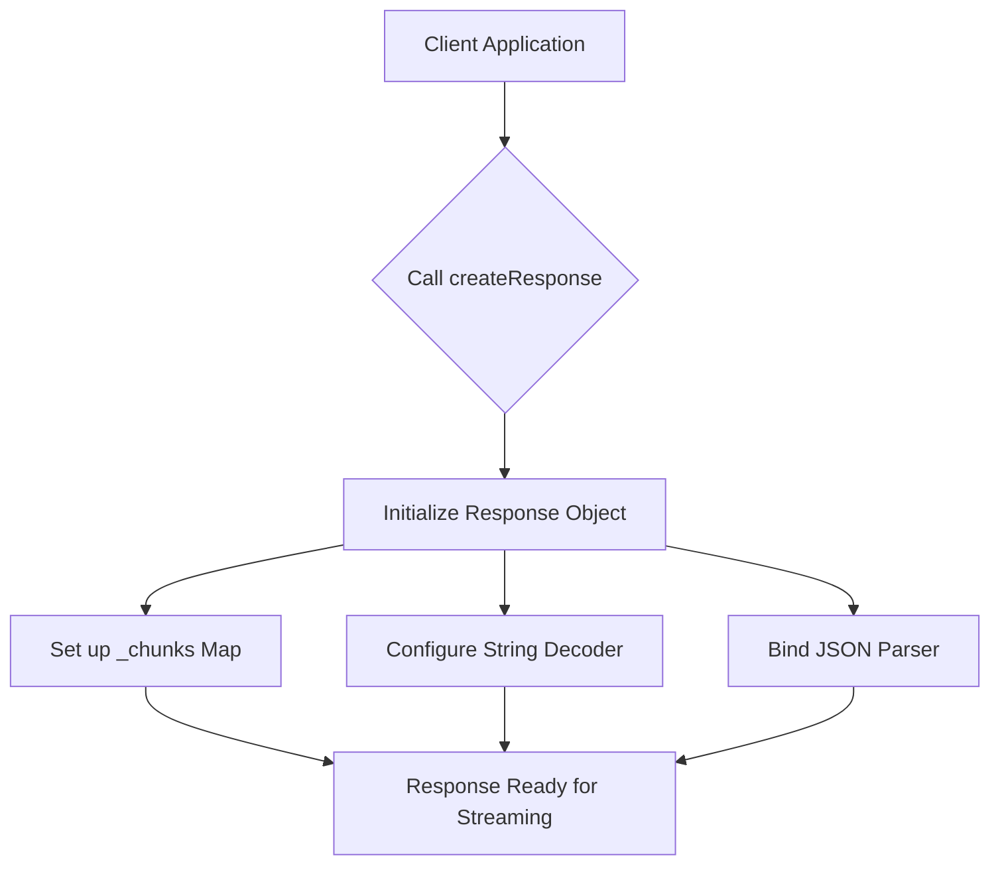
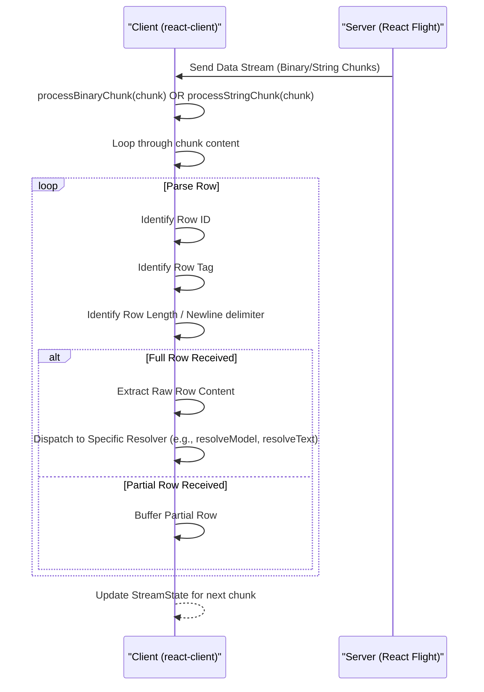

# Streaming Data Flow

`react-client` employs a sophisticated, asynchronous mechanism to transmit and process data efficiently between the server and client. This process involves managing various data chunk types and their lifecycle within a streaming environment. For a broader understanding of `react-client`'s foundational principles, refer to [Core Concepts](./core-concepts.md). To delve into the specific data formats exchanged, consult the [Serialization Protocol](./core-concepts-serialization-protocol.md) section.

## The Response Object

The `Response` object acts as the central hub for managing all incoming data streams from the server. It orchestrates the receipt, parsing, and resolution of various data chunks.

### Response Initialization

When `react-client` is initialized, a `Response` object is created using `createResponse`. This function sets up the necessary configurations for processing the incoming React Flight payload.

```javascript
export function createResponse(
  bundlerConfig: ServerConsumerModuleMap,
  serverReferenceConfig: null | ServerManifest,
  moduleLoading: ModuleLoading,
  callServer: void | CallServerCallback,
  encodeFormAction: void | EncodeFormActionCallback,
  nonce: void | string,
  temporaryReferences: void | TemporaryReferenceSet,
  findSourceMapURL: void | FindSourceMapURLCallback, // DEV-only
  replayConsole: boolean, // DEV-only
  environmentName: void | string, // DEV-only
  debugChannel: void | DebugChannelCallback, // DEV-only
): WeakResponse;
```

The `Response` object internally maintains a `_chunks` map, which is a crucial component for tracking and managing the state of all received data segments (`SomeChunk` objects) by their unique identifiers.



## Parsing Incoming Data Streams

The `react-client` processes data from the server through a row-based protocol, which can arrive as either binary or string chunks. The primary functions for handling these incoming chunks are `processBinaryChunk` and `processStringChunk`.

These functions manage a `StreamState` object that tracks the parsing progress across multiple incoming chunks. The `StreamState` includes:

| Property | Type | Description |
|---|---|---|
| `_rowState` | `0` \| `1` \| `2` \| `3` \| `4` | Current state of the row parser (e.g., parsing ID, tag, length). |
| `_rowID` | `number` | The ID of the current row being parsed. |
| `_rowTag` | `number` | The tag identifying the type of data in the current row. |
| `_rowLength` | `number` | Remaining bytes for the current row, for length-prefixed chunks. |
| `_buffer` | `Array<Uint8Array>` | Accumulated binary chunks for the current row until it's complete. |

These parsing functions iteratively read through the incoming data, identifying row boundaries (marked by `:` or `\n`) and extracting the row ID, tag, and content. Once a complete row is assembled, it's dispatched to a specific resolution function based on its tag.



## Chunk Lifecycle and Types

Data received from the server is managed as `SomeChunk` objects, each progressing through a defined lifecycle. The `ReactPromise` object serves as the underlying mechanism, allowing asynchronous data resolution and integration into React's suspense model.

### Chunk Statuses

| Status | Description |
|---|---|
| `pending` | Initial state; waiting for data. |
| `blocked` | Temporarily halted, usually due to cyclic dependencies or unresolved debug info. |
| `resolved_model` | Raw JSON model received but not yet parsed into a JavaScript object. |
| `resolved_module` | Client reference metadata received, module path resolved, but module not yet loaded/initialized. |
| `fulfilled` | Chunk successfully initialized and value is available. |
| `rejected` | An error occurred during resolution. |
| `halted` | (DEV-only) Never resolves, even if the connection closes, typically due to missing debug channel data. |

### Chunk Tags and Resolution

Each row in the stream is prefixed with a tag that dictates how its content should be interpreted and resolved:

| Tag | Description | Resolution Method(s) | Notes |
|---|---|---|---|
| JSON (no specific tag) | Standard JSON model (e.g., React elements, plain objects/arrays). | `resolveModel` | The most common chunk type. |
| `T` | Text (string) | `resolveText` | Plain string values. |
| `A` | ArrayBuffer | `resolveBuffer` | Raw binary data. |
| `O`, `o`, `U`, `S`, `s`, `L`, `l`, `G`, `g`, `M`, `m`, `V` | Various Typed Arrays (`Int8Array`, `Uint8Array`, etc.). | `resolveTypedArray` (internal) | Binary data views, optimized for performance. |
| `I` | Module (Client Reference) | `resolveModule` | References a client-side module, which `react-client` dynamically loads. |
| `R` / `r` | Readable Stream (`R` for default, `r` for bytes). | `startReadableStream`, `resolveStream` | Initiates a standard or byte-based `ReadableStream`. |
| `X` / `x` | Async Iterable (`X` for general, `x` for iterator). | `startAsyncIterable`, `resolveStream` | Initiates an `AsyncIterable` for pulling data over time. |
| `C` | Close Stream | `stopStream` | Signals the graceful end of a stream. |
| `E` | Error | `resolveErrorModel` | Reports server-side errors, often including a digest and stack trace. |
| `H` | Hint | `resolveHint` | Provides runtime hints to the client renderer (e.g., for preloading). |
| `P` | Postpone | `resolvePostponeDev`/`Prod` | Signals that content rendering was postponed on the server. |
| `D` | Debug Model (DEV only) | `resolveDebugModel` | Provides additional debug information for models. |
| `J` | I/O Info (DEV + Performance only) | `resolveIOInfo` | Performance telemetry for I/O operations on the server. |
| `N` | Time Origin (Performance only) | `response._timeOrigin` update | Adjusts timestamps for performance profiling relative to the client's time origin. |
| `W` | Console Entry (DEV only) | `resolveConsoleEntry` | Replays server-side `console` logs in the client environment. |
| `""` (empty string) | Debug Halt (DEV only) | `resolveDebugHalt` | Signals a halt on a debug channel, preventing further resolution. |

## Resolving Data and References

Upon receiving a full row, `react-client`'s internal `JSON.parse` implementation, augmented by `createFromJSONCallback`, actively processes the content. This custom parser intercepts special string prefixes (e.g., `$L` for lazy chunks, `$@` for promises, `$F` for server references, `$` for React elements) to identify and handle different types of references and data structures.

### Lazy Initialization

Chunks typically undergo lazy initialization. When a chunk's status is `RESOLVED_MODEL` or `RESOLVED_MODULE`, its actual value isn't parsed or loaded until it's explicitly needed, for example, when `readChunk` is called. The `initializeModelChunk` and `initializeModuleChunk` functions are responsible for this on-demand initialization, transitioning the chunk to the `INITIALIZED` state.

### Dependency Management and Cyclic References

The `InitializationHandler` and `InitializationReference` objects play a critical role in managing dependencies and resolving cyclic references within the object graph transmitted from the server.

*   **`waitForReference`**: When a value within the stream refers to an unresolved chunk (e.g., `$1:foo.bar`), `waitForReference` is invoked. It registers a listener on the referenced chunk, ensuring that the current `InitializationHandler` (and thus the `BlockedChunk`) waits until the dependency is fulfilled.
*   **`fulfillReference`**: Once a referenced chunk is resolved, `fulfillReference` is called. It updates the placeholder in the parent object with the actual value and decrements the `deps` counter of the `InitializationHandler`. When `deps` reaches zero, indicating all dependencies are met, the `BlockedChunk` can transition to `INITIALIZED`.
*   **`rejectReference`**: If a referenced chunk errors, `rejectReference` is called, propagating the error to the `InitializationHandler` and ultimately triggering an error on the associated `BlockedChunk`.

This system ensures that even complex object graphs with interdependencies and cycles can be correctly reconstructed on the client without leading to deadlocks or unresolvable states.

## Handling Streaming Primitives

`react-client` supports the streaming of native JavaScript `ReadableStream` and `AsyncIterable` objects, enabling continuous data flow directly to the client. The `startReadableStream` and `startAsyncIterable` functions are responsible for creating and managing these streaming primitives based on the incoming row tags.

These streams are backed by internal controllers (`FlightStreamController`) that allow the server to enqueue values, enqueue models (which are then lazily initialized), close the stream, or signal an error, providing fine-grained control over the data flow.

## Error and Postponement Signals

Beyond data transmission, `react-client` also handles specific signals from the server:

*   **Errors**: `resolveErrorModel` processes incoming error information from the server, converting it into a client-side `Error` object that includes details like `name`, `message`, `stack`, and a `digest`. These errors are then propagated to the relevant chunks.
*   **Postponements**: `resolvePostponeDev`/`Prod` handles `Postpone` signals, indicating that a part of the server-rendered content could not be fully resolved and was intentionally postponed. This allows the client to render a fallback or handle the postponement gracefully. You can find more details in [Error & Postponement Handling](./developer-tools-error-postponement-handling.md).

---

This section has provided a comprehensive overview of how `react-client` manages streaming data, from parsing raw chunks to resolving complex references and handling asynchronous data flows. For a deeper understanding of the wire format and data transformations, proceed to the [Serialization Protocol](./core-concepts-serialization-protocol.md) section.