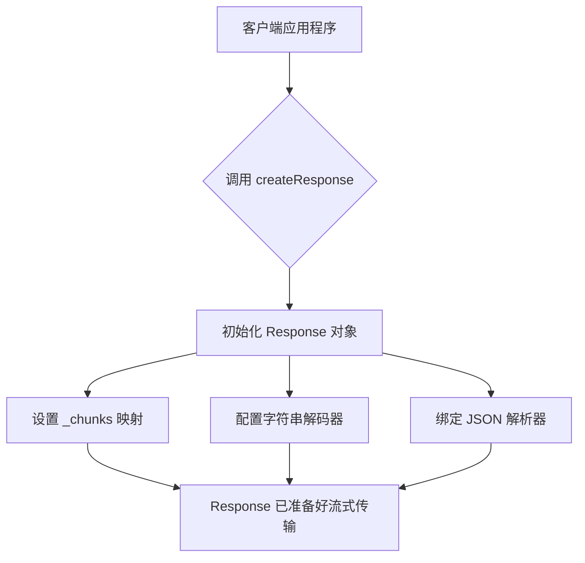
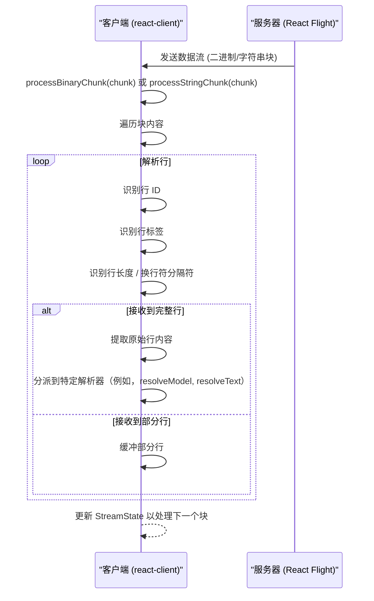

# 流数据流

`react-client` 采用复杂、异步的机制在服务器和客户端之间高效传输和处理数据。这个过程涉及在流环境中管理各种数据块类型及其生命周期。要更广泛地了解 `react-client` 的基本原理，请参阅 [核心概念](./core-concepts.md)。要深入了解交换的具体数据格式，请查阅 [序列化协议](./core-concepts-serialization-protocol.md) 部分。

## Response 对象

`Response` 对象充当管理来自服务器的所有传入数据流的中心枢纽。它协调各种数据块的接收、解析和解析。

### Response 初始化

当 `react-client` 初始化时，会使用 `createResponse` 创建一个 `Response` 对象。此函数设置处理传入的 React Flight 有效负载所需的配置。

```javascript
export function createResponse(
  bundlerConfig: ServerConsumerModuleMap,
  serverReferenceConfig: null | ServerManifest,
  moduleLoading: ModuleLoading,
  callServer: void | CallServerCallback,
  encodeFormAction: void | EncodeFormActionCallback,
  nonce: void | string,
  temporaryReferences: void | TemporaryReferenceSet,
  findSourceMapURL: void | FindSourceMapURLCallback, // DEV-only
  replayConsole: boolean, // DEV-only
  environmentName: void | string, // DEV-only
  debugChannel: void | DebugChannelCallback, // DEV-only
): WeakResponse;
```

`Response` 对象内部维护一个 `_chunks` 映射，这是通过其唯一标识符跟踪和管理所有接收到的数据段（`SomeChunk` 对象）状态的关键组件。



## 解析传入数据流

`react-client` 通过基于行的协议处理来自服务器的数据，这些数据可以作为二进制或字符串块到达。处理这些传入块的主要函数是 `processBinaryChunk` 和 `processStringChunk`。

这些函数管理一个 `StreamState` 对象，该对象跟踪跨多个传入块的解析进度。`StreamState` 包括：

| Property | Type | Description |
|---|---|---|
| `_rowState` | `0` \| `1` \| `2` \| `3` \| `4` | 行解析器的当前状态（例如，解析 ID、标签、长度）。 |
| `_rowID` | `number` | 当前正在解析的行的 ID。 |
| `_rowTag` | `number` | 标识当前行中数据类型的标签。 |
| `_rowLength` | `number` | 当前行的剩余字节数，用于带长度前缀的块。 |
| `_buffer` | `Array<Uint8Array>` | 当前行累积的二进制块，直到完成。 |

这些解析函数迭代地读取传入数据，识别行边界（由 `:` 或 `\n` 标记）并提取行 ID、标签和内容。一旦组装完成一行，它就会根据其标签分派给特定的解析函数。



## 块生命周期和类型

从服务器接收到的数据作为 `SomeChunk` 对象进行管理，每个对象都经过一个定义的生命周期。`ReactPromise` 对象作为底层机制，允许异步数据解析和集成到 React 的 suspense 模型中。

### 块状态

| Status | Description |
|---|---|
| `pending` | 初始状态；等待数据。 |
| `blocked` | 暂时停止，通常由于循环依赖或未解析的调试信息。 |
| `resolved_model` | 收到原始 JSON 模型但尚未解析为 JavaScript 对象。 |
| `resolved_module` | 收到客户端引用元数据，模块路径已解析，但模块尚未加载/初始化。 |
| `fulfilled` | 块成功初始化且值可用。 |
| `rejected` | 解析期间发生错误。 |
| `halted` | (仅限 DEV) 永不解析，即使连接关闭，通常是由于缺少调试通道数据。 |

### 块标签和解析

流中的每一行都以一个标签作为前缀，该标签决定其内容应如何解释和解析：

| Tag | Description | Resolution Method(s) | Notes |
|---|---|---|---|
| JSON (无特定标签) | 标准 JSON 模型（例如，React 元素、纯对象/数组）。 | `resolveModel` | 最常见的块类型。 |
| `T` | 文本 (字符串) | `resolveText` | 纯字符串值。 |
| `A` | ArrayBuffer | `resolveBuffer` | 原始二进制数据。 |
| `O`, `o`, `U`, `S`, `s`, `L`, `l`, `G`, `g`, `M`, `m`, `V` | 各种类型化数组（`Int8Array`、`Uint8Array` 等）。 | `resolveTypedArray` (内部) | 二进制数据视图，针对性能进行了优化。 |
| `I` | 模块 (客户端引用) | `resolveModule` | 引用客户端模块，`react-client` 会动态加载。 |
| `R` / `r` | 可读流 (`R` 用于默认，`r` 用于字节)。 | `startReadableStream`, `resolveStream` | 启动标准或基于字节的 `ReadableStream`。 |
| `X` / `x` | 异步迭代器 (`X` 用于一般，`x` 用于迭代器)。 | `startAsyncIterable`, `resolveStream` | 启动 `AsyncIterable` 以随时间拉取数据。 |
| `C` | 关闭流 | `stopStream` | 表示流的正常结束。 |
| `E` | 错误 | `resolveErrorModel` | 报告服务器端错误，通常包括摘要和堆栈跟踪。 |
| `H` | 提示 | `resolveHint` | 向客户端渲染器提供运行时提示（例如，用于预加载）。 |
| `P` | 推迟 | `resolvePostponeDev`/`Prod` | 表示服务器上内容渲染被推迟。 |
| `D` | 调试模型 (仅限 DEV) | `resolveDebugModel` | 为模型提供附加调试信息。 |
| `J` | I/O 信息 (仅限 DEV + 性能) | `resolveIOInfo` | 服务器上 I/O 操作的性能遥测。 |
| `N` | 时间原点 (仅限性能) | `response._timeOrigin` 更新 | 调整时间戳以相对于客户端时间原点进行性能分析。 |
| `W` | 控制台条目 (仅限 DEV) | `resolveConsoleEntry` | 在客户端环境中重播服务器端 `console` 日志。 |
| `""` (空字符串) | 调试暂停 (仅限 DEV) | `resolveDebugHalt` | 表示调试通道上的暂停，阻止进一步解析。 |

## 解析数据和引用

收到完整行后，`react-client` 的内部 `JSON.parse` 实现（由 `createFromJSONCallback` 增强）会主动处理内容。此自定义解析器会拦截特殊字符串前缀（例如，`$L` 用于惰性块，`$@` 用于 Promise，`$F` 用于服务器引用，`$` 用于 React 元素），以识别和处理不同类型的引用和数据结构。

### 惰性初始化

块通常会进行惰性初始化。当块的状态为 `RESOLVED_MODEL` 或 `RESOLVED_MODULE` 时，其实际值在明确需要之前不会被解析或加载，例如当调用 `readChunk` 时。`initializeModelChunk` 和 `initializeModuleChunk` 函数负责这种按需初始化，将块转换为 `INITIALIZED` 状态。

### 依赖管理和循环引用

`InitializationHandler` 和 `InitializationReference` 对象在管理依赖项和解决从服务器传输的对象图中的循环引用方面起着关键作用。

- **`waitForReference`**：当流中的值引用未解析的块（例如，`$1:foo.bar`）时，会调用 `waitForReference`。它在被引用的块上注册一个侦听器，确保当前的 `InitializationHandler`（以及 `BlockedChunk`）等待直到依赖项完成。
- **`fulfillReference`**：一旦引用的块被解析，就会调用 `fulfillReference`。它用实际值更新父对象中的占位符，并递减 `InitializationHandler` 的 `deps` 计数器。当 `deps` 达到零时，表示所有依赖项都已满足，`BlockedChunk` 可以转换为 `INITIALIZED`。
- **`rejectReference`**：如果引用的块出错，则会调用 `rejectReference`，将错误传播到 `InitializationHandler`，并最终触发关联 `BlockedChunk` 上的错误。

该系统确保即使是具有相互依赖和循环的复杂对象图也能在客户端正确重建，而不会导致死锁或无法解析的状态。

## 处理流式原语

`react-client` 支持原生 JavaScript `ReadableStream` 和 `AsyncIterable` 对象的流式传输，从而实现数据直接连续流向客户端。`startReadableStream` 和 `startAsyncIterable` 函数负责根据传入的行标签创建和管理这些流式原语。

这些流由内部控制器（`FlightStreamController`）支持，允许服务器将值排队、将模型排队（然后惰性初始化）、关闭流或发出错误信号，从而对数据流进行精细控制。

## 错误和推迟信号

除了数据传输之外，`react-client` 还处理来自服务器的特定信号：

- **错误**：`resolveErrorModel` 处理来自服务器的传入错误信息，将其转换为客户端 `Error` 对象，该对象包含 `name`、`message`、`stack` 和 `digest` 等详细信息。然后这些错误会传播到相关块。
- **推迟**：`resolvePostponeDev`/`Prod` 处理 `Postpone` 信号，表示服务器渲染内容的一部分未能完全解析并被有意推迟。这允许客户端渲染回退或优雅地处理推迟。您可以在 [错误和推迟处理](./developer-tools-error-postponement-handling.md) 中找到更多详细信息。

---

本节全面概述了 `react-client` 如何管理流数据，从解析原始块到解析复杂引用和处理异步数据流。要更深入地了解有线格式和数据转换，请继续阅读 [序列化协议](./core-concepts-serialization-protocol.md) 部分。