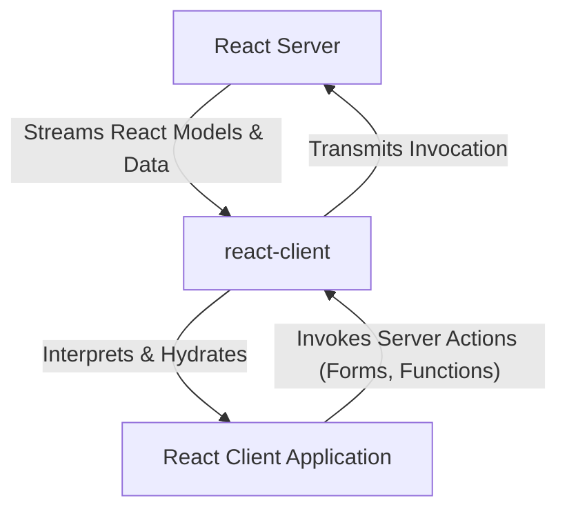

# Core Concepts

This section explores the foundational principles and architectural patterns that underpin react-client's operation. Understanding these concepts is crucial for effectively leveraging the package's capabilities and for advanced usage. We will briefly introduce how `react-client` manages the flow of data, handles serialization, and facilitates server-client interactions. For a deeper dive into each of these areas, refer to their dedicated sections:

*   [Streaming Data Flow](./core-concepts-streaming-data-flow.md)
*   [Serialization Protocol](./core-concepts-serialization-protocol.md)
*   [Server-Client Interaction](./core-concepts-server-client-interaction.md)

## Understanding react-client's Role

`react-client` is an experimental package designed to bridge the communication gap between a React server environment and a React client application, specifically for streaming React models. It acts as an intermediary, facilitating the asynchronous transmission and interpretation of UI components and data between the server and the browser.

The following diagram illustrates the high-level architecture and the central role `react-client` plays:

### Streaming Data Flow

`react-client` is built upon a streaming architecture, which enables efficient and asynchronous data transmission. This approach ensures that UI and data updates can be progressively delivered to the client as they become available on the server, enhancing responsiveness and user experience. This includes managing various data chunk types and ensuring proper stream management from the server to the client.

### Serialization Protocol

To enable seamless communication, `react-client` implements a specific serialization protocol. This protocol defines how complex JavaScript types, including React elements, are transformed into a format suitable for network transmission and then rehydrated on the client side. This mechanism is vital for maintaining data integrity and functionality across the network boundary.

### Server-Client Interaction

This concept covers the robust communication channels established between the server and client. It details how client-side operations, such as invoking server functions or submitting form actions, are translated and executed on the server. `react-client` manages the underlying processes for handling references and ensuring these interactions are secure and reliable.

---

These core concepts form the backbone of `react-client`'s functionality, dictating how server-rendered UI and data are delivered and interacted with on the client. To delve deeper into the specifics of data transmission, serialization, and interaction, proceed to the detailed breakdown of [Streaming Data Flow](./core-concepts-streaming-data-flow.md).