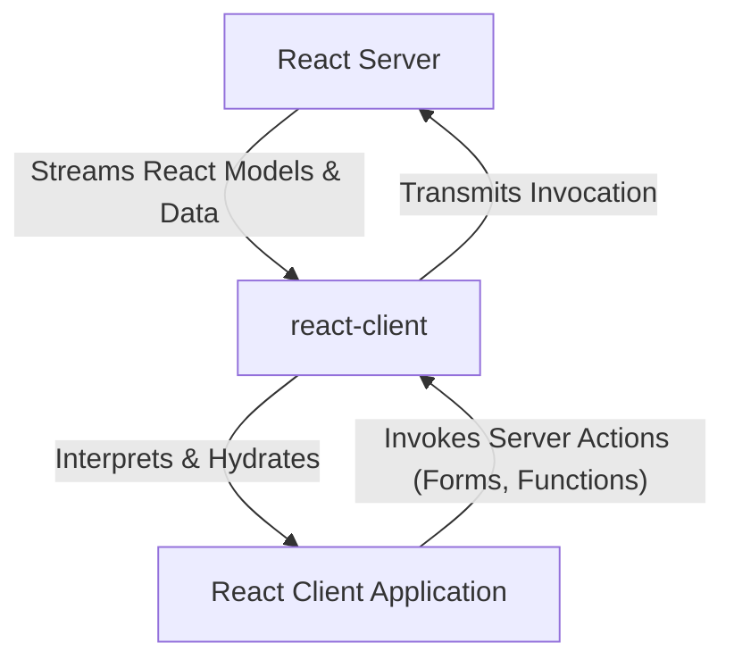

# 核心概念

本节探讨了 `react-client` 运行所依赖的基础原则和架构模式。理解这些概念对于有效利用该包的功能和进行高级用法至关重要。我们将简要介绍 `react-client` 如何管理数据流、处理序列化以及促进服务器与客户端的交互。如需深入了解这些领域，请参阅其专属章节：

*   [流式数据流](./core-concepts-streaming-data-flow.md)
*   [序列化协议](./core-concepts-serialization-protocol.md)
*   [服务器-客户端交互](./core-concepts-server-client-interaction.md)

## 理解 `react-client` 的作用

`react-client` 是一个实验性软件包，旨在弥合 React 服务器环境与 React 客户端应用之间的通信鸿沟，特别是针对流式传输 React 模型。它充当中间层，促进 UI 组件和数据在服务器与浏览器之间的异步传输和解释。

以下图表展示了 `react-client` 的高层架构及其核心作用：

### 流式数据流

`react-client` 基于流式架构构建，可实现高效异步的数据传输。这种方法确保 UI 和数据更新能够在服务器上可用时逐步交付给客户端，从而提高响应能力和用户体验。这包括管理各种数据块类型并确保从服务器到客户端的正确流管理。

### 序列化协议

为了实现无缝通信，`react-client` 实现了特定的序列化协议。该协议定义了如何将复杂的 JavaScript 类型（包括 React 元素）转换为适合网络传输的格式，然后在客户端进行“再水合”（rehydrate）。此机制对于维护跨网络边界的数据完整性和功能至关重要。

### 服务器-客户端交互

此概念涵盖了服务器与客户端之间建立的强大通信通道。它详细说明了客户端操作（例如调用服务器函数或提交表单动作）如何被翻译并在服务器上执行。`react-client` 管理处理引用和确保这些交互安全可靠的底层过程。

---

这些核心概念构成了 `react-client` 功能的骨干，决定了服务器渲染的 UI 和数据如何在客户端交付和交互。如需深入了解数据传输、序列化和交互的具体细节，请继续阅读 [流式数据流](./core-concepts-streaming-data-flow.md) 的详细解析。