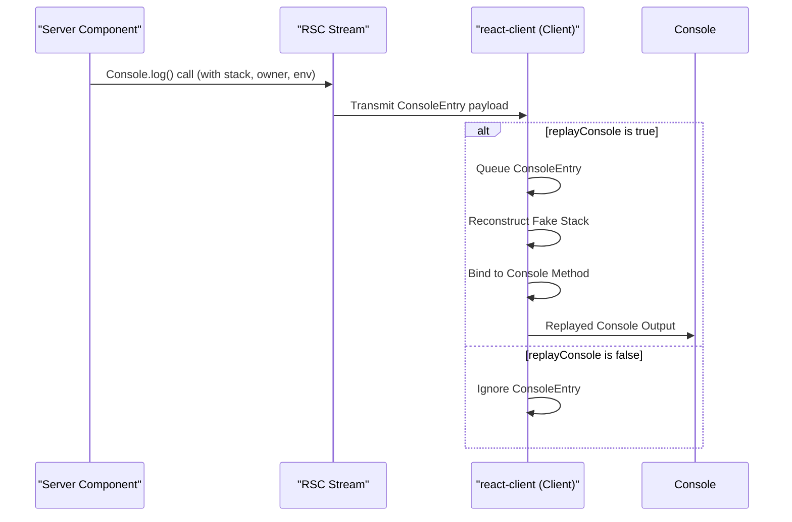

# Console Replay

`react-client` offers a robust mechanism for replaying server-side console logs and their associated stack traces directly within your client-side development environment. This capability provides architects and developers with an enhanced debugging experience for Server Components, allowing you to observe server-initiated console output as if it originated from the client.

This section delves into how console replay works within `react-client`. For a broader understanding of debugging utilities, refer to the [Developer Tools & Debugging](./developer-tools.md) section. For more on performance analysis, see [Performance Tracking](./developer-tools-performance-tracking.md), and for error management, consult [Error & Postponement Handling](./developer-tools-error-postponement-handling.md).

## Overview of the Mechanism

When `react-client` operates in a development environment, it can capture console output generated by Server Components. Instead of merely forwarding raw log messages, the system intercepts these calls, including contextual information such as the original stack trace on the server, the associated React component owner, and the server environment name. This rich payload is then streamed to the client.

The `replayConsole` option within the `createResponse` function dictates whether these server-side console entries are replayed. When enabled, `react-client` queues these entries and replays them sequentially on the client, maintaining the original call context as much as possible.



## Replaying Console Entries

The core of the console replay mechanism lies in the `resolveConsoleEntry` function, which processes each incoming server-side console payload. If the `_replayConsole` flag is enabled on the `Response` object, these payloads are then passed to `replayConsoleWithCallStackInDEV`.

`replayConsoleWithCallStackInDEV` is designed to re-execute the original console method (e.g., `console.log`, `console.warn`, `console.error`) on the client. It achieves this by:

1.  **Reconstructing the Call Stack**: It uses the `buildFakeCallStack` function to generate a synthetic call stack on the client that mirrors the original server-side stack trace. This is crucial for making the replayed logs appear as if they came from the correct location in the server component's code.
2.  **Context Binding**: It utilizes `bindToConsole` to ensure that the replayed console method is executed with the correct `this` context (which is `console` itself) and to apply any environment-specific badging or styling, such as `[%s]` for plain environments or `%c%s%c` for browsers/servers with styling.
3.  **Task Integration**: If the client environment supports `console.createTask` (e.g., Chrome DevTools), `initializeFakeTask` is used to associate the replayed console output with a performance task. This links the log to the relevant server component's lifecycle in the performance timeline, improving traceability.

```javascript
// From ReactFlightClient.js (simplified for brevity)
type ConsoleEntry = [
  string,             // methodName (e.g., 'log', 'warn')
  ReactStackTrace,    // stackTrace from server
  null | ReactComponentInfo, // owner component info
  string,             // env (environment name)
  mixed               // ...args (original console arguments)
];

// The function responsible for replaying console entries
function resolveConsoleEntry(
  response: Response,
  json: UninitializedModel,
): void {
  // ... (checks for __DEV__ and _replayConsole)

  const payload: ConsoleEntry = parseModel(response, json);

  // Queues and replays the console entry
  replayConsoleWithCallStackInDEV(response, payload);
}

// From ReactClientConsoleConfigBrowser.js (example bindToConsole)
export function bindToConsole(
  methodName: string,
  args: Array<any>,
  badgeName: string,
): () => any {
  // ...
  // Modifies args to include styling for the badge
  if (typeof newArgs[offset] === 'string') {
    newArgs.splice(
      offset,
      1,
      badgeFormat + ' ' + newArgs[offset],
      badgeStyle,
      pad + badgeName + pad,
      resetStyle,
    );
  } else {
    newArgs.splice(
      offset,
      0,
      badgeFormat,
      badgeStyle,
      pad + badgeName + pad,
      resetStyle,
    );
  }

  newArgs.unshift(console);
  return bind.apply(console[methodName], newArgs);
}
```

## Fake Call Stack Generation

Server Component execution happens on the server, meaning standard client-side stack traces wouldn't naturally include server-side frames. To bridge this gap, `react-client` generates synthetic call stacks that mimic the server environment. This process involves several key functions:

-   **`createFakeFunction`**: This utility dynamically generates JavaScript functions that correspond to individual stack frames from the server. By using `eval` (in development mode), `createFakeFunction` embeds `//# sourceURL` and `//# sourceMappingURL` comments directly into the generated function's code. These comments are crucial as they allow browser developer tools to map the replayed console output back to its *original server-side source file, line number, and column*, providing an accurate debugging experience.

-   **`buildFakeCallStack`**: This function constructs the complete synthetic call stack. It iterates through the `ReactStackTrace` (an array containing details like function name, filename, line, and column for each server-side frame) and, for each frame, either retrieves a cached fake function or calls `createFakeFunction` to generate a new one. These fake functions are then recursively bound together to form a call chain that, when executed, simulates the server-side stack.

-   **`fakeFunctionCache`**: To optimize performance and avoid redundant work, `react-client` maintains a `fakeFunctionCache`. This cache stores previously generated fake functions, ensuring that identical stack frames do not trigger repeated dynamic function creation.

-   **`fakeJSXCallSite`**: This is an internal, no-op function that acts as the conceptual bottom frame of the simulated JSX creation call stack. Its presence helps ensure that the generated stack trace's structure is consistent with how React elements are typically created and rendered within the framework.

```javascript
// From ReactFlightClient.js (simplified for brevity)

const fakeFunctionCache: Map<string, FakeFunction<any>> = __DEV__
  ? new Map()
  : (null: any);

function createFakeFunction<
  T,
>( /* ... parameters for name, filename, line, col, etc. ... */ ): FakeFunction<T> {
  // ... dynamic code generation using eval
  // Code embeds sourceURL and sourceMappingURL comments for DevTools integration
  // Example: code += '\n//# sourceURL=about://React/' + encodeURIComponent(environmentName) + '/' + encodeURI(filename) + '?' + fakeFunctionIdx++;
  // Example: code += '\n//# sourceMappingURL=' + sourceMap;
}

function buildFakeCallStack<T>(
  response: Response,
  stack: ReactStackTrace, // e.g., [['ComponentName', '/path/to/file.js', 10, 5, 8, 1]]
  environmentName: string,
  useEnclosingLine: boolean,
  innerCall: () => T,
): () => T {
  let callStack = innerCall;
  for (let i = 0; i < stack.length; i++) {
    const frame = stack[i];
    const frameKey = /* ... unique key based on frame details ... */;
    let fn = fakeFunctionCache.get(frameKey);
    if (fn === undefined) {
      const [name, filename, line, col, enclosingLine, enclosingCol] = frame;
      const findSourceMapURL = response._debugFindSourceMapURL;
      const sourceMap = findSourceMapURL
        ? findSourceMapURL(filename, environmentName)
        : null;
      fn = createFakeFunction(
        name, filename, sourceMap, line, col, 
        useEnclosingLine ? line : enclosingLine,
        useEnclosingLine ? col : enclosingCol, 
        environmentName
      );
      fakeFunctionCache.set(frameKey, fn);
    }
    callStack = fn.bind(null, callStack); // Wraps the call for stack simulation
  }
  return callStack;
}

// Used as the bottom-most frame in the simulated stack for JSX creation
function fakeJSXCallSite() {
  return new Error('react-stack-top-frame');
}

// Sets the global current owner in DEV mode for accurate stack reporting
function getCurrentOwnerInDEV(): null | ReactComponentInfo {
  return currentOwnerInDEV;
}

// Injects currentOwnerInDEV into ReactSharedInternals for DevTools
export function injectIntoDevTools(): boolean {
  const internals: Object = {
    // ... other internals ...
    getCurrentComponentInfo: getCurrentOwnerInDEV,
  };
  return injectInternals(internals);
}
```

This intricate process ensures that when you encounter console logs originating from Server Components, your client-side development tools provide rich, contextually accurate stack traces, significantly enhancing the debugging experience.

---

Having explored the debugging capabilities, including console replay, you can now delve into the detailed inner workings of `react-client`'s architecture. Continue to the [Internal Mechanisms](./internal-mechanisms.md) section for an in-depth understanding.