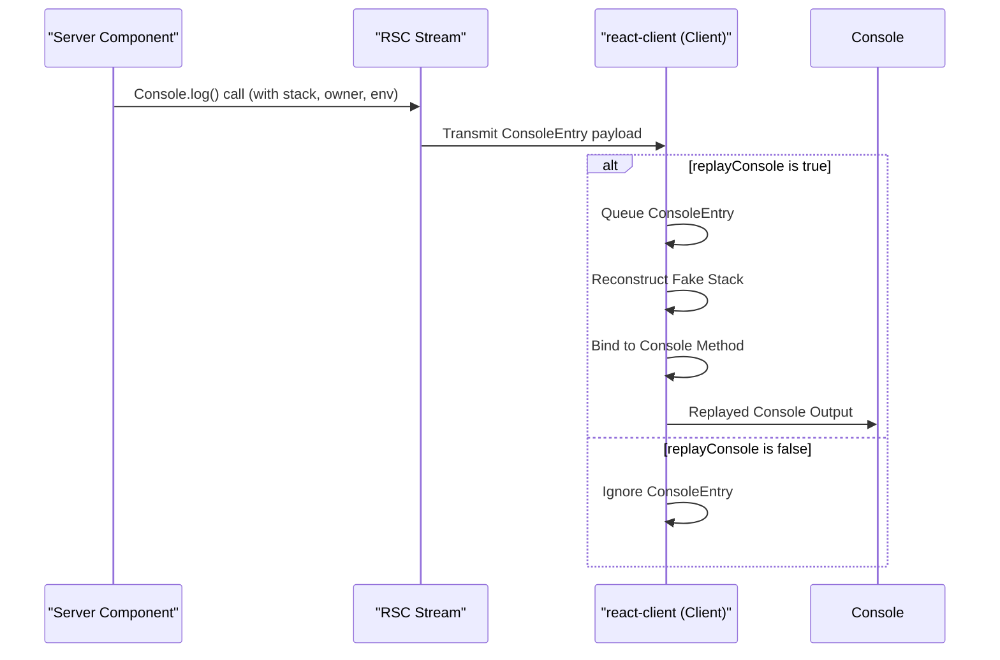

# 控制台回放

`react-client` 提供了一种强大的机制，可以直接在客户端开发环境中回放服务器端控制台日志及其相关的堆栈跟踪。此功能为架构师和开发人员提供了增强的服务器组件调试体验，使您能够像观察来自客户端的控制台输出一样，观察服务器发起的控制台输出。

本节将深入探讨 `react-client` 中控制台回放的工作原理。有关调试工具的更广泛理解，请参阅[开发人员工具和调试](./developer-tools.md)部分。有关性能分析的更多信息，请参阅[性能跟踪](./developer-tools-performance-tracking.md)，有关错误管理，请查阅[错误和推迟处理](./developer-tools-error-postponement-handling.md)。

## 机制概述

当 `react-client` 在开发环境中运行时，它可以捕获服务器组件生成的控制台输出。系统不会仅仅转发原始日志消息，而是会拦截这些调用，包括上下文信息，例如服务器上的原始堆栈跟踪、相关的 React 组件所有者和服务器环境名称。然后，此丰富的数据负载会流式传输到客户端。

`createResponse` 函数中的 `replayConsole` 选项决定是否回放这些服务器端控制台条目。启用后，`react-client` 会将这些条目排队，并在客户端上按顺序回放它们，尽可能保持原始调用上下文。



## 回放控制台条目

控制台回放机制的核心在于 `resolveConsoleEntry` 函数，该函数处理每个传入的服务器端控制台数据负载。如果 `Response` 对象上的 `_replayConsole` 标志已启用，则这些数据负载将传递给 `replayConsoleWithCallStackInDEV`。

`replayConsoleWithCallStackInDEV` 旨在在客户端上重新执行原始控制台方法（例如 `console.log`、`console.warn`、`console.error`）。它通过以下方式实现：

1.  **重建调用堆栈**：它使用 `buildFakeCallStack` 函数在客户端上生成一个模拟调用堆栈，该堆栈镜像原始服务器端堆栈跟踪。这对于使回放的日志看起来像是来自服务器组件代码中的正确位置至关重要。
2.  **上下文绑定**：它利用 `bindToConsole` 来确保回放的控制台方法以正确的 `this` 上下文（即 `console` 本身）执行，并应用任何特定于环境的标记或样式，例如用于纯环境的 `[%s]` 或用于带样式浏览器/服务器的 `%c%s%c`。
3.  **任务集成**：如果客户端环境支持 `console.createTask`（例如 Chrome DevTools），则使用 `initializeFakeTask` 将回放的控制台输出与性能任务关联起来。这会将日志链接到性能时间线中相关服务器组件的生命周期，从而提高可追溯性。

```javascript
// 来自 ReactFlightClient.js（为简洁起见已简化）
type ConsoleEntry = [
  string,             // methodName (e.g., 'log', 'warn')
  ReactStackTrace,    // stackTrace from server
  null | ReactComponentInfo, // owner component info
  string,             // env (environment name)
  mixed               // ...args (original console arguments)
];

// 负责回放控制台条目的函数
function resolveConsoleEntry(
  response: Response,
  json: UninitializedModel,
): void {
  // ... (checks for __DEV__ and _replayConsole)

  const payload: ConsoleEntry = parseModel(response, json);

  // 将控制台条目排队并回放
  replayConsoleWithCallStackInDEV(response, payload);
}

// 来自 ReactClientConsoleConfigBrowser.js（bindToConsole 示例）
export function bindToConsole(
  methodName: string,
  args: Array<any>,
  badgeName: string,
): () => any {
  // ...
  // 修改 args 以包含徽章的样式
  if (typeof newArgs[offset] === 'string') {
    newArgs.splice(
      offset,
      1,
      badgeFormat + ' ' + newArgs[offset],
      badgeStyle,
      pad + badgeName + pad,
      resetStyle,
    );
  } else {
    newArgs.splice(
      offset,
      0,
      badgeFormat,
      badgeStyle,
      pad + badgeName + pad,
      resetStyle,
    );
  }

  newArgs.unshift(console);
  return bind.apply(console[methodName], newArgs);
}
```

## 模拟调用堆栈生成

服务器组件执行在服务器上进行，这意味着标准的客户端堆栈跟踪自然不会包含服务器端帧。为了弥补这一差距，`react-client` 生成模拟调用堆栈，以模仿服务器环境。此过程涉及几个关键函数：

-   **`createFakeFunction`**：此实用程序动态生成与服务器中各个堆栈帧对应的 JavaScript 函数。通过使用 `eval`（在开发模式下），`createFakeFunction` 将 `//# sourceURL` 和 `//# sourceMappingURL` 注释直接嵌入到生成的函数代码中。这些注释至关重要，因为它们允许浏览器开发人员工具将回放的控制台输出映射回其*原始服务器端源文件、行号和列*，从而提供准确的调试体验。

-   **`buildFakeCallStack`**：此函数构建完整的模拟调用堆栈。它遍历 `ReactStackTrace`（一个包含每个服务器端帧的函数名、文件名、行和列等详细信息的数组），并且对于每个帧，要么检索缓存的模拟函数，要么调用 `createFakeFunction` 生成一个新的函数。然后，这些模拟函数被递归地绑定在一起，形成一个调用链，该调用链在执行时模拟服务器端堆栈。

-   **`fakeFunctionCache`**：为了优化性能并避免重复工作，`react-client` 维护一个 `fakeFunctionCache`。此缓存存储先前生成的模拟函数，确保相同的堆栈帧不会触发重复的动态函数创建。

-   **`fakeJSXCallSite`**：这是一个内部的无操作函数，作为模拟 JSX 创建调用堆栈的概念性最底层帧。它的存在有助于确保生成的堆栈跟踪结构与 React 元素在框架中通常的创建和渲染方式保持一致。

```javascript
// 来自 ReactFlightClient.js（为简洁起见已简化）

const fakeFunctionCache: Map<string, FakeFunction<any>> = __DEV__
  ? new Map()
  : (null: any);

function createFakeFunction<
  T,
>( /* ... parameters for name, filename, line, col, etc. ... */ ): FakeFunction<T> {
  // ... 使用 eval 进行动态代码生成
  // 代码嵌入 sourceURL 和 sourceMappingURL 注释以进行 DevTools 集成
  // Example: code += '\n//# sourceURL=about://React/' + encodeURIComponent(environmentName) + '/' + encodeURI(filename) + '?' + fakeFunctionIdx++;
  // Example: code += '\n//# sourceMappingURL=' + sourceMap;
}

function buildFakeCallStack<T>(
  response: Response,
  stack: ReactStackTrace, // e.g., [['ComponentName', '/path/to/file.js', 10, 5, 8, 1]]
  environmentName: string,
  useEnclosingLine: boolean,
  innerCall: () => T,
): () => T {
  let callStack = innerCall;
  for (let i = 0; i < stack.length; i++) {
    const frame = stack[i];
    const frameKey = /* ... unique key based on frame details ... */;
    let fn = fakeFunctionCache.get(frameKey);
    if (fn === undefined) {
      const [name, filename, line, col, enclosingLine, enclosingCol] = frame;
      const findSourceMapURL = response._debugFindSourceMapURL;
      const sourceMap = findSourceMapURL
        ? findSourceMapURL(filename, environmentName)
        : null;
      fn = createFakeFunction(
        name, filename, sourceMap, line, col, 
        useEnclosingLine ? line : enclosingLine,
        useEnclosingLine ? col : enclosingCol, 
        environmentName
      );
      fakeFunctionCache.set(frameKey, fn);
    }
    callStack = fn.bind(null, callStack); // 包装调用以进行堆栈模拟
  }
  return callStack;
}

// 用作 JSX 创建模拟堆栈中的最底层帧
function fakeJSXCallSite() {
  return new Error('react-stack-top-frame');
}

// 在 DEV 模式下设置全局当前所有者以实现准确的堆栈报告
function getCurrentOwnerInDEV(): null | ReactComponentInfo {
  return currentOwnerInDEV;
}

// 将 currentOwnerInDEV 注入 ReactSharedInternals 以进行 DevTools
export function injectIntoDevTools(): boolean {
  const internals: Object = {
    // ... 其他内部组件 ...
    getCurrentComponentInfo: getCurrentOwnerInDEV,
  };
  return injectInternals(internals);
}
```

这一复杂的过程确保了当您遇到源自服务器组件的控制台日志时，您的客户端开发工具会提供丰富且上下文准确的堆栈跟踪，从而显著增强调试体验。

---

探索了包括控制台回放的调试功能后，您现在可以深入了解 `react-client` 架构的详细内部工作原理。继续阅读[内部机制](./internal-mechanisms.md)部分以获得深入理解。