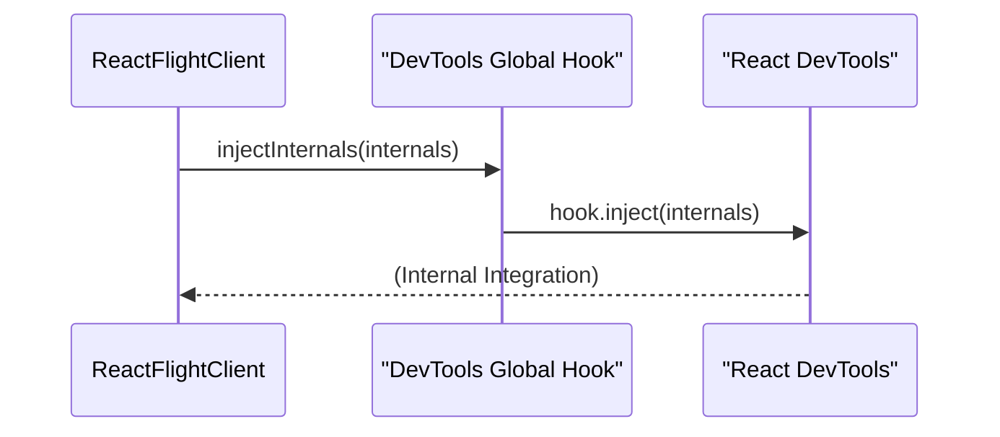

# DevTools Integration

`react-client` connects with React DevTools to give you a deep understanding of how your Server Components render. This connection allows you to look at component trees, understand where they came from, and see server-side performance directly within your development environment.

## How DevTools Integration Works

The integration starts with the `injectInternals` function. This function checks for a global React DevTools hook (`__REACT_DEVTOOLS_GLOBAL_HOOK__`). If it finds the hook and it supports Flight, `react-client` injects its internal information. This allows React DevTools to recognize and display data specifically related to your Server Components, giving you a comprehensive view of your application.

Here’s a look at the injection process:

If the injection is successful, DevTools can use the exposed internals for more detailed debugging and profiling.

## Injected Internals Overview

For thorough debugging, `react-client` injects an `internals` object into React DevTools. This object contains vital information about the runtime environment and component structure:

| Property Name             | Description                                                                                                                                                                                                                                                                                                                                                                                                 |
| :------------------------ | :---------------------------------------------------------------------------------------------------------------------------------------------------------------------------------------------------------------------------------------------------------------------------------------------------------------------------------------------------------------------------------------------------------- |
| `bundleType`              | Shows the type of React bundle in use, typically `1` for development builds.                                                                                                                                                                                                                                                                                                                                |
| `version`                 | The version string of the `react-client` renderer.                                                                                                                                                                                                                                                                                                                                                          |
| `rendererPackageName`     | The package name for the renderer, which is `react-client`.                                                                                                                                                                                                                                                                                                                                                 |
| `currentDispatcherRef`    | A reference to React's internal dispatcher, which helps DevTools identify the reconciler version. This is important for DevTools to adapt to different React versions, even when used by third-party renderers.                                                                                                                                                                                                |
| `reconcilerVersion`       | The specific version of the React reconciler, ensuring DevTools compatibility and accurate feature support.                                                                                                                                                                                                                                                                                               |
| `getCurrentComponentInfo` | A function DevTools calls to get information about the currently active React component. This is useful for understanding the owner chain of Server Components, as it uses `getCurrentOwnerInDEV` to expose relevant debugging data.                                                                                                                                                                                   |

This data lets DevTools reconstruct the server component tree, display owner relationships, and provide context for content generated on the server.

## Enabling Deeper Inspection

The DevTools integration for `react-client` does more than just show a basic component tree. It provides the crucial context needed for more advanced debugging features:

*   **Component Ownership**: You can view the owner hierarchy of your Server Components. This helps you trace how components are rendered and managed on the server before they stream to the client.
*   **Server-Side Context**: Debugging information, such as component names and their execution environment on the server, is passed through. This gives you a more complete picture of your application's flow.

This core integration is essential for using other debugging and performance analysis tools within the `react-client` ecosystem. To learn more about analyzing performance or replaying server-side logs, explore these sections:

*   [Performance Tracking](./developer-tools-performance-tracking.md)
*   [Console Replay](./developer-tools-console-replay.md).
