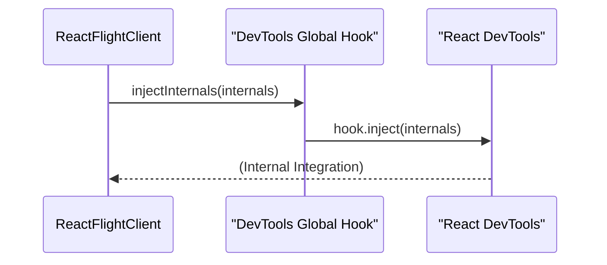

# DevTools 集成

`react-client` 与 React DevTools 连接，让您深入了解 Server Components 的渲染方式。此连接允许您查看组件树、了解其来源，并在开发环境中直接查看服务器端性能。

## DevTools 集成工作原理

集成始于 `injectInternals` 函数。此函数会检查是否存在全局 React DevTools hook (`__REACT_DEVTOOLS_GLOBAL_HOOK__`)。如果找到该 hook 且其支持 Flight，`react-client` 会注入其内部信息。这使得 React DevTools 能够识别并显示与您的 Server Components 相关的特定数据，从而为您提供应用程序的全面视图。

以下是注入过程：

如果注入成功，DevTools 可以使用公开的内部信息进行更详细的调试和性能分析。

## 注入的内部信息概览

为了进行彻底的调试，`react-client` 会将一个 `internals` 对象注入到 React DevTools 中。此对象包含有关运行时环境和组件结构的重要信息：

| 属性名称          | 描述                                                                                                                                                                                                                                                                                                                                                                                        |
| :---------------- | :------------------------------------------------------------------------------------------------------------------------------------------------------------------------------------------------------------------------------------------------------------------------------------------------------------------------------------------------------------------------------------------ |
| `bundleType`      | 显示正在使用的 React bundle 类型，开发版本通常为 `1`。                                                                                                                                                                                                                                                                                                                                      |
| `version`         | `react-client` 渲染器的版本字符串。                                                                                                                                                                                                                                                                                                                                                         |
| `rendererPackageName` | 渲染器的包名，即 `react-client`。                                                                                                                                                                                                                                                                                                                                                       |
| `currentDispatcherRef` | 对 React 内部调度器的引用，有助于 DevTools 识别协调器版本。这对于 DevTools 适应不同的 React 版本至关重要，即使第三方渲染器使用它也是如此。                                                                                                                                                                                                                                           |
| `reconcilerVersion` | React 协调器的特定版本，确保 DevTools 兼容性和准确的功能支持。                                                                                                                                                                                                                                                                                                                          |
| `getCurrentComponentInfo` | DevTools 调用此函数以获取当前活动的 React 组件的信息。这对于理解 Server Components 的所有者链非常有用，因为它使用 `getCurrentOwnerInDEV` 来公开相关的调试数据。                                                                                                                                                                                                                  |

这些数据使 DevTools 能够重建服务器组件树、显示所有者关系，并为服务器上生成的内容提供上下文。

## 启用更深层次的检查

`react-client` 的 DevTools 集成不仅仅是显示一个基本的组件树。它提供了更高级调试功能所需的关键上下文：

*   **组件所有权**：您可以查看 Server Components 的所有者层级结构。这有助于您追踪组件在流式传输到客户端之前，如何在服务器上渲染和管理。
*   **服务器端上下文**：调试信息，例如组件名称及其在服务器上的执行环境，都会被传递。这能让您更全面地了解应用程序的流程。

此核心集成对于在 `react-client` 生态系统中使用其他调试和性能分析工具至关重要。要了解有关分析性能或重播服务器端日志的更多信息，请查阅以下部分：

*   [性能追踪](./developer-tools-performance-tracking.md)
*   [控制台回放](./developer-tools-console-replay.md)。