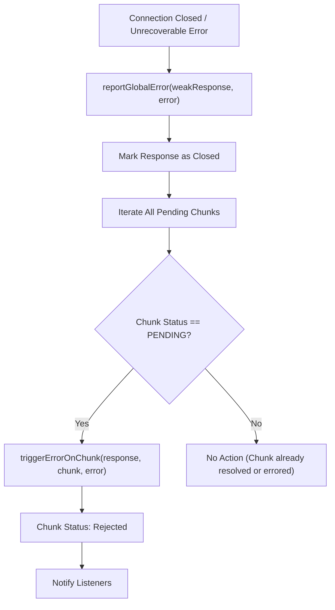

# Error & Postponement Handling

When working with server components, understanding how `react-client` manages and reports errors and content postponements originating on the server is critical. This section covers the robust strategies employed, including specific debug information available in development environments. This capability complements your debugging efforts, as detailed in [DevTools Integration](./developer-tools-devtools-integration.md), [Performance Tracking](./developer-tools-performance-tracking.md), and [Console Replay](./developer-tools-console-replay.md).

## Global Error Reporting

If the server component connection closes or an unrecoverable error occurs, `react-client` triggers a global error. The `reportGlobalError` function marks the entire response as closed and propagates the error to any pending chunks that have not yet resolved. This ensures that any part of your application awaiting data from the server receives an immediate indication of failure.

### Flow of Global Error Reporting

## Server Error Resolution

Errors encountered during server component rendering or data serialization are sent to the client. `react-client` handles these errors differently based on the environment (development vs. production) to balance debuggability and information security.

### Production Environment (`resolveErrorProd`)

In production builds, `resolveErrorProd` is invoked. To avoid leaking sensitive details, the error message is generalized. A `digest` property may be included on the error instance, providing a concise identifier for server-side logging and tracking.

### Development Environment (`resolveErrorDev`)

In development mode, `resolveErrorDev` provides a more detailed error experience. It uses the original name, message, stack trace, and environment information from the server to reconstruct a client-side error object. This enhanced error includes a reconstructed call stack that maps back to the server component's origin, making debugging more effective. The `_debugRootOwner`, `_debugRootStack`, `_debugRootTask`, and `_debugFindSourceMapURL` configurations play a role in this detailed reconstruction.

### Error Information in Development

| Property | Type | Description |
|---|---|---|
| `name` | `string` | The name of the error from the server. |
| `message` | `string` | The detailed error message from the server. |
| `stack` | `ReactStackTrace` | The server-side stack trace at the point of the error. |
| `env` | `string` | The environment name (e.g., 'Server') where the error originated. |
| `digest` | `string` | An optional digest for correlating server logs. |

## Content Postponement

React's experimental `postpone` feature allows server components to defer rendering if certain data or conditions are not met, preventing waterfalls and improving perceived performance. `react-client` recognizes and handles these postponements.

### Production Environment (`resolvePostponeProd`)

When `enablePostpone` is active, `resolvePostponeProd` generates a generic `Postpone` instance in production. The specific reason for postponement is omitted to prevent exposing internal state or sensitive data.

### Development Environment (`resolvePostponeDev`)

In development, `resolvePostponeDev` provides detailed information about why content was postponed, including the reason and the server-side stack trace. This `Postpone` instance also gets a reconstructed call stack, similar to errors, aiding developers in understanding and addressing the postponement conditions.

## Debug Information in Errors and Elements

`react-client` enriches React elements and their associated chunks with debug information, especially in development. This includes:

*   **Element Debug Properties**: When `createElement` is called (during model parsing), properties like `_owner`, `_debugStack`, and `_debugTask` are attached to the React element. These fields store references to server-side component owners, stack traces, and console tasks respectively.
*   **Lazy Loading and Errors**: If a server-side error occurs within an element's props during `initializeModelChunk`, the element may be wrapped in a `LazyComponent` that resolves to an error. In this scenario, `ReactComponentInfo` about the errored component is attached to the chunk's `_debugInfo`.
*   **Stack Trace Reconstruction**: Functions like `createFakeJSXCallStackInDEV`, `buildFakeCallStack`, `initializeFakeStack`, and `initializeFakeTask` work together to transform raw server-side stack traces (`ReactStackTrace`) into client-side `Error` objects and `ConsoleTask`s. This makes server-side execution context visible in browser developer tools.
*   **Omitted Properties**: In development, if a lazy-loaded property is accessed before it's initialized and no debug channel is available, it resolves to `OMITTED_PROP_ERROR`. This helps identify unfulfilled server-side lazy references.

## Chunk-Specific Error Propagation

Beyond global errors, `react-client` manages errors at a granular, chunk-by-chunk level. When a specific data chunk fails to resolve or encounters an issue:

*   **`triggerErrorOnChunk`**: This function is central to marking a `PendingChunk` or `BlockedChunk` as `ERRORED`. It releases any pending references for that chunk and notifies all registered `reject` listeners, passing the error through the promise chain.
*   **`rejectReference`**: When an `InitializationReference` (a pending reference to another chunk or module) fails to resolve, `rejectReference` is called. This marks the associated `InitializationHandler` as `errored`, prevents further resolution for that handler, and ultimately triggers an error on the `BlockedChunk` it might be linked to. This ensures that errors are propagated up the dependency tree.

---

Understanding how `react-client` handles errors and postponements provides the foundation for building more resilient and debuggable server component applications. Leveraging the development-time debug features can significantly accelerate your troubleshooting process. For more details on the structures that underpin these processes, refer to [Streaming Data Flow](./core-concepts-streaming-data-flow.md) and [Serialization Protocol](./core-concepts-serialization-protocol.md).