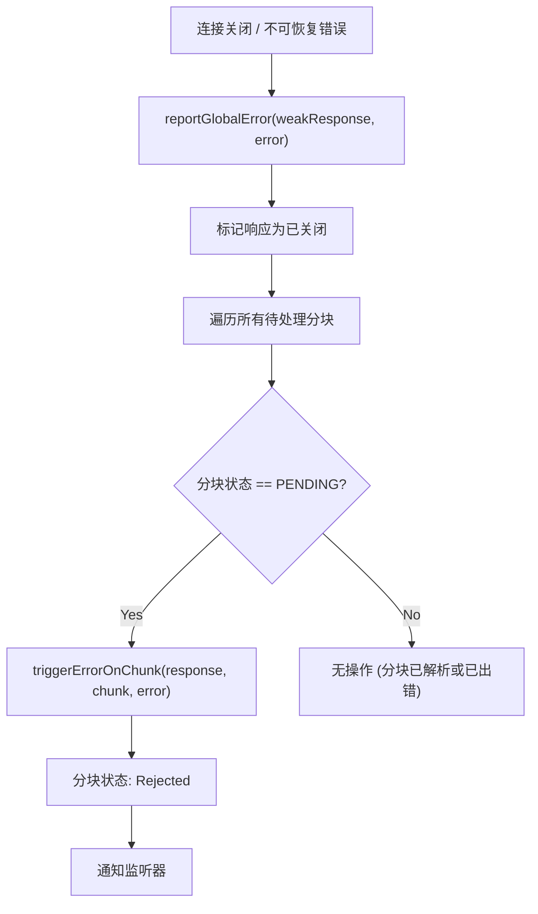

# 错误与推迟处理

在使用服务器组件时，理解 `react-client` 如何管理和报告源自服务器的错误和内容推迟至关重要。本节涵盖了所采用的稳健策略，包括在开发环境中可用的特定调试信息。此功能补充了您的调试工作，详见 [DevTools 集成](./developer-tools-devtools-integration.md)、[性能跟踪](./developer-tools-performance-tracking.md) 和 [控制台回放](./developer-tools-console-replay.md)。

## 全局错误报告

如果服务器组件连接关闭或发生不可恢复的错误，`react-client` 将触发一个全局错误。`reportGlobalError` 函数会将整个响应标记为已关闭，并将错误传播到任何尚未解析的待处理分块。这确保了应用程序中等待服务器数据的任何部分都能立即收到失败指示。

### 全局错误报告流程

## 服务器错误解析

服务器组件渲染或数据序列化过程中遇到的错误会被发送到客户端。`react-client` 会根据环境（开发环境 vs 生产环境）以不同方式处理这些错误，以平衡可调试性和信息安全性。

### 生产环境 (`resolveErrorProd`)

在生产构建中，会调用 `resolveErrorProd`。为避免泄露敏感细节，错误消息会被泛化。错误实例中可能会包含一个 `digest` 属性，为服务器端日志记录和跟踪提供一个简洁的标识符。

### 开发环境 (`resolveErrorDev`)

在开发模式下，`resolveErrorDev` 提供更详细的错误体验。它使用来自服务器的原始名称、消息、堆栈跟踪和环境信息来重构客户端错误对象。这种增强的错误包含一个重构的调用堆栈，可以映射回服务器组件的来源，从而使调试更有效。`_debugRootOwner`、`_debugRootStack`、`_debugRootTask` 和 `_debugFindSourceMapURL` 配置在此详细重构中发挥作用。

### 开发中的错误信息

| Property | Type | Description |
|---|---|---|
| `name` | `string` | 来自服务器的错误名称。 |
| `message` | `string` | 来自服务器的详细错误消息。 |
| `stack` | `ReactStackTrace` | 错误发生时的服务器端堆栈跟踪。 |
| `env` | `string` | 错误来源的环境名称（例如“Server”）。 |
| `digest` | `string` | 用于关联服务器日志的可选摘要。 |

## 内容推迟

React 的实验性 `postpone` 功能允许服务器组件在某些数据或条件不满足时推迟渲染，从而防止瀑布效应并提高感知性能。`react-client` 识别并处理这些推迟。

### 生产环境 (`resolvePostponeProd`)

当 `enablePostpone` 处于活动状态时，`resolvePostponeProd` 会在生产环境中生成一个通用的 `Postpone` 实例。推迟的具体原因会被省略，以防止暴露内部状态或敏感数据。

### 开发环境 (`resolvePostponeDev`)

在开发环境中，`resolvePostponeDev` 提供有关内容为何被推迟的详细信息，包括原因和服务器端堆栈跟踪。此 `Postpone` 实例还会获得一个重构的调用堆栈，与错误类似，有助于开发人员理解和解决推迟条件。

## 错误和元素中的调试信息

`react-client` 会用调试信息丰富 React 元素及其关联的分块，尤其是在开发环境中。这包括：

*   **元素调试属性**：当调用 `createElement`（在模型解析期间）时，诸如 `_owner`、`_debugStack` 和 `_debugTask` 等属性会附加到 React 元素。这些字段分别存储对服务器端组件所有者、堆栈跟踪和控制台任务的引用。
*   **惰性加载和错误**：如果在 `initializeModelChunk` 期间元素的 prop 中发生服务器端错误，该元素可能会被包装在一个解析为错误的 `LazyComponent` 中。在这种情况下，有关出错组件的 `ReactComponentInfo` 会附加到分块的 `_debugInfo`。
*   **堆栈跟踪重构**：`createFakeJSXCallStackInDEV`、`buildFakeCallStack`、`initializeFakeStack` 和 `initializeFakeTask` 等函数协同工作，将原始服务器端堆栈跟踪 (`ReactStackTrace`) 转换为客户端 `Error` 对象和 `ConsoleTask`。这使得服务器端执行上下文在浏览器开发工具中可见。
*   **省略的属性**：在开发中，如果惰性加载的属性在初始化之前被访问，并且没有可用的调试通道，它将解析为 `OMITTED_PROP_ERROR`。这有助于识别未满足的服务器端惰性引用。

## 分块特定错误传播

除了全局错误之外，`react-client` 还在粒度更细的分块层面管理错误。当特定数据分块无法解析或遇到问题时：

*   **`triggerErrorOnChunk`**：此函数是标记 `PendingChunk` 或 `BlockedChunk` 为 `ERRORED` 的核心。它会释放该分块的任何待处理引用，并通知所有已注册的 `reject` 监听器，通过 Promise 链传递错误。
*   **`rejectReference`**：当 `InitializationReference`（对另一个分块或模块的待处理引用）无法解析时，会调用 `rejectReference`。这会将关联的 `InitializationHandler` 标记为 `errored`，阻止该处理程序进一步解析，并最终触发与其可能关联的 `BlockedChunk` 上的错误。这确保了错误沿依赖树向上传播。

---

理解 `react-client` 如何处理错误和推迟为构建更具韧性且更易调试的服务器组件应用程序奠定了基础。利用开发时调试功能可以显著加快故障排除过程。有关支撑这些过程的结构的更多详细信息，请参阅 [流式数据流](./core-concepts-streaming-data-flow.md) 和 [序列化协议](./core-concepts-serialization-protocol.md)。