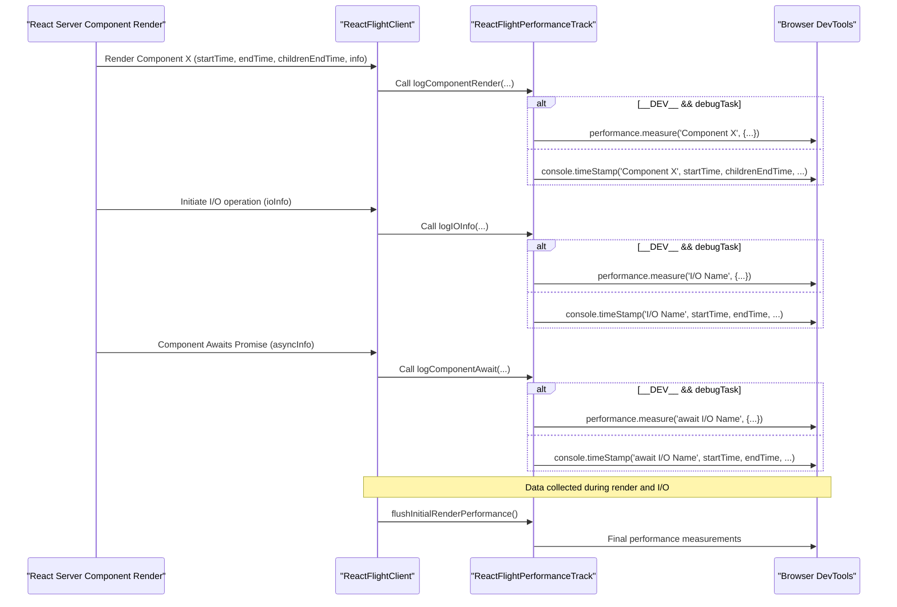

# Performance Tracking

`react-client` provides robust performance measurement and logging capabilities for server components and I/O operations, offering insights into their execution and helping you interpret profiling data for optimization. These features integrate with browser development tools, allowing for a detailed timeline view of your application's server-side activity. For a broader overview of DevTools integrations, refer to the [DevTools Integration](./developer-tools-devtools-integration.md) section.

## Enabling Performance Tracking

Performance tracking in `react-client` relies on the browser's User Timing API (`performance.measure` and `console.timeStamp`). This functionality is conditionally enabled through internal React feature flags like `enableProfilerTimer` and `enableComponentPerformanceTrack`, ensuring that performance overhead is only introduced when necessary.

Key aspects of the setup include:

*   **`supportsUserTiming`**: A internal flag that verifies the availability of necessary browser performance APIs.
*   **`_timeOrigin`**: When performance tracking is active, `react-client` synchronizes its internal timestamps with the browser's `performance.timeOrigin`. This ensures that server-side performance metrics are accurately aligned with client-side events in a unified timeline.
*   **`_replayConsole`**: This flag determines whether console messages and performance entries captured on the server are replayed and logged on the client, enabling comprehensive debugging and profiling.

At the start of performance tracking, `markAllTracksInOrder` is called to pre-create and order the primary tracks in DevTools, specifically "Server Requests ⚛" and "Server Components ⚛". This ensures consistent visualization of server-side activity.

## Tracking Server Components

Server components are tracked within the "Server Components ⚛" track group, organized into parallel tracks to visualize concurrent rendering. The `trackNames` array, using zero-width spaces, creates up to 10 distinct parallel tracks (`Primary`, `Parallel`, `Parallel`, etc.) to prevent track name collisions and improve readability in complex scenarios.

### `logComponentRender`

This function logs the rendering of a server component that completes successfully. It records the component's name, environment (e.g., "Primary"), and its self-time (the duration spent rendering the component itself, excluding its children). Entries are color-coded in DevTools based on the component's self-time duration and its environment:

| Self-Time Range | Primary Environment Color | Secondary Environment Color |
| :-------------- | :------------------------ | :-------------------------- |
| `< 0.5ms`       | `primary-light`           | `secondary-light`           |
| `0.5ms - 50ms`  | `primary`                 | `secondary`                 |
| `50ms - 500ms`  | `primary-dark`            | `secondary-dark`            |
| `>= 500ms`      | `error`                   | `error`                     |

This color-coding helps visually identify components with long rendering times or those operating in different environments.

### `logDedupedComponentRender`

When React dedupes a server component render (meaning the component's output was reused from a previous render), this function logs a placeholder. This indicates that the component did not execute new work but was served from a cache, which is valuable for identifying optimization opportunities.

### `logComponentAborted`

Components that are aborted during rendering (e.g., due to stream closure or an early client disconnection) are logged using this function. These entries are marked with a `warning` color in DevTools, indicating incomplete server-side work.

### `logComponentErrored`

If a server component encounters an error during rendering, `logComponentErrored` records this event. These entries are displayed with an `error` color and include details about the error message, aiding in server-side debugging.

## Tracking I/O Operations

Input/Output (I/O) operations, such as data fetching, are tracked within the "Server Requests ⚛" track group. This provides visibility into the latency and status of server-side data dependencies.

### `logIOInfo`

This function logs the successful resolution of an I/O operation. It includes the operation's name, a description of the data, and the environment. The color of the entry is determined by a hash of the function name, providing visual variety:

*   `tertiary-light`
*   `tertiary`
*   `tertiary-dark`

Short and long names for I/O operations are generated using `getIOShortName` and `getIOLongName`, respectively, ensuring clear and concise labels in the DevTools timeline.

### `logIOInfoErrored`

When an I/O operation fails (e.g., a data fetch promise rejects), `logIOInfoErrored` records the error. These entries are marked with an `error` color in DevTools, highlighting problematic data dependencies.

## Tracking Asynchronous Awaits

`react-client` also tracks promises awaited by server components, providing granular details on when components pause for asynchronous operations and when those operations resolve, abort, or error.

### `logComponentAwait`

This function logs the successful resolution of an awaited promise. It indicates when a component finishes waiting for an asynchronous operation, including a description of the resolved value and its duration.

### `logComponentAwaitAborted`

If an awaited promise is aborted before resolving (e.g., due to stream cancellation), this function logs the event. These entries appear as `warning` color in DevTools.

### `logComponentAwaitErrored`

When an awaited promise rejects, `logComponentAwaitErrored` records the error. These entries are marked with an `error` color, providing immediate feedback on failed asynchronous operations.

## Visualizing Performance Data

The performance data captured by `react-client` is exposed to browser DevTools via the User Timing API (`performance.measure` and `console.timeStamp`). This allows for a detailed visual timeline of server component rendering and I/O activity, helping you understand execution flow and identify bottlenecks.

`flushInitialRenderPerformance` is a critical step that processes and emits final performance entries for DevTools, especially for components that might have been part of a larger, still-pending render tree. This ensures all relevant timing data is recorded for comprehensive analysis.

## Interpreting and Optimizing

By examining the performance timeline in your browser's DevTools, you can gain valuable insights:

*   **High Self-Time Components**: Components with significant self-times (darker `primary` or `secondary` colors, or `error` if very long) indicate CPU-bound work on the server. Consider optimizing their logic or offloading heavy computations.
*   **Aborted Entries**: `warning`-colored entries for components or `await` operations suggest that the stream was interrupted. This might point to early client disconnections, server-side cancellations, or issues with streaming infrastructure.
*   **Errored Entries**: `error`-colored entries immediately highlight server-side errors affecting component rendering or I/O operations. These require immediate attention for stability and correctness.
*   **Deduped Components**: `logDedupedComponentRender` entries indicate effective caching or reuse of component output. Identify areas where memoization or shared data patterns can be further applied.
*   **Long I/O Operations**: Examine `Server Requests ⚛` track for long-running I/O operations. Optimizing data fetching or backend response times can significantly improve overall component render performance.

## Conclusion

The performance tracking capabilities of `react-client` provide crucial visibility into the server-side rendering and data flow of your React applications. By understanding and utilizing these insights, you can effectively pinpoint performance bottlenecks and optimize your server components and I/O operations.

For more details on how console logs from the server are displayed in the client environment, see [Console Replay](./developer-tools-console-replay.md).