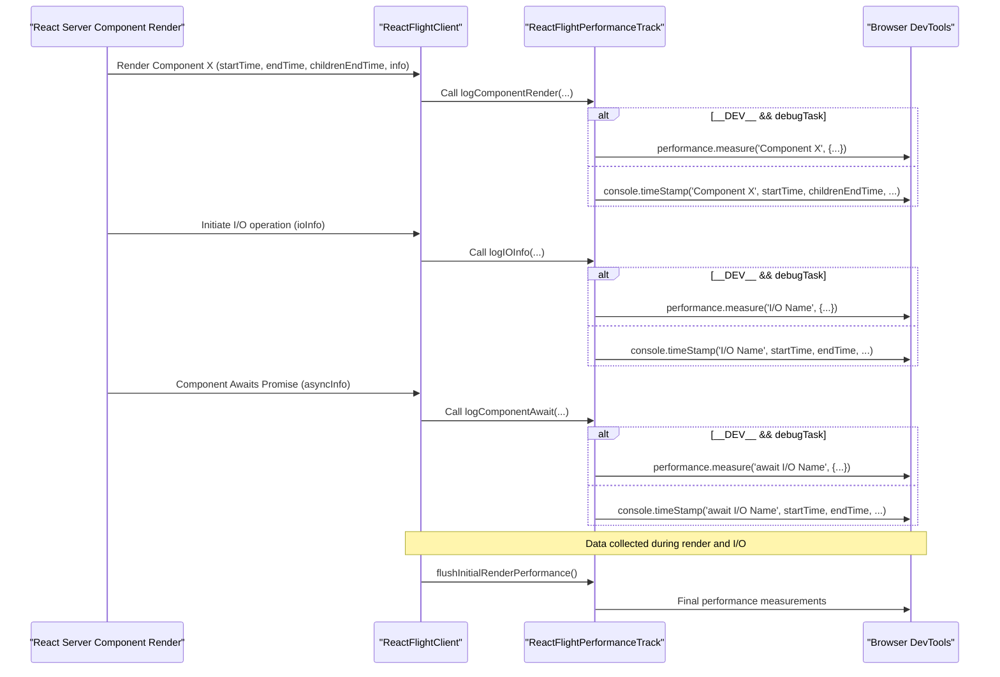

# 性能跟踪

`react-client` 为服务器组件和 I/O 操作提供了强大的性能测量和日志记录功能，深入了解它们的执行情况，帮助您解释分析数据以进行优化。这些功能与浏览器开发工具集成，可以详细查看应用程序的服务器端活动时间线。有关 DevTools 集成的更广泛概述，请参阅 [DevTools 集成](./developer-tools-devtools-integration.md) 部分。

## 启用性能跟踪

`react-client` 中的性能跟踪依赖于浏览器的 User Timing API（`performance.measure` 和 `console.timeStamp`）。此功能通过内部 React 功能标志（如 `enableProfilerTimer` 和 `enableComponentPerformanceTrack`）有条件地启用，确保仅在必要时引入性能开销。

设置的关键方面包括：

*   **`supportsUserTiming`**：一个内部标志，用于验证必要的浏览器性能 API 是否可用。
*   **`_timeOrigin`**：当性能跟踪激活时，`react-client` 会将其内部时间戳与浏览器的 `performance.timeOrigin` 同步。这确保了服务器端性能指标在统一的时间线中与客户端事件精确对齐。
*   **`_replayConsole`**：此标志确定服务器上捕获的控制台消息和性能条目是否在客户端重放和记录，从而实现全面的调试和分析。

在性能跟踪开始时，调用 `markAllTracksInOrder` 以在 DevTools 中预创建并排序主要跟踪，特别是“Server Requests ⚛”和“Server Components ⚛”。这确保了服务器端活动的一致可视化。

## 跟踪服务器组件

服务器组件在“Server Components ⚛”跟踪组中进行跟踪，组织成并行跟踪以可视化并发渲染。`trackNames` 数组使用零宽度空格创建多达 10 个不同的并行跟踪（`Primary`、`Parallel`、`Parallel `等），以防止跟踪名称冲突并提高复杂场景中的可读性。

### `logComponentRender`

此函数记录成功完成的服务器组件的渲染。它记录组件的名称、环境（例如，“Primary”）及其自用时间（渲染组件本身所花费的时间，不包括其子组件）。DevTools 中的条目根据组件的自用时间长度和其环境进行颜色编码：

| 自用时间范围 | 主环境颜色 | 次环境颜色 |
| :-------------- | :------------------------ | :-------------------------- |
| `< 0.5ms`       | `primary-light`           | `secondary-light`           |
| `0.5ms - 50ms`  | `primary`                 | `secondary`                 |
| `50ms - 500ms`  | `primary-dark`            | `secondary-dark`            |
| `>= 500ms`      | `error`                   | `error`                     |

此颜色编码有助于可视化识别渲染时间长的组件或在不同环境中运行的组件。

### `logDedupedComponentRender`

当 React 对服务器组件渲染进行去重（意味着组件的输出被重用自之前的渲染）时，此函数会记录一个占位符。这表明组件没有执行新的工作，而是从缓存中提供，这对于识别优化机会很有价值。

### `logComponentAborted`

在渲染过程中被中止的组件（例如，由于流关闭或客户端提前断开连接）将使用此函数进行日志记录。这些条目在 DevTools 中标有 `warning` 颜色，表示服务器端工作不完整。

### `logComponentErrored`

如果服务器组件在渲染过程中遇到错误，`logComponentErrored` 会记录此事件。这些条目以 `error` 颜色显示，并包含有关错误消息的详细信息，有助于服务器端调试。

## 跟踪 I/O 操作

输入/输出 (I/O) 操作，例如数据获取，在“Server Requests ⚛”跟踪组中进行跟踪。这提供了服务器端数据依赖的延迟和状态的可见性。

### `logIOInfo`

此函数记录 I/O 操作的成功解析。它包括操作的名称、数据的描述和环境。条目的颜色由函数名称的哈希值确定，提供了视觉多样性：

*   `tertiary-light`
*   `tertiary`
*   `tertiary-dark`

I/O 操作的短名称和长名称分别使用 `getIOShortName` 和 `getIOLongName` 生成，确保 DevTools 时间线中的标签清晰简洁。

### `logIOInfoErrored`

当 I/O 操作失败（例如，数据获取 promise 拒绝）时，`logIOInfoErrored` 会记录错误。这些条目在 DevTools 中标有 `error` 颜色，突出了有问题的数据依赖。

## 跟踪异步等待

`react-client` 还跟踪服务器组件等待的 promise，提供关于组件何时暂停进行异步操作以及这些操作何时解析、中止或出错的详细信息。

### `logComponentAwait`

此函数记录 awaited promise 的成功解析。它指示组件何时完成等待异步操作，包括已解析值的描述及其持续时间。

### `logComponentAwaitAborted`

如果一个 awaited promise 在解析之前被中止（例如，由于流取消），此函数会记录该事件。这些条目在 DevTools 中显示为 `warning` 颜色。

### `logComponentAwaitErrored`

当一个 awaited promise 拒绝时，`logComponentAwaitErrored` 会记录错误。这些条目标有 `error` 颜色，提供了失败异步操作的即时反馈。

## 可视化性能数据

`react-client` 捕获的性能数据通过 User Timing API（`performance.measure` 和 `console.timeStamp`）暴露给浏览器 DevTools。这允许对服务器组件渲染和 I/O 活动进行详细的可视化时间线，帮助您理解执行流程并识别瓶颈。

`flushInitialRenderPerformance` 是一个关键步骤，它处理并为 DevTools 发出最终的性能条目，特别是对于可能属于更大、仍在等待的渲染树的组件。这确保记录所有相关的计时数据以进行全面分析。

## 解释和优化

通过检查浏览器 DevTools 中的性能时间线，您可以获得宝贵的见解：

*   **高自用时间组件**：自用时间显著（颜色更深的 `primary` 或 `secondary`，如果非常长则为 `error`）的组件表示服务器上的 CPU 密集型工作。考虑优化其逻辑或卸载繁重计算。
*   **中止条目**：组件或 `await` 操作的 `warning` 颜色条目表明流已中断。这可能指向客户端过早断开连接、服务器端取消或流式传输基础设施问题。
*   **错误条目**：`error` 颜色条目立即突出显示影响组件渲染或 I/O 操作的服务器端错误。这些需要立即关注以确保稳定性和正确性。
*   **去重组件**：`logDedupedComponentRender` 条目表明组件输出的有效缓存或重用。识别可以进一步应用记忆化或共享数据模式的区域。
*   **长时间 I/O 操作**：检查 `Server Requests ⚛` 跟踪，以查找长时间运行的 I/O 操作。优化数据获取或后端响应时间可以显著提高整体组件渲染性能。

## 总结

`react-client` 的性能跟踪功能为您的 React 应用程序的服务器端渲染和数据流提供了重要的可见性。通过理解和利用这些见解，您可以有效地找出性能瓶颈并优化您的服务器组件和 I/O 操作。

有关控制台日志如何在客户端环境中显示的更多详细信息，请参阅 [控制台重放](./developer-tools-console-replay.md)。