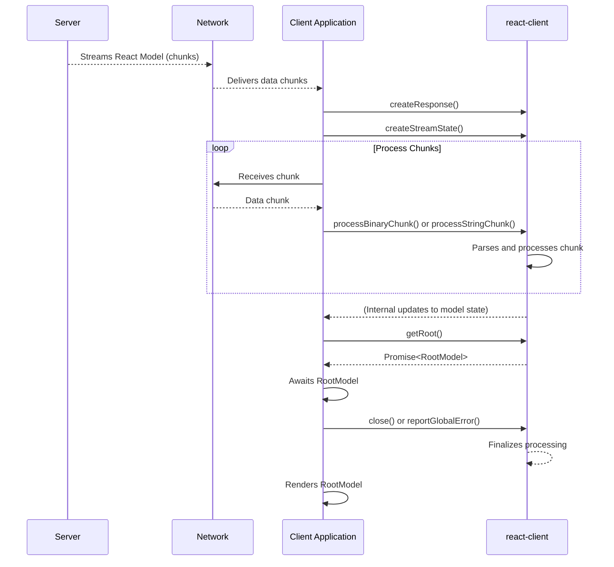

# Getting Started

`react-client` is a specialized React package designed for consuming streaming models. It serves as the bridge between server-generated content, such as React Server Components, and the client-side rendering environment. This package is typically an internal dependency of frameworks that implement React's streaming capabilities, rather than a standalone package for direct installation via npm.

This guide provides a practical overview of how to initialize `react-client` within your project and set up the essential components for consuming a basic streaming React model. For a deeper dive into the underlying principles, refer to the [Core Concepts](./core-concepts.md) section.

## Core Components

To consume a streaming React model, you will primarily interact with the following `react-client` functions:

*   `createResponse`: Initializes the client-side mechanism for handling streamed data.
*   `createStreamState`: Manages the parsing state of the incoming stream.
*   `processBinaryChunk` / `processStringChunk`: Process individual data chunks from the stream.
*   `getRoot`: Retrieves the root of the parsed React model or data.
*   `close`: Signals the end of the stream and completes any pending operations.
*   `reportGlobalError`: Reports a global error that occurred during stream processing.

## Steps for Consumption

The following steps outline the general process for consuming a streaming React model:

### 1. Initialize the Response Stream

Begin by creating a response object using `createResponse`. This object orchestrates the processing of the incoming stream.

**Parameters**

| Name | Type | Description |
|---|---|---|
| `bundlerConfig` | `ServerConsumerModuleMap` | Maps client reference IDs to module information, enabling the client to load necessary modules. |
| `serverReferenceConfig` | `null \| ServerManifest` | Maps server action IDs to module information, allowing client-side invocation of server functions. |
| `moduleLoading` | `ModuleLoading` | Specifies the mechanism for loading client modules (e.g., dynamic imports). |
| `callServer` | `void \| CallServerCallback` | An asynchronous function responsible for making network requests to invoke server actions/functions. If not provided, calling a server function will throw an error. |
| `encodeFormAction` | `void \| EncodeFormActionCallback` | An optional function to encode form actions for server communication. |
| `nonce` | `?string` | An optional cryptographic nonce used for Content Security Policy. |
| `temporaryReferences` | `void \| TemporaryReferenceSet` | An optional set of temporary references that can be resolved from the reply. |
| `findSourceMapURL` | `void \| FindSourceMapURLCallback` | **(DEV-only)** A callback function to find source map URLs for debugging. |
| `replayConsole` | `boolean` | **(DEV-only)** If `true`, enables replaying server-side console logs and their associated stack traces in the client's development environment. |
| `environmentName` | `void \| string` | **(DEV-only)** The name of the server environment (e.g., 'Server', 'Node.js'). |
| `debugChannel` | `void \| DebugChannelCallback` | **(DEV-only)** A callback function for sending debug messages. |

**Example**

```javascript
import { createResponse } from './src/ReactFlightClient';

// Placeholder configurations. In a real application, your framework would provide these.
const bundlerConfig = {}; // Maps client reference IDs to module information.
const serverReferenceConfig = null; // Maps server action IDs to module information.
const moduleLoading = null; // Specifies the mechanism for loading client modules.

// A dummy `callServer` function for demonstration. In a real application, this would
// be an asynchronous function responsible for making network requests to invoke
// server actions/functions.
const callServer = async (id, args) => {
  console.log('Server function invoked:', id, args);
  // Simulate a response from the server
  return { value: 'Data from simulated server!' };
};

// Initialize the response object
const response = createResponse(
  bundlerConfig,
  serverReferenceConfig,
  moduleLoading,
  callServer
);
```

This example initializes the client's response handling mechanism. The `bundlerConfig`, `serverReferenceConfig`, and `moduleLoading` are typically provided by the framework, while `callServer` is a critical asynchronous function for interacting with server functions.

### 2. Manage the Stream State

To correctly parse the incoming stream, `react-client` requires a stream state object. Create this using `createStreamState`. This object maintains the internal state of the stream parsing process.

**Parameters**

`createStreamState` takes no parameters.

**Returns**

| Name | Type | Description |
|---|---|---|
| `streamState` | `StreamState` | An object representing the current parsing state of the incoming stream. |

**Example**

```javascript
import { createStreamState } from './src/ReactFlightClient';

const streamState = createStreamState();
```

This simple call prepares the necessary state object for processing incoming data chunks.

### 3. Process Incoming Data Chunks

As data arrives from the network (e.g., from a `fetch` request or Node.js stream), feed each chunk into the `react-client` response object. Use `processBinaryChunk` for `Uint8Array` chunks or `processStringChunk` for string chunks. This step continuously updates the internal model as data streams in.

**Parameters for `processBinaryChunk`**

| Name | Type | Description |
|---|---|---|
| `weakResponse` | `WeakResponse` | The response object initialized by `createResponse`. |
| `streamState` | `StreamState` | The stream state object initialized by `createStreamState`. |
| `chunk` | `Uint8Array` | A chunk of incoming binary data from the stream. |

**Parameters for `processStringChunk`**

| Name | Type | Description |
|---|---|---|
| `weakResponse` | `WeakResponse` | The response object initialized by `createResponse`. |
| `streamState` | `StreamState` | The stream state object initialized by `createStreamState`. |
| `chunk` | `string` | A chunk of incoming string data from the stream. |

**Example**

```javascript
import { processBinaryChunk, reportGlobalError, close } from './src/ReactFlightClient';

// Assuming 'response' (WeakResponse) and 'streamState' are already initialized as above.

async function consumeIncomingStream(readableStreamReader) {
  try {
    while (true) {
      const { value, done } = await readableStreamReader.read();
      if (done) {
        break;
      }
      // Process each binary chunk as it arrives
      // For string-based streams, use processStringChunk(response, streamState, value);
      processBinaryChunk(response, streamState, value);
    }
  } catch (error) {
    reportGlobalError(response, error); // Report any errors that occur during stream processing
  } finally {
    close(response); // Signal the end of the stream
  }
}

// Example: Consuming a stream from a web fetch response
/*
async function fetchAndConsume() {
  const fetchResponse = await fetch('/your-rsc-endpoint', { headers: { Accept: 'text/x-component' } });
  if (fetchResponse.body) {
    await consumeIncomingStream(fetchResponse.body.getReader());
  }
}
fetchAndConsume();
*/
```

This function iteratively reads chunks from a `ReadableStream` and passes them to `processBinaryChunk`. It also demonstrates the use of `reportGlobalError` to handle stream errors and `close` to signal the end of the stream, ensuring all pending operations are finalized.

### 4. Access the Root Model

The `getRoot` function returns a `Promise` that resolves to the fully parsed React model or data when the stream processing is complete and all dependencies are resolved. This is typically the top-level React element tree you intend to render.

**Parameters**

| Name | Type | Description |
|---|---|---|
| `weakResponse` | `WeakResponse` | The response object initialized by `createResponse`. |

**Returns**

| Name | Type | Description |
|---|---|---|
| `rootModelPromise` | `Promise<T>` | A Promise that resolves to the root of the parsed React model or data. |

**Example**

```javascript
import { getRoot } from './src/ReactFlightClient';

// Assuming 'response' (WeakResponse) is already initialized.
const rootModelPromise = getRoot(response);

(async () => {
  try {
    const rootModel = await rootModelPromise;
    console.log('Root model received:', rootModel);
    // You can now use 'rootModel' to render your React application.
    // If 'rootModel' is a React element, you would pass it to your ReactDOM.render or createRoot call.
  } catch (error) {
    console.error('Failed to get root model:', error);
  }
})();
```

This example shows how to asynchronously retrieve the root model. Once resolved, `rootModel` can be used to render the server-generated content in your client-side React application.

## Conceptual Flow

The following diagram illustrates the high-level data flow when `react-client` consumes a streaming React model:



--- 

This section provided a practical guide to initializing and consuming streaming React models with `react-client`. You have learned how to set up the response stream, process incoming data, and access the final React model. For a deeper understanding of the underlying principles and architectural patterns, continue to the [Core Concepts](./core-concepts.md) section.
