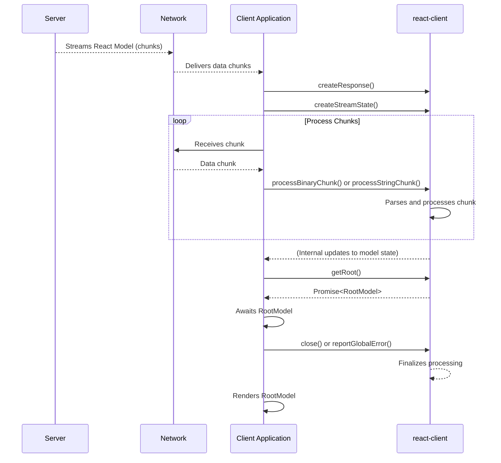

# 入门

`react-client` 是一个专门的 React 包，旨在消费流式模型。它充当服务器生成内容（如 React 服务器组件）与客户端渲染环境之间的桥梁。此包通常是实现 React 流式功能的框架的内部依赖，而不是通过 npm 直接安装的独立包。

本指南提供了如何在项目中初始化 `react-client` 并设置必要组件以消费基本流式 React 模型的实践概览。要深入了解底层原理，请参阅 [核心概念](./core-concepts.md) 部分。

## 核心组件

要消费流式 React 模型，您将主要与以下 `react-client` 函数交互：

*   `createResponse`：初始化用于处理流式数据的客户端机制。
*   `createStreamState`：管理传入流的解析状态。
*   `processBinaryChunk` / `processStringChunk`：处理流中的单个数据块。
*   `getRoot`：检索解析后的 React 模型或数据的根。
*   `close`：标记流的结束并完成所有待处理的操作。
*   `reportGlobalError`：报告流处理过程中发生的全局错误。

## 消费步骤

以下步骤概述了消费流式 React 模型的一般过程：

### 1. 初始化响应流

首先使用 `createResponse` 创建一个响应对象。此对象协调传入流的处理。

**参数**

| 名称 | 类型 | 描述 |
|---|---|---|
| `bundlerConfig` | `ServerConsumerModuleMap` | 将客户端引用 ID 映射到模块信息，使客户端能够加载必要的模块。 |
| `serverReferenceConfig` | `null | ServerManifest` | 将服务器动作 ID 映射到模块信息，允许客户端调用服务器函数。 |
| `moduleLoading` | `ModuleLoading` | 指定加载客户端模块的机制（例如，动态导入）。 |
| `callServer` | `void | CallServerCallback` | 一个负责发送网络请求以调用服务器动作/函数的异步函数。如果未提供，调用服务器函数将抛出错误。 |
| `encodeFormAction` | `void | EncodeFormActionCallback` | 一个可选函数，用于编码表单操作以进行服务器通信。 |
| `nonce` | `?string` | 用于内容安全策略的可选加密 nonce。 |
| `temporaryReferences` | `void | TemporaryReferenceSet` | 一组可选的临时引用，可以从回复中解析。 |
| `findSourceMapURL` | `void | FindSourceMapURLCallback` | **(仅 DEV)** 一个回调函数，用于查找用于调试的源映射 URL。 |
| `replayConsole` | `boolean` | **(仅 DEV)** 如果为 `true`，则在客户端的开发环境中启用重放服务器端控制台日志及其关联的堆栈跟踪。 |
| `environmentName` | `void | string` | **(仅 DEV)** 服务器环境的名称（例如，“Server”，“Node.js”）。 |
| `debugChannel` | `void | DebugChannelCallback` | **(仅 DEV)** 一个用于发送调试消息的回调函数。 |

**示例**

```javascript
import { createResponse } from './src/ReactFlightClient';

// 占位符配置。在实际应用程序中，您的框架将提供这些。
const bundlerConfig = {}; // 将客户端引用 ID 映射到模块信息。
const serverReferenceConfig = null; // 将服务器动作 ID 映射到模块信息。
const moduleLoading = null; // 指定加载客户端模块的机制。

// 用于演示的虚拟 `callServer` 函数。在实际应用程序中，这将
// 是一个负责发送网络请求以调用
// 服务器动作/函数的异步函数。
const callServer = async (id, args) => {
  console.log('服务器函数被调用:', id, args);
  // 模拟来自服务器的响应
  return { value: '来自模拟服务器的数据！' };
};

// 初始化响应对象
const response = createResponse(
  bundlerConfig,
  serverReferenceConfig,
  moduleLoading,
  callServer
);
```

此示例初始化了客户端的响应处理机制。`bundlerConfig`、`serverReferenceConfig` 和 `moduleLoading` 通常由框架提供，而 `callServer` 是一个用于与服务器函数交互的关键异步函数。

### 2. 管理流状态

为了正确解析传入流，`react-client` 需要一个流状态对象。使用 `createStreamState` 创建此对象。此对象维护流解析过程的内部状态。

**参数**

`createStreamState` 不接受任何参数。

**返回值**

| 名称 | 类型 | 描述 |
|---|---|---|
| `streamState` | `StreamState` | 一个表示传入流当前解析状态的对象。 |

**示例**

```javascript
import { createStreamState } from './src/ReactFlightClient';

const streamState = createStreamState();
```

这个简单的调用准备了处理传入数据块所需的状态对象。

### 3. 处理传入数据块

当数据从网络（例如，从 `fetch` 请求或 Node.js 流）到达时，将每个数据块送入 `react-client` 响应对象。对于 `Uint8Array` 块使用 `processBinaryChunk`，对于字符串块使用 `processStringChunk`。此步骤随着数据流的传入不断更新内部模型。

**`processBinaryChunk` 的参数**

| 名称 | 类型 | 描述 |
|---|---|---|
| `weakResponse` | `WeakResponse` | 由 `createResponse` 初始化的响应对象。 |
| `streamState` | `StreamState` | 由 `createStreamState` 初始化的流状态对象。 |
| `chunk` | `Uint8Array` | 来自流的传入二进制数据块。 |

**`processStringChunk` 的参数**

| 名称 | 类型 | 描述 |
|---|---|---|
| `weakResponse` | `WeakResponse` | 由 `createResponse` 初始化的响应对象。 |
| `streamState` | `StreamState` | 由 `createStreamState` 初始化的流状态对象。 |
| `chunk` | `string` | 来自流的传入字符串数据块。 |

**示例**

```javascript
import { processBinaryChunk, reportGlobalError, close } from './src/ReactFlightClient';

// 假设 'response' (WeakResponse) 和 'streamState' 已如上初始化。

async function consumeIncomingStream(readableStreamReader) {
  try {
    while (true) {
      const { value, done } = await readableStreamReader.read();
      if (done) {
        break;
      }
      // 处理到达的每个二进制块
      // 对于基于字符串的流，使用 processStringChunk(response, streamState, value);
      processBinaryChunk(response, streamState, value);
    }
  } catch (error) {
    reportGlobalError(response, error); // 报告流处理过程中发生的任何错误
  } finally {
    close(response); // 标记流的结束
  }
}

// 示例：从 Web fetch 响应中消费流
/*
async function fetchAndConsume() {
  const fetchResponse = await fetch('/your-rsc-endpoint', { headers: { Accept: 'text/x-component' } });
  if (fetchResponse.body) {
    await consumeIncomingStream(fetchResponse.body.getReader());
  }
}
fetchAndConsume();
*/
```

此函数迭代地从 `ReadableStream` 中读取数据块，并将其传递给 `processBinaryChunk`。它还演示了如何使用 `reportGlobalError` 处理流错误以及使用 `close` 标记流的结束，确保所有待处理的操作都已完成。

### 4. 访问根模型

当流处理完成且所有依赖项都已解析时，`getRoot` 函数返回一个 `Promise`，该 `Promise` 解析为完全解析的 React 模型或数据。这通常是您打算渲染的顶级 React 元素树。

**参数**

| 名称 | 类型 | 描述 |
|---|---|---|
| `weakResponse` | `WeakResponse` | 由 `createResponse` 初始化的响应对象。 |

**返回值**

| 名称 | 类型 | 描述 |
|---|---|---|
| `rootModelPromise` | `Promise<T>` | 一个解析为解析后的 React 模型或数据的根的 Promise。 |

**示例**

```javascript
import { getRoot } from './src/ReactFlightClient';

// 假设 'response' (WeakResponse) 已初始化。
const rootModelPromise = getRoot(response);

(async () => {
  try {
    const rootModel = await rootModelPromise;
    console.log('接收到根模型:', rootModel);
    // 您现在可以使用 'rootModel' 来渲染您的 React 应用程序。
    // 如果 'rootModel' 是一个 React 元素，您将把它传递给您的 ReactDOM.render 或 createRoot 调用。
  } catch (error) {
    console.error('获取根模型失败:', error);
  }
})();
```

此示例展示了如何异步检索根模型。一旦解析，`rootModel` 就可以用于在客户端 React 应用程序中渲染服务器生成的内容。

## 概念流程

下图说明了 `react-client` 消费流式 React 模型时的高层数据流：



---

本节提供了使用 `react-client` 初始化和消费流式 React 模型的实用指南。您已经学习了如何设置响应流、处理传入数据以及访问最终的 React 模型。要更深入地了解底层原理和架构模式，请继续阅读 [核心概念](./core-concepts.md) 部分。