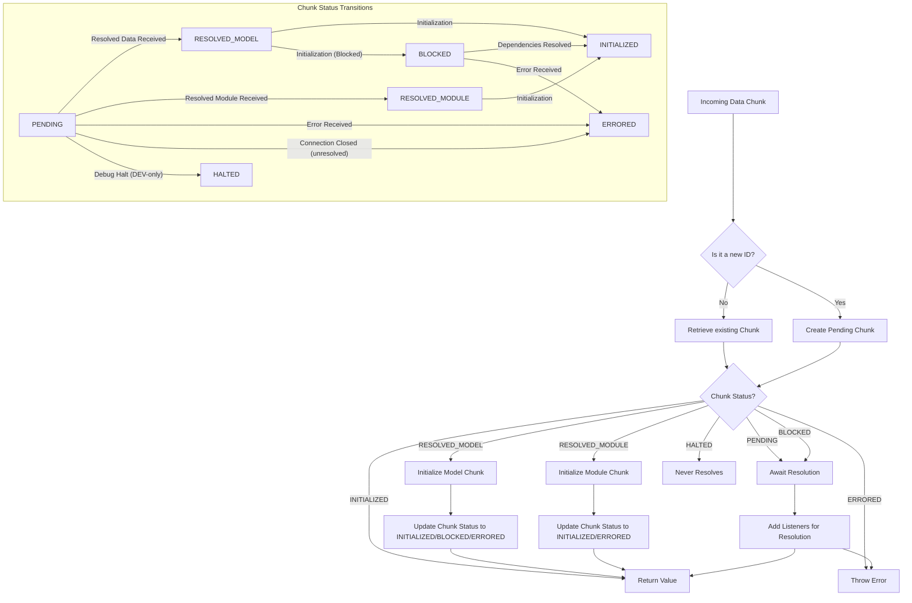

# Internal Mechanisms

This section delves into the intricate internal workings of `react-client`, providing an in-depth understanding of how it processes incoming data, resolves dependencies, and manages dynamic resources. For a foundational understanding of data flow and the overall protocol, you can refer to the [Streaming Data Flow](./core-concepts-streaming-data-flow.md) and [Serialization Protocol](./core-concepts-serialization-protocol.md) sections.

## Chunk Lifecycle Management

At the core of `react-client`'s operation is its sophisticated chunk management system. The `Response` object maintains a `Map` named `_chunks`, which stores various `SomeChunk` objects. Each chunk represents a discrete unit of data or an asynchronously resolved value from the server. These chunks progress through different statuses as they are processed.

Each `SomeChunk` type carries a `status` property indicating its current state, along with `value` (for resolved content) and `reason` (for errors or stream controllers). Key functions involved in managing these chunks include:

*   `createPendingChunk(response)`: Creates a new chunk in the `PENDING` state when an ID is referenced but its data hasn't arrived yet.
*   `getChunk(response, id)`: Retrieves an existing chunk or creates a `PENDING` one if not found.
*   `resolveModel(response, id, model)`: Transitions a chunk to `RESOLVED_MODEL` with the raw JSON string.
*   `resolveModule(response, id, model)`: Transitions a chunk to `RESOLVED_MODULE` with the client reference metadata.
*   `resolveStream(response, id, stream, controller)`: Initializes a chunk directly to `INITIALIZED` for streaming data types, holding the stream and its controller.
*   `initializeModelChunk(chunk)`: Attempts to parse and fully initialize a `RESOLVED_MODEL` chunk, potentially moving it to `INITIALIZED` or `BLOCKED` if it has further dependencies.
*   `initializeModuleChunk(chunk)`: Attempts to `requireModule` for a `RESOLVED_MODULE` chunk, moving it to `INITIALIZED`.
*   `triggerErrorOnChunk(response, chunk, error)`: Moves a chunk to `ERRORED` and notifies any waiting listeners.
*   `releasePendingChunk(response, chunk)`: Manages internal counters related to pending chunks, which can influence debug channel cleanup and performance tracking.

The different statuses of a `SomeChunk` are detailed below:

| Status          | Description                                                                    | `value`        | `reason`                                  |
| :-------------- | :----------------------------------------------------------------------------- | :------------- | :---------------------------------------- |
| `pending`       | Waiting for data from the server.                                              | `null`         | `null`                                    |
| `blocked`       | Initializing, but blocked on other pending `SomeChunk` dependencies (e.g., cyclic references or un-loaded modules). | `null`         | `null`                                    |
| `resolved_model`  | Raw JSON model data has been received, but not yet parsed into JavaScript objects. | `UninitializedModel` | `Response` object                         |
| `resolved_module` | Client reference metadata received, but module not yet loaded/initialized.     | `ClientReference` | `null`                                    |
| `fulfilled`     | Fully initialized JavaScript value is available.                               | `T` (initialized value) | `null` or `FlightStreamController` (for streams) |
| `rejected`      | An error occurred during resolution or initialization.                         | `null`         | `mixed` (error object)                    |
| `halted`        | (DEV-only) The chunk will never resolve, even if the connection closes. Usually due to missing debug channel. | `null`         | `null`                                    |

## Serialization and Deserialization Protocol

`react-client` relies on a custom JSON serialization protocol to transmit complex JavaScript values and React elements across the network boundary. The core of deserialization is the `JSON.parse` method combined with a custom `reviver` function, `response._fromJSON`.

The `_fromJSON` callback inspects each `key`/`value` pair during parsing. If a `value` is a string prefixed with `$`, it signifies a special serialized type that needs reconstruction. The specific character following the `$` indicates the type, allowing `react-client` to reconstruct various JavaScript primitives, objects, and references.

| Prefix | Type Represented        | Description                                                                                                                                                                                                                                                             |
| :----- | :---------------------- | :---------------------------------------------------------------------------------------------------------------------------------------------------------------------------------------------------------------------------------------------------------------------- |
| `$`    | `REACT_ELEMENT_TYPE`    | Represents a React element. When encountered at key `'0'` within a tuple, it signals the start of a React element tuple.                                                                                                                                      |
| `$$`   | Escaped String          | The original string started with a `$`, so it was escaped.                                                                                                                                                                                              |
| `$L`   | Lazy Node               | A `React.lazy` wrapper around another chunk. This allows React to suspend rendering until the actual value is available.                                                                                                                             |
| `$@`   | Promise                 | A JavaScript `Promise` resolved from another chunk. `react-client` uses `ReactPromise` to represent these and integrate them with React's suspense mechanism.                                                                                                    |
| `$S`   | Symbol                  | A `Symbol.for` value.                                                                                                                                                                                                                                   |
| `$F`   | Server Reference        | A reference to a server-side function (`'use server'`). It resolves to a client-callable function that invokes `_callServer`.                                                                                                                      |
| `$T`   | Temporary Reference     | A reference to a temporary object stored in a `TemporaryReferenceSet`, typically used for values passed between server actions and the client.                                                                                                          |
| `$Q`   | Map                     | A JavaScript `Map` object, reconstructed from a serialized array of key-value pairs.                                                                                                                                                                    |
| `$W`   | Set                     | A JavaScript `Set` object, reconstructed from a serialized array of values.                                                                                                                                                                             |
| `$B`   | Blob                    | A `Blob` object, reconstructed from its type and constituent parts.                                                                                                                                                                                     |
| `$K`   | FormData                | A `FormData` object, reconstructed from an array of name-value pairs.                                                                                                                                                                                   |
| `$Z`   | Error                   | An `Error` object, potentially including `name`, `message`, `stack`, and `digest` (DEV-only also includes `env` and `ReactStackTrace`).                                                                                                            |
| `$i`   | AsyncIterator           | An asynchronous iterator object, allowing client components to consume streaming data.                                                                                                                                                                   |
| `$I`   | `Infinity`              | The JavaScript `Infinity` value.                                                                                                                                                                                                                        |
| `$-`   | `-0` or `-Infinity`     | The JavaScript negative zero (`-0`) or negative infinity (`-Infinity`).                                                                                                                                                                                 |
| `$N`   | `NaN`                   | The JavaScript `NaN` (Not-a-Number) value.                                                                                                                                                                                                              |
| `$u`   | `undefined`             | The JavaScript `undefined` value, which cannot be natively serialized in JSON.                                                                                                                                                                          |
| `$D`   | Date                    | A JavaScript `Date` object, reconstructed from its ISO 8601 string representation.                                                                                                                                                                      |
| `$n`   | BigInt                  | A JavaScript `BigInt` value.                                                                                                                                                                                                                            |
| `$P`   | Apply Constructor (DEV) | (DEV-only) Applies a constructor prototype to an object for debugging purposes.                                                                                                                                                                         |
| `$E`   | Inferred Function (DEV) | (DEV-only) Used to reconstruct a function from its code string for logging and debugging, especially for server-side functions.                                                                                                                            |
| `$Y`   | Omitted/Deferred (DEV)  | (DEV-only) Represents an omitted property in production, or a deferred Promise/lazy getter in development for debug info. Queries the server to start sending the referenced data if not already present.                                                   |
| Any other `$`-prefixed string | Outlined Model Reference | A reference to another chunk by its ID and an optional path within that chunk (e.g., `"123:foo:bar"`). This mechanism is used for shared or deeply nested objects to avoid duplication in the payload.                                             |

For React elements, `_fromJSON` specifically recognizes a tuple structure `[REACT_ELEMENT_TYPE, type, key, props, owner, stack, validated]`. This tuple is then transformed into a standard React element object using `createElement`.

## Reference Resolution and Graph Traversal

When `react-client` encounters references to other chunks (e.g., through `$L`, `$@`, or general outlined model references), it needs a mechanism to wait for those referenced chunks to resolve before the current object can be fully initialized. This is managed through `InitializationReference` and `InitializationHandler`.

*   `InitializationHandler`: A state object that tracks dependencies. It maintains a `deps` count, which increments for each unresolved dependency. When `deps` reaches zero, the handler's value is ready for its owning chunk to transition to `INITIALIZED`.
*   `waitForReference(referencedChunk, parentObject, key, response, map, path)`: This function is invoked when a `_fromJSON` call encounters a reference to a `PENDING` or `BLOCKED` chunk. It creates an `InitializationReference` that links the `parentObject[key]` to the `referencedChunk` via the `initializingHandler`. It adds `reference` to the `value` and `reason` listener lists of the `referencedChunk`.
*   `fulfillReference(reference, value)`: Called when a `referencedChunk` (that `reference` was waiting for) successfully resolves. It updates `parentObject[key]` with the `value` and decrements the `handler.deps`. If `handler.deps` becomes zero, the handler's associated chunk can be fully initialized.
*   `rejectReference(reference, error)`: Called when a `referencedChunk` (that `reference` was waiting for) fails. It marks the `handler.errored` flag and causes the owning chunk to `triggerErrorOnChunk`.

This system effectively builds a dependency graph, ensuring that objects are only fully materialized once all their constituent parts are available. It also handles cyclic references by detecting them during `wakeChunkIfInitialized` (specifically `resolveBlockedCycle`), allowing immediate resolution to the already partially initialized value.

## Dynamic Module and Server Reference Loading

`react-client` is responsible for dynamically loading both client-side modules referenced by the server and server functions (`'use server'`).

*   **Client Modules**: When the server transmits metadata for a client module (`ClientReferenceMetadata`), the `resolveModule` function is triggered. This uses `resolveClientReference` to get the module's client-side identifier. Before the module is required, `prepareDestinationForModule` ensures any necessary client-side manifest setup or module hydration is performed. The module is then either `preloadModule`'d (asynchronously fetched) or `requireModule`'d (synchronously fetched if already in cache).
*   **Server References**: Server actions, marked with `'use server'`, are transmitted as special `$F` references. When `loadServerReference` processes these, it checks `response._serverReferenceConfig`. If a server manifest is available, it uses `resolveServerReference` to get the actual client module that exports the server action. Otherwise, it creates a `createBoundServerReference` proxy that will invoke `response._callServer` when the action is called from the client.
*   **Temporary References**: For specific use cases, such as passing temporary objects between server actions and the client, `react-client` uses `TemporaryReferenceSet`. `writeTemporaryReference` adds an object to this set, and `readTemporaryReference` retrieves it using its reference ID.

## Conclusion

Understanding these internal mechanisms provides a deeper appreciation of `react-client`'s capabilities in building highly efficient and interactive React applications. The intelligent management of data chunks, the sophisticated serialization protocol, and the dynamic resolution of dependencies are key to its performance and seamless server-client integration. For details on how these internal processes behave across different execution environments, proceed to the [Compatibility & Environments](./compatibility-environments.md) section.