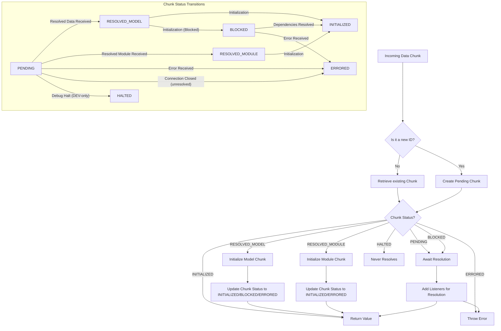

# 内部机制

本节深入探讨 `react-client` 的复杂内部工作原理，详细介绍了它如何处理传入数据、解决依赖关系以及管理动态资源。要了解数据流和整体协议的基础知识，您可以参考[流数据流](./core-concepts-streaming-data-flow.md)和[序列化协议](./core-concepts-serialization-protocol.md)部分。

## 数据块生命周期管理

`react-client` 运行的核心是其复杂的数据块管理系统。`Response` 对象维护一个名为 `_chunks` 的 `Map`，其中存储各种 `SomeChunk` 对象。每个数据块代表服务器发来的一个离散数据单元或一个异步解析的值。这些数据块在处理过程中会经历不同的状态。

每个 `SomeChunk` 类型都带有一个 `status` 属性，指示其当前状态，以及 `value`（用于已解析内容）和 `reason`（用于错误或流控制器）。涉及管理这些数据块的关键函数包括：

*   `createPendingChunk(response)`: 当引用了一个 ID 但其数据尚未到达时，创建一个处于 `PENDING` 状态的新数据块。
*   `getChunk(response, id)`: 检索一个现有数据块，如果未找到则创建一个 `PENDING` 数据块。
*   `resolveModel(response, id, model)`: 将数据块转换为 `RESOLVED_MODEL` 状态，并带上原始 JSON 字符串。
*   `resolveModule(response, id, model)`: 将数据块转换为 `RESOLVED_MODULE` 状态，并带上客户端引用元数据。
*   `resolveStream(response, id, stream, controller)`: 直接将流数据类型的数据块初始化为 `INITIALIZED` 状态，持有流及其控制器。
*   `initializeModelChunk(chunk)`: 尝试解析并完全初始化 `RESOLVED_MODEL` 数据块，如果它有进一步的依赖关系，可能会将其移动到 `INITIALIZED` 或 `BLOCKED` 状态。
*   `initializeModuleChunk(chunk)`: 尝试为 `RESOLVED_MODULE` 数据块 `requireModule`，将其移动到 `INITIALIZED` 状态。
*   `triggerErrorOnChunk(response, chunk, error)`: 将数据块移动到 `ERRORED` 状态，并通知任何等待的监听器。
*   `releasePendingChunk(response, chunk)`: 管理与挂起数据块相关的内部计数器，这可以影响调试通道的清理和性能跟踪。

`SomeChunk` 的不同状态如下详述：

| Status          | Description                                                                    | `value`        | `reason`                                  |
| :-------------- | :----------------------------------------------------------------------------- | :------------- | :---------------------------------------- |
| `pending`       | 正在等待服务器的数据。                                                       | `null`         | `null`                                    |
| `blocked`       | 正在初始化，但被其他挂起的 `SomeChunk` 依赖项（例如，循环引用或未加载的模块）阻塞。 | `null`         | `null`                                    |
| `resolved_model`  | 原始 JSON 模型数据已收到，但尚未解析为 JavaScript 对象。               | `UninitializedModel` | `Response` 对象                         |
| `resolved_module` | 客户端引用元数据已收到，但模块尚未加载/初始化。                      | `ClientReference` | `null`                                    |
| `fulfilled`     | 完全初始化的 JavaScript 值可用。                                       | `T` (initialized value) | `null` or `FlightStreamController` (for streams) |
| `rejected`      | 在解析或初始化过程中发生错误。                                               | `null`         | `mixed` (error object)                    |
| `halted`        | (仅限 DEV) 即使连接关闭，该数据块也永远不会解析。通常是由于缺少调试通道。 | `null`         | `null`                                    |

## 序列化和反序列化协议

`react-client` 依赖于自定义 JSON 序列化协议来跨网络边界传输复杂的 JavaScript 值和 React 元素。反序列化的核心是 `JSON.parse` 方法与自定义 `reviver` 函数 `response._fromJSON` 的结合。

`_fromJSON` 回调在解析过程中检查每个 `key`/`value` 对。如果 `value` 是以 `$` 为前缀的字符串，则表示需要重构的特殊序列化类型。`$` 之后的特定字符表示类型，允许 `react-client` 重构各种 JavaScript 原语、对象和引用。

| Prefix | Type Represented        | Description                                                                                                                                                                                                                                                             |
| :----- | :---------------------- | :---------------------------------------------------------------------------------------------------------------------------------------------------------------------------------------------------------------------------------------------------------------------- |
| `$`    | `REACT_ELEMENT_TYPE`    | 表示一个 React 元素。当在元组中键 `'0'` 处遇到时，它表示 React 元素元组的开始。                                                                                                                                      |
| `$$`   | Escaped String          | 原始字符串以 `$` 开头，因此被转义。                                                                                                                                                               |
| `$L`   | Lazy Node               | 另一个数据块的 `React.lazy` 包装器。这允许 React 暂停渲染，直到实际值可用。                                                                                                                             |
| `$@`   | Promise                 | 从另一个数据块解析的 JavaScript `Promise`。`react-client` 使用 `ReactPromise` 来表示这些并将其与 React 的 suspense 机制集成。                                                                                                    |
| `$S`   | Symbol                  | 一个 `Symbol.for` 值。                                                                                                                                                                     |
| `$F`   | Server Reference        | 对服务器端函数 (`'use server'`) 的引用。它解析为一个可由客户端调用的函数，该函数会调用 `_callServer`。                                                                                                                      |
| `$T`   | Temporary Reference     | 对存储在 `TemporaryReferenceSet` 中的临时对象的引用，通常用于在服务器动作和客户端之间传递的值。                                                                                                          |
| `$Q`   | Map                     | 一个 JavaScript `Map` 对象，从键值对的序列化数组中重构。                                                                                                                                                                    |
| `$W`   | Set                     | 一个 JavaScript `Set` 对象，从值的序列化数组中重构。                                                                                                                                                                             |
| `$B`   | Blob                    | 一个 `Blob` 对象，从其类型和组成部分中重构。                                                                                                                                                                                     |
| `$K`   | FormData                | 一个 `FormData` 对象，从名称-值对数组中重构。                                                                                                                                                                                   |
| `$Z`   | Error                   | 一个 `Error` 对象，可能包括 `name`、`message`、`stack` 和 `digest`（仅限 DEV 也包括 `env` 和 `ReactStackTrace`）。                                                                                                            |
| `$i`   | AsyncIterator           | 一个异步迭代器对象，允许客户端组件使用流数据。                                                                                                                                                                   |
| `$I`   | `Infinity`              | JavaScript 的 `Infinity` 值。                                                                                                                                                                                         |
| `$-`   | `-0` or `-Infinity`     | JavaScript 负零 (`-0`) 或负无穷 (`-Infinity`)。                                                                                                                                                                                 |
| `$N`   | `NaN`                   | JavaScript 的 `NaN` (非数字) 值。                                                                                                                                                                               |
| `$u`   | `undefined`             | JavaScript 的 `undefined` 值，无法在 JSON 中原生序列化。                                                                                                                                                                          |
| `$D`   | Date                    | 一个 JavaScript `Date` 对象，从其 ISO 8601 字符串表示中重构。                                                                                                                                                                      |
| `$n`   | BigInt                  | 一个 JavaScript `BigInt` 值。                                                                                                                                                                                             |
| `$P`   | Apply Constructor (DEV) | (仅限 DEV) 将构造函数原型应用于对象以进行调试。                                                                                                                                                                         |
| `$E`   | Inferred Function (DEV) | (仅限 DEV) 用于从其代码字符串重构函数以进行日志记录和调试，特别是对于服务器端函数。                                                                                                                            |
| `$Y`   | Omitted/Deferred (DEV)  | (仅限 DEV) 在生产环境中表示省略的属性，或者在开发环境中表示延迟的 Promise/lazy getter 以获取调试信息。如果引用的数据尚未存在，则查询服务器以开始发送。                                                                                                                 |
| Any other `$`-prefixed string | Outlined Model Reference | 通过其 ID 和该数据块中的可选路径（例如，`"123:foo:bar"`）引用另一个数据块。此机制用于共享或深度嵌套的对象，以避免在有效负载中重复。                                                                                                           |

对于 React 元素，`_fromJSON` 特别识别元组结构 `[REACT_ELEMENT_TYPE, type, key, props, owner, stack, validated]`。然后，此元组使用 `createElement` 转换为标准 React 元素对象。

## 引用解析和图遍历

当 `react-client` 遇到对其他数据块的引用（例如，通过 `$L`、`$@` 或一般概述模型引用）时，它需要一种机制来等待这些引用的数据块解析，然后才能完全初始化当前对象。这通过 `InitializationReference` 和 `InitializationHandler` 进行管理。

*   `InitializationHandler`: 一个跟踪依赖项的状态对象。它维护一个 `deps` 计数，每个未解析的依赖项都会使其递增。当 `deps` 达到零时，处理程序的值就准备好其所属的数据块转换为 `INITIALIZED` 状态。
*   `waitForReference(referencedChunk, parentObject, key, response, map, path)`: 当 `_fromJSON` 调用遇到对 `PENDING` 或 `BLOCKED` 数据块的引用时，会调用此函数。它创建一个 `InitializationReference`，通过 `initializingHandler` 将 `parentObject[key]` 链接到 `referencedChunk`。它将 `reference` 添加到 `referencedChunk` 的 `value` 和 `reason` 监听器列表。
*   `fulfillReference(reference, value)`: 当 `referencedChunk`（`reference` 正在等待的）成功解析时调用。它使用 `value` 更新 `parentObject[key]` 并递减 `handler.deps`。如果 `handler.deps` 变为零，则处理程序关联的数据块可以完全初始化。
*   `rejectReference(reference, error)`: 当 `referencedChunk`（`reference` 正在等待的）失败时调用。它标记 `handler.errored` 标志并导致所属数据块 `triggerErrorOnChunk`。

该系统有效地构建了一个依赖图，确保对象只有在其所有组成部分都可用后才能完全实现。它还通过在 `wakeChunkIfInitialized`（特别是 `resolveBlockedCycle`）期间检测循环引用来处理循环引用，允许立即解析到已部分初始化的值。

## 动态模块和服务器引用加载

`react-client` 负责动态加载服务器引用的客户端模块和服务器函数 (`'use server'`)。

*   **客户端模块**: 当服务器传输客户端模块的元数据 (`ClientReferenceMetadata`) 时，`resolveModule` 函数被触发。这会使用 `resolveClientReference` 获取模块的客户端标识符。在需要模块之前，`prepareDestinationForModule` 确保执行任何必要的客户端清单设置或模块水合。然后模块会被 `preloadModule`（异步获取）或 `requireModule`（如果已在缓存中则同步获取）。
*   **服务器引用**: 服务器动作（标记为 `'use server'`）作为特殊 `$F` 引用传输。当 `loadServerReference` 处理这些引用时，它会检查 `response._serverReferenceConfig`。如果服务器清单可用，它会使用 `resolveServerReference` 获取导出服务器动作的实际客户端模块。否则，它会创建一个 `createBoundServerReference` 代理，当从客户端调用该动作时，该代理将调用 `response._callServer`。
*   **临时引用**: 对于特定用例，例如在服务器动作和客户端之间传递临时对象，`react-client` 使用 `TemporaryReferenceSet`。`writeTemporaryReference` 将对象添加到此集合，`readTemporaryReference` 使用其引用 ID 检索它。

## 结论

了解这些内部机制可以更深入地理解 `react-client` 在构建高效且交互式 React 应用程序方面的能力。数据块的智能管理、复杂的序列化协议以及依赖项的动态解析是其性能和无缝服务器-客户端集成的关键。有关这些内部过程在不同执行环境中如何表现的详细信息，请参阅[兼容性与环境](./compatibility-environments.md)部分。
