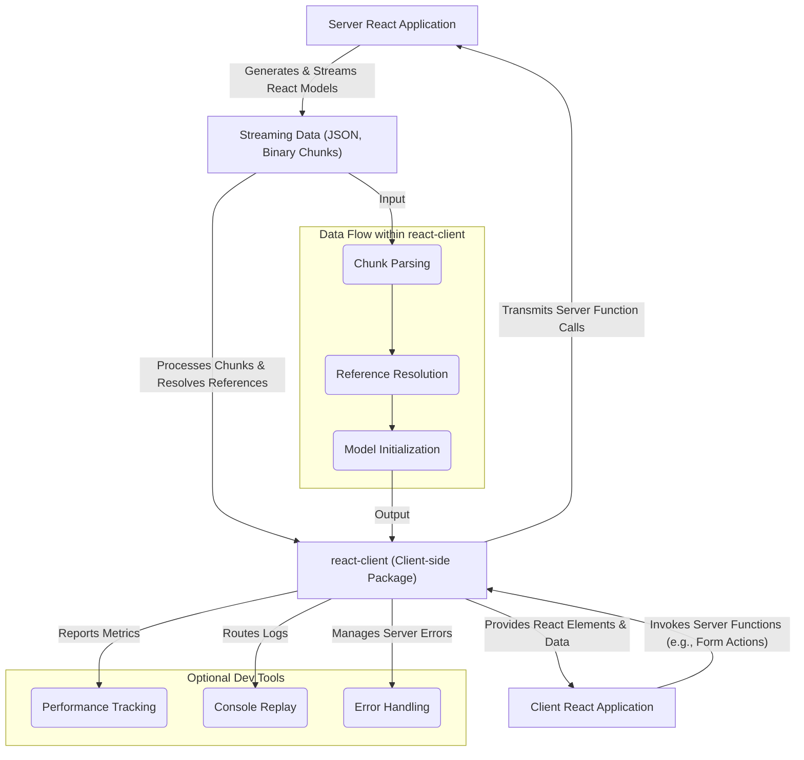

# Overview

`react-client` is an experimental React package for consuming streaming models. Its primary purpose is to bridge the data flow between server and client environments, enabling applications to render and interact with React components streamed directly from the server.

It's important to note that as an experimental package, its API stability differs from core React libraries and does not follow the standard versioning scheme. Use of this package is at your own risk.

## Core Capabilities

`react-client` provides the foundational mechanisms for building applications that leverage server components and streaming data. Its core functionalities revolve around efficient data transmission, interpretation, and interaction across the network boundary:

*   **Streaming Model Consumption**: `react-client` is designed to efficiently receive and process a continuous flow of data from the server. This includes handling various types of data chunks as they arrive, enabling progressive rendering and dynamic updates on the client.
*   **Data Serialization and Deserialization**: The package manages the complex task of converting various JavaScript data types, including React elements, symbols, dates, BigInts, and errors, into a format suitable for network transmission (serialization) and reconstructing them back on the client (deserialization). This ensures data integrity and type preservation across the server-client divide.
*   **Server Reference Invocation**: A key feature is the ability for client components to invoke functions residing on the server. `react-client` handles the underlying processes to facilitate these calls, ensuring seamless interaction with server-side logic.
*   **Chunk Management and Resolution**: It orchestrates the lifecycle of incoming data chunks, managing their pending, resolved, and errored states. This includes mechanisms for resolving dependencies between chunks and efficiently waking up components or listeners when data becomes available.
*   **Developer Tools and Debugging**: For development purposes, `react-client` integrates with developer tools, offering features for inspecting server component rendering, logging performance metrics, and replaying server-side console output directly in the client's development environment.
*   **Error and Postponement Handling**: The package includes strategies for robustly managing and reporting errors that originate from the server. It also handles content postponements, ensuring that the client can gracefully respond to server-initiated delays or suspensions in rendering.

## Architecture Overview

The `react-client` package acts as a critical intermediary, managing the communication and data interpretation between the server-side rendering environment and the client-side React application. It processes raw data streams into usable React models and handles client-initiated calls back to the server.

## Next Steps

To begin integrating `react-client` into your project, proceed to the [Getting Started](./getting-started.md) section. For a deeper understanding of its foundational principles, explore the [Core Concepts](./core-concepts.md) section.