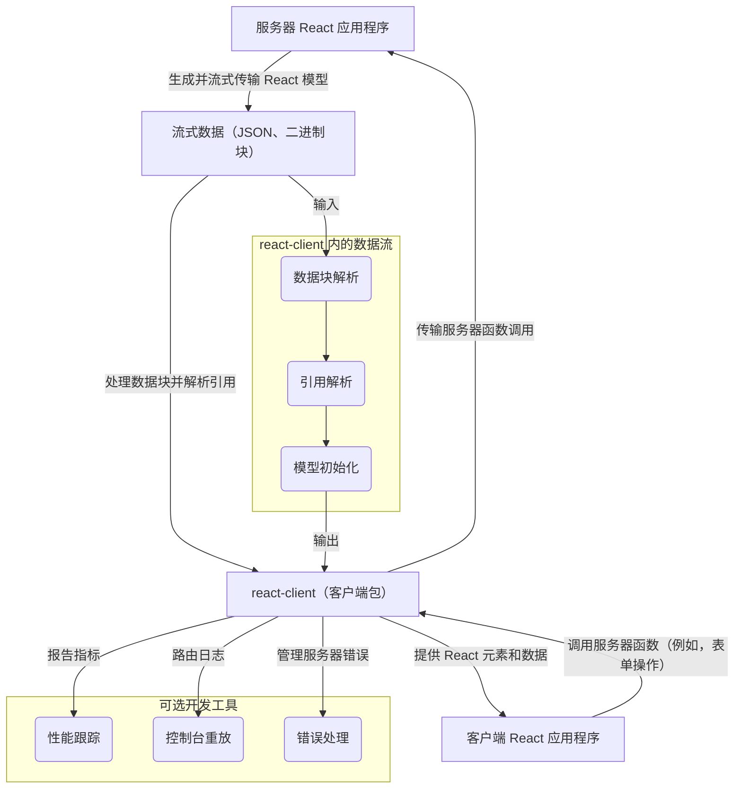

# 概览

`react-client` 是一个用于消费流式模型的实验性 React 包。它的主要目的是弥合服务器和客户端环境之间的数据流，使应用程序能够渲染并与直接从服务器流式传输的 React 组件进行交互。

值得注意的是，作为一个实验性软件包，其 API 稳定性与核心 React 库不同，并且不遵循标准版本控制方案。使用此软件包需自行承担风险。

## 核心功能

`react-client` 提供了构建利用服务器组件和流式数据的应用程序的基础机制。其核心功能围绕着跨网络边界的有效数据传输、解释和交互：

*   **流式模型消费**：`react-client` 旨在高效接收和处理来自服务器的连续数据流。这包括处理到达的各种类型的数据块，从而在客户端实现渐进式渲染和动态更新。
*   **数据序列化和反序列化**：该软件包负责管理复杂的任务，即将各种 JavaScript 数据类型（包括 React 元素、符号、日期、BigInts 和错误）转换为适合网络传输的格式（序列化），并在客户端上重新构建它们（反序列化）。这确保了服务器-客户端之间的数据完整性和类型保留。
*   **服务器引用调用**：一个关键特性是客户端组件能够调用驻留在服务器上的函数。`react-client` 处理底层过程以促进这些调用，确保与服务器端逻辑的无缝交互。
*   **数据块管理和解析**：它协调传入数据块的生命周期，管理它们的待处理、已解析和出错状态。这包括用于解析数据块之间依赖关系以及在数据可用时高效唤醒组件或监听器的机制。
*   **开发工具和调试**：出于开发目的，`react-client` 与开发工具集成，提供检查服务器组件渲染、记录性能指标以及直接在客户端开发环境中重播服务器端控制台输出的功能。
*   **错误和延迟处理**：该软件包包括用于稳健管理和报告源自服务器的错误的策略。它还处理内容延迟，确保客户端能够优雅地响应服务器发起的渲染延迟或暂停。

## 架构概览

`react-client` 包充当关键中介，管理服务器端渲染环境和客户端 React 应用程序之间的通信和数据解释。它将原始数据流处理成可用的 React 模型，并处理客户端发起的对服务器的调用。

## 下一步

要开始将 `react-client` 集成到您的项目中，请前往[入门](./getting-started.md)部分。要更深入地了解其基本原理，请探索[核心概念](./core-concepts.md)部分。
